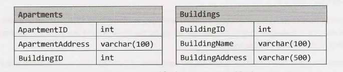
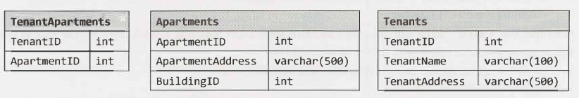
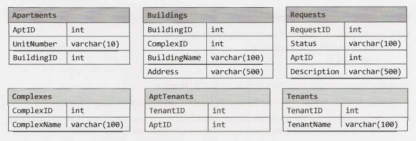

# Chapter 14 | 数据库

如果你了解数据库知识，则可能会被问到一些有关数据库的问题。本章我们将回顾一些关键概念，并概述如何解决这些问题。在阅读这些查询语句时，不要对语法上的细微变化感到惊讶。SQL有多种风格，你可能只是使用了稍微不同的一种。本书中的示例已针对 Microsoft SQL Server 进行了测试。

### SQL 语法和变体

隐式连接（implicit join）和显式连接（explicit join）如下所示。这两种说法是等价的，选择哪一种是个人偏好的问题。为了保持一致，我们将坚持使用显式连接。

| 显式连接                                                     | 隐式连接                                                     |
| ------------------------------------------------------------ | ------------------------------------------------------------ |
| 1 SELECT CourseName, TeacherName <br/>2 FROM Courses INNER JOIN Teachers<br/>3 ON Courses.TeacherID = Teachers.TeacherID | 1 SELECT CourseName, TeacherName<br/>2 FROM   Courses, Teachers<br/>3 WHERE Courses.TeacherID =<br/>4               Teachers.TeacherID |

### 反规范化数据库与规范化数据库

规范化数据库（Normalized Databases ）旨在最大程度地减少冗余，而反规范化数据库（Denormalized databases ，译者注，即反模式）旨在优化读取时间。

在传统的规范化数据库中，例如有 Courses 和 Teachers 两个数据库表，Courses 可能包含一个名为TeacherID 的列，它是 Teacher 的外键。这样做的一个好处是，关于老师的信息（姓名、地址等）只在数据库中存储一次。缺点是许多常见查询需要昂贵的连接。

相反，我们可以通过存储冗余数据来对数据库进行反规范化。例如，如果我们知道必须经常重复这个查询，我们可能会将老师的名字存储在 Courses 表中。反规范化通常用于创建高度可扩展的系统。

### SQL 语句

让我们以前面提到的数据库为例，回顾一下基本的 SQL 语法。该数据库具有以下简单结构（*表示主键）：

```sql
Courses： CourseID*, CourseName, TeacherID 
Teachers： TeacherID*, TeacherName 
Students： StudentID*, StudentName
StudentCourses： CourseID*, StudentID*
```

使用上面的表，实现以下查询。

#### 查询 1：学生注册人数

实现一个查询来获得所有学生的列表以及每个学生注册了多少门课程

首先，我们可以尝试如下操作：

```sql
1 /* Incorrect Code */
2 SELECT Students.StudentName, count（*）
3 FROM Students INNER JOIN StudentCourses
4 ON Students.StudentID = StudentCourses.StudentID 
5 GROUP BY Students.StudentID
```

这有三个问题：

1. 我们排除了未注册任何课程的学生，因为 StudentCourses 仅包括已注册的学生。我们需要将其更改为左连接（LEFT JOIN）。
2. 即使我们将其更改为左连接（LEFT JOIN），查询仍然不太正确。进行 count(*) 将返回给定的一组StudentID 中有多少个项目。选修零门课程的学生在他们的小组里仍然有一个项目。我们需要将其更改成计算每个组中的 CourseID 的数量：count(StudentCourses.CourseID)。
3. 我们已经按 Student.StudentID 分组了，但是每个组中仍然有多个 StudentName。数据库将如何知道要返回哪个 StudentName？ 当然，它们可能都具有相同的值，但是数据库是不知道这一点的。我们需要对此应用一个聚合函数，例如 first(Students.StudentName)。

解决这些问题后，我们可以执行以下查询：

```sql
1 /* Solution 1： Wrap with another query */
2 SELECT StudentName, Students.StudentID, Cnt
3 FROM(
4 	SELECT Students.StudentID, count(StudentCourses.CourseID) as [Cnt]
5 	FROM Students LEFT JOIN StudentCourses
6 	ON Students.StudentID = StudentCourses.StudentID
7 	GROUP BY Students.StudentID
8 ) T INNER JOIN Students on T.studentID = Students.StudentID
```

查看这段代码，有人可能会问，为什么我们不直接在第 3 行中选择学生名，以避免必须使用另一个查询来包装第 3 到第 6 行。这种（不正确的）解决方案如下所示。

```sql
1 /* Incorrect Code */
1 SELECT StudentName, Students.StudentID, count（StudentCourses.CourseID） as [Cnt]
2 FROM Students LEFT JOIN StudentCourses
3 ON Students.StudentID = StudentCourses.StudentID
4 GROUP BY Students.StudentID
```

答案是，我们不能那样做——至少不能完全像上面展示的那样。我们只能选择聚合函数或 GROUP BY 子句中的值。

或者，我们可以通过以下两种方法之一解决上述问题：

```sql
1 /* Solution 2： Add StudentName to GROUP BY clause. */
2 SELECT StudentName, Students.StudentID, count(StudentCourses.CourseID) as [Cnt]
3 FROM Students LEFT JOIN StudentCourses
4 ON Students.StudentID = StudentCourses.StudentID
5 GROUP BY Students.StudentID, Students.StudentName
```

或

```sql
1 /* Solution 3： Wrap with aggregate function. */
2 SELECT max(StudentName) as [StudentName], Students.StudentID,
3 		count(StudentCourses.CourseID) as [Count]
4 FROM Students LEFT JOIN StudentCourses
5 ON Students.StudentID = StudentCourses.StudentID
6 GROUP BY Students.StudentID
```

#### 查询 2：教师班级规模

实现一个查询，以获得所有教师和每个教师教多少学生的列表。如果一个老师教同一个学生两门课，你应该重复计算这个学生。按老师所教学生人数的降序排列。

我们可以逐步构建这个查询。首先，让我们获取 TeacherID 的列表以及与每个 TeacherID 关联的学生人数。这与先前的查询非常相似。

```sql
1 SELECT TeacherID, count(StudentCourses.CourseID) AS [Number]
2 FROM Courses INNER JOIN StudentCourses
3 ON Courses.CourseID = StudentCourses.CourseID
4 GROUP BY Courses.TeacherID
```

请注意，这个内连接（INNER JOIN）不会选择不上课的老师。当我们将其与所有教师列表连接时，我们将在下面的查询中进行处理。

```sql
1 SELECT TeacherName, is null(StudentSize.Number, 0)
2 FROM Teachers LEFT JOIN
3 		(SELECT TeacherID, count(StudentCourses.CourseID) AS [Number]
4 		FROM Courses INNER JOIN StudentCourses
5 		ON Courses.CourseID = StudentCourses.CourseID
6 		GROUP BY Courses.TeacherID) StudentSize
7 ON Teachers.TeacherID = StudentSize.TeacherID
8 ORDER BY StudentSize.Number DESC
```

注意上面我们是如何处理 SELECT 语句中的 NULL 值以将 NULL 值转换为零的。

### 小型数据库设计

此外，可能会要求你设计自己的数据库。我们将为你介绍一种方法。你可能会注意到此方法与面向对象设计方法之间的相似性。

#### Step 1：处理歧义

数据库问题常常有意或无意地有一些歧义。在进行设计之前，你必须确切地了解设计需求。

假设你被要求设计一个代表公寓租赁公司的系统。你需要知道这个中介机构是在多个地点还是只有一个。你也应该和你的面试官讨论该系统的使用情况应该有多普遍。例如，一个人在同一栋楼里租两套公寓是非常罕见的。但这是否意味着你不需要有能力处理这些情况呢？也许是，也许不是。一些非常罕见的情况最好通过工作来处理（例如，在数据库中复制此人的联系信息）。

#### Step 2：定义核心对象

接下来，我们应该看一下系统的核心对象。这些核心对象通常每个都转换为一个表。在这种情况下，我们的核心对象可能是 Property、Building、Apartment、Tenant 和 Manager。

#### Step 3：分析关系

列出核心对象可以让我们更好地了解表应该是什么。这些表是如何相互关联的？他们是多对多的吗？一对多吗？

如果 Building 与 Apartment 是一对多关系（一栋 Building 有很多 Apartment），那么我们可以这样表示：

<div align=center></div>
请注意，Apartments 表通过一个 BuildingID 列连接到 Buildings 表。

如果我们要考虑一个人租多套公寓的可能性，我们可能需要实现多对多关系，如下所示：

<div align=center></div>
TenantApartments 表存储了 Tenants 和 Apartments 之间的关系。

#### Step 4：研究操作

最后，我们完成细节。逐步执行将要采取的常见操作，并了解如何存储和检索相关数据。我们将需要处理租赁条款、搬迁、租金支付等操作。这些操作都需要新的表和列。

### 大型数据库设计

设计大型可伸缩数据库时，连接（在上面的示例中是必需的）通常非常慢。因此，你必须对数据进行反规范化。仔细考虑如何使用数据——你可能需要将数据复制到多个表中。

------

### Interview Questions

------

问题 1 至 3 涉及本章末尾的 database schema。每个 apartment 可以有多个 tenant，每个 tenant 可以有多个 apartment。每个 apartment 属于一个 building，每个 building 属于一个 complex。

- **14.1 多个公寓（Multiple Apartments）**：编写一个 SOL 查询，以获取租用多个公寓的租户列表。

  *提示：#408*

  

- **14.2 Open Requests**：编写一个 SQL 查询，来获得所有 building 的列表以及 Open Requests 的数量（status 等于 Open 的 Requests）。

  *提示：#411*

  

- **14.3 关闭所有请求（Close All Requests）**：Building #11 正在进行重大装修。实现一个查询来关闭此大楼中公寓的所有请求。

  *提示：#431*

  

- **14.4 连接（Joins）**：连接的类型有哪些？ 请说明它们之间的区别以及为什么某些类型在某些情况下会更好。

  *提示：#451*

  

- **14.5 反范式（Denormalization）**：什么是反范式？解释利弊。

  *提示：#444, #455*

  

- **14.6 E-R 图（Entity-Relationship Diagram）**：绘制一个包含公司（companies）、人员（people）和专业人员（professionals，在公司工作的人员）的数据库的 E-R 图。

  *提示：#436*

  

- **14.7 设计成绩数据库（Design Grade Database）**：想象一个简单的存储学生成绩信息的数据库。设计这个数据库可能的样子，并提供一个 SQL 查询来返回一个优等生（前10%）的列表，按他们的平均成绩排序。

  *提示：#428, #442*

  

**附加问题**：面向对象的设计(#7.7)，系统设计和可伸缩性(#9.6)

提示从第 676 页开始。

<div align=center></div>

