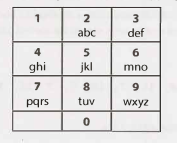

# Chapter 16 | 中等

- **16.1 数字翻转器（Number Swapper）**：编写一个函数原地（即没有临时变量）翻转一个数字。

  *提示：#492, #716, #737*

  

- **16.2 单词频率（Word Frequencies）**：设计一种方法来找出一本书中任何给定单词出现的频率。如果我们多次运行这个算法呢?

  *提示：#489, #536*

  

- **16.3 相交（Intersection）**：给出两个直线段（以给定起点和终点的方式表示），计算相交点（如果有的话）。

  *提示：#465, #472, #497, #517, #527*

  

- **16.4 井字游戏（Tic Tac Win）**：设计一个算法来判断某人是否赢得了一场井字游戏（tic-tac-toe）。

  *提示：#710, #732*

  

- **16.5 阶乘中的 0（Factorial Zeros）**：编写一个算法，计算 n! 中尾随的 0 的数量。

  *提示：#585, #711, #729, #733, #745*

  

- **16.6 最小差值（Smallest Difference）**：给定两个整数数组，计算出具有最小（非负）差值的一对值（每个数组中的一个值）。并返回这个差值。

  EXAMPLE

  ```
  Input: {1, 3, 15, 11, 2}, {23, 127,235, 19, 8}
  Output: 3. That is, the pair (11, 8).
  ```

  *提示：#632, #670, #679*

  

- **16.7 最大值（Number Max）**：编写一个方法，找到两个数字中的最大值。不能使用 if-else 或任何其他比较运算符。

  *提示：#473, #513, #707, #728*

  

- **16.8 英文整数（English Int）**：给定任意整数，打印一个描述该整数的英文短语（例如，"One Thousand, Two Hundred Thirty Four"）。

  *提示：#502, #588, #688*

  

- **16.9 运算（Operations）**：编写方法来实现整数的乘除运算。所有这些的结果都是整数。只使用 add 运算符。

  *提示：#572, #600, #613, #648*

  

- **16.10 在世的人（Living People）**：给定一份某些人的出生和死亡年份的列表，实现一个方法，计算在世人数最多的年份。你可以假设所有的人都出生在 1900 年到 2000 年之间。如果一个人在那一年的任何时候还活着，他应该被包括在那一年的统计中。例如，Person (birth = 1908, death = 1909) 被包含在 1908 年和 1909 年的计数中。

  *提示：#476, #490, #507, #514, #523, #532, #541, #549, #576*

  

- **16.11 跳水板（Diving Board）**：你正在建造一个跳水板，把一堆木板首尾相连。有两种类型的木板，一种长度较短，一种长度较长。你必须正好用 K 块木板。写一个方法来生成跳水板的所有可能长度。

  *提示：#690, #700, #715, #722, #740, #747*

  

- **16.12 XML 编码（XML Encoding）**：由于XML非常冗长，因此提供了一种编码方法，其中每个标签（tag）都映射到一个预定义的整数值。语言/语法如下:

  ```
  Element --> Tag Attributes END Children END
  Attribute --> Tag Value
  END --> 0
  Tag --> some predefined mapping to int
  Value --> string value
  ```

  例如，以下 XML 可以转换为下面的压缩字符串（假设映射为 family -> 1，person -> 2，firstName -> 3，lastName -> 4，state -> 5）。

  ```javascript
  <family lastName="McDowell" state="CA">
  <person firstName="Gayle">Some Message</person>
  </family>
  ```

  就变成:

  ```
  1 4 McDowell 5 CA 0 2 3 Gayle 0 Some Message 0 0
  ```

  编写代码以打印 XML element 的编码版本（传入 Element 和 Attribute 对象）。

  *提示：#466*

  

- **16.13 平分正方形（Bisect Squares）**：给定二维平面上的两个正方形，找出一条可以将这两个正方形对半切开的直线。假设正方形的顶部和底部平行于 x 轴。

  *提示：#468, #479, #528, #560*

  

- **16.14 最佳直线（Best Line）**：给定一个二维图，图上有一些点，找出一条经过最多点的直线。

  *提示：#491, #520, #529, #563*

  

- **16.15 猜字游戏（Master Mind）**：Master Mind 游戏玩法如下:

  机器上有四个插槽，每个插槽将容纳一个球，其颜色可以是红色 (R)、黄色 (Y)、绿色 (G) 或蓝色 (B)。

  例如，该机器可能有 RGGB（Slot #1是红色的，Slots #2 和 Slots #3 是绿色的，Slots #4 是蓝色的)。

  假设你正在尝试猜测答案。例如，你可能会猜 YRGB。

  当你猜对某个插槽上球的颜色时，你会得到一个“hit”。如果你猜的颜色存在，但是插槽的位置不对时，你会得到一个“伪命中”。注意，一个插槽被统计为 hit 后永远不可能被统计为 pseudo-hit。

  例如，如果实际的答案是 RGBY，而你猜是 GGRR，那么你有一个 hit 和一个 pseudo-hit。编写一个方法，给定一个猜测和一个答案，返回 hit 次数和 pseudo-hit 次数。

  *提示：#639, #730*

  

- **16.16 子排序（Sub Sort）**：给定一个整数数组，写一个方法来找到下标 m 和 n，这样，如果对元素 m 到 n 进行排序，则整个数组都将被排序。求 n~m 的最小值（即找到最小的此类序列）。

  EXAMPLE

  ```
  Input: 1, 2, 4, 7, 10, 11, 7, 12, 6, 7, 16, 18, 19
  Output: (3, 9)
  ```

  *提示：#482, #553, #667, #708, #735, #746*

  

- **16.17 连续序列（Contiguous Sequence）**：给定一个整数数组（包括正数和负数）。找到总和最大的连续序列。返回总和。

  EXAMPLE

  ```
  Input: 2, -8, 3, -2, 4, -10
  Output: 5 ( i.e., {3, -2, 4})
  ```

  *提示：#537, #551, #567, #594, #614*

  

- **16.18 模式匹配（Pattern Matching）**：给定两个字符串，即模式和值。模式字符串仅由字母 a 和 b 组成，它们描述了字符串中的模式。例如，字符串 catcatgocatgo 匹配模式 aabab （其中 cat 是 a，go 是 b），它还匹配 a，ab 和 b 之类的模式。编写一个方法来确定值是否与模式匹配。

  *提示：#631, #643, #653, #663, #685, #718, #727*

  

- **16.19 池塘大小（Pond Sizes）**:你有一个整数矩阵，代表一块土地，其中该位置的值代表海拔高度。0 值表示水。池塘是横、竖或对角线相连的水域。池塘的大小是相连的水格（water cells）总数。编写一种方法来计算矩阵中所有池塘的大小。

  EXAMPLE

  ```
  Input:
  0 2 1 0
  0 1 0 1
  1 1 0 1
  0 1 0 1
  Output: 2, 4, 1 (in any order)
  ```

  *提示：#674, #687, #706, #723*

  

- **16.20 T9**：在旧的手机上，用户在数字键盘上输入数字，手机将提供与这些数字匹配的单词列表。每个数字映射到一组 0~4 个字母。实现一个算法，给定一个数字序列，返回匹配的单词列表。你会得到一个有效单词的列表（以你想要的任何数据结构提供）。映射如下图所示：

  <div align=center></div>

  EXAMPLE
  
  ```
  Input: 8733
  Output: tree, used
  ```
  
  *提示：#477, #487, #654, #703, #726, #744*
  
  


- **16.21 和交换（Sum Swap）**：给定两个整数数组，找到一对值（每个数组一个值），能够满足互换这些值以使两个数组具有相同的总和。

  EXAMPLE

  ```
Input: {4, 1, 2, 1, 1, 2} and {3, 6, 3, 3}
  Output: {1, 3}
  ```
  
  *提示：#545, #557, #564, #577, #583, #592, #602, #606, #635*