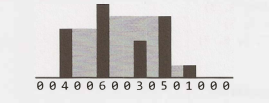

# Chapter 17 | 困难

- **17.1 不用加号相加（Add Without Plus）**：编写一个将两个数字相加的函数。不能使用 + 或任何算术运算符。

  *提示：#467, #544, #607, #628, #642, #664, #692, #772, #724*

  

- **17.2 洗牌（Shuffle）**：写一个洗牌的方法。它必须是一次完美的洗牌——换句话说，`52!` 个牌组排列中每个出现的概率都是相同的。假设你有一个完美的随机数生成器。

  *提示：#483, #579, #634*

  

- **17.3 随机集合（Random Set）**：写一个方法，从一个大小为 n 的数组中随机生成一组 m 个整数，每个元素被选中的概率必须相等。

  *提示：#494, #596*

  

- **17.4 缺失的数字（Missing Number）**：数组 A 包含从 0 到 n 的所有整数，除了少了一个数字。在这个问题中，我们不能用单个操作访问 A 中的所有整数。A 的元素用二进制表示，我们可以用来访问它们的唯一操作是“获取 A[i] 的第 j 位”，这需要花费固定的时间。编写代码来查找丢失的整数。你能在 O(n) 时间内完成吗?

  *提示：#670, #659, #683*

  

- **17.5 字母和数字（Letters and Numbers）**：给定一个由字母和数字组成的数组，找出字母和数字数目相等的最长的子数组。

  *提示：#485, #575, #679, #677, #773*

  

- **17.6 对 2 计数（Count of 2s）**：写一个方法，对在 0 到 n（包括 n）之间的所有数字中出现的 2 的数量进行统计。

  EXAMPLE

	```
	Input: 25
	Output: 9 (2, 12, 20, 21, 22, 23, 24 and 25. Note that 22 counts for two 2s.)
	```
  
  *提示：#573, #672, #641*
  
  

- **17.7 婴儿名字（Baby Names）**：每年，政府都会发布 10000 个最常用的婴儿名字及其频率（带有该名字的婴儿数量）的列表。唯一的问题是某些名称具有多种拼写。例如，“John” 和 “Jon” 本质上是相同的名字，但会在列表中分别单独列出。给定两个列表，一个是名称/频率，另一个是等效名字对，编写一个算法来打印每个名字的真实出现频率的新列表。请注意，如果 John 和 Jon 是同义词，而 Jon 和 Johnny 是同义词，则 John 和 Johnny 也是同义词（既可传递，也可对称）。在最后的列表中，任何名字都可以用作“真实”姓名。

  EXAMPLE

	```
	Input:
	  	Names: John (15), Jon (12), Chris (13), Kris (4), Christopher (19)
	  	Synonyms: (Jon, John), (John, Johnny), (Chris, Kris), (Chris, Christopher)
	Output: John (27), Kris (36)
	```
  
  *提示：#478, #493, #512, #537, #586, #605, #655, #675, #704*
  
  

- **17.8 马戏团塔（Circus Tower）**：马戏团正在设计一种塔舞，人们站在彼此的肩膀上。出于实用和审美的原因，每个人都必须比他或她下面的人更矮、更轻。给定马戏团里每个人的身高和体重，写一个方法来计算这样一个塔里可能的最大人数。

  EXAMPLE

	```
	Input(ht,wt): (65, 100) (70, 150) (56, 90) (75, 190) (60, 95) (68, 110)
	Output: The longest tower is length 6 and includes from top to bottom:
	(56, 90) (60,95) (65,100) (68,110) (70,150) (75,190)
	```
  
  *提示：#638, #657, #666, #682, #699*
  
  

- **17.9 第 k 个倍数（Kth Multiple）**：设计一种算法来找到唯一因数是3、5 和 7 的数字排列中的第 k 个数。请注意，3、5 和 7 不一定是其因数，但它不应该有任何其他质因数。例如，前几个倍数是（按顺序）1、3、5、7、9、15、21。

  *提示：#488, #508, #550, #591, #622, #660, #686*

  

- **17.10 多数元素（Majority Element）**：多数元素是一个数组中一半以上的元素。给定一个正整数数组，找到多数元素。如果没有多数元素，返回 -1。请在 O(N) 时间 和 O(1) 空间内完成此操作。

  EXAMPLE

	```
	Input: 1 2 5 9 5 9 5 5 5
	Output: 5
	```
  
  *提示：#522, #566, #604, #620, #650*
  
  

- **17.11 单词距离（Word Distance）**：你有一个包含单词的大文本文件。给定任意两个单词，找出它们在文件中的最短距离（以单词数量为单位）。如果对同一个文件（但是不同的单词对）重复执行多次操作，你是否可以优化你的解决方案？

  *提示：#486, #501, #538, #558, #633*

  

- **17.12 BiNode**：考虑一个名为 BiNode 的简单数据结构，其中有指向其他两个节点的指针。

	```java
	public class BiNode {
	  	public BiNode node1, node2;
		  public int data;
	  }
	```

  数据结构 BiNode 可用于表示二叉树（其中 node1 是左节点，node2 是右节点）或双向链表（其中 node1 是前一个节点，node2 是下一个节点）。实现一个方法，将二叉搜索树（由 BiNode 实现）转换为双链表。应该按顺序保存这些值，并且在原地（即在原始数据结构上）执行操作。

  *提示：#509, #608, #646, #680, #707, #779*

  

- **17.13 重新加空格（Re-Space）**：哦，不！ 你不小心移除了长篇文档中的所有空格、标点和大写字母。像 “I reset the computer. It still didn't boot!” 这样的句子变成了 “iresetthecomputeritstilldidntboot” 。可以稍后再处理标点和大写，现在你只需要重新插入空格。大多数单词都在字典中，但也有一些不是。给定一个字典（字符串列表）和文档（字符串），设计一种算法，以使连接在一起的文档分开，并且保证使无法识别的字符数降到最小。

  EXAMPLE:

  `Input: jesslookedjustliketimherbrother`
  `Output:` <u>jess</u> looked just like <u>tim</u> her brother (7 unrecognized characters)

  *提示：#496, #623, #656, #677, #739, #749*

  

- **17.14 最小的 K（Smallest K）**：设计一个算法，找出数组中最小的 K 个数字。

  *提示：#470, #530, #552, #593, #625, #647, #661, #678*

  

- **17.15 最长单词（Longest Word）**：给定一个单词列表，编写一个程序，找出该列表中由其他单词组成的最长单词。

  EXAMPLE

	```
	Input: cat, banana, dog, nana, walk, walker, dogwalker
	Output: dogwalker
	```
  
  *提示：#475, #499, #543, #589*
  
  

- **17.16 女按摩师（The Masseuse）**：一个很受欢迎的女按摩师收到了一连串的预约请求，正考虑应该接受哪些请求。她需要在预约之间有15分钟的休息时间，因此她不能接受任何相邻的请求。给定一个连续的预约请求序列（所有的请求的时长都是15分钟的倍数，没有重叠，并且都不能移动），找到按摩师可以接受的最佳设置（最高预订总分钟数）。并返回分钟数。

  EXAMPLE

	```
	Input: {30, 15, 60, 75, 45, 15, 15, 45}
	Output:180 minutes ({30, 60, 45, 45}).
	```
  
  *提示：#495, #504, #576, #526, #542, #554, #562, #568, #578, #587, #607*
  
  

- **17.17 多重搜索（Multi Search）**：给定一个字符串 b 和一个较小的字符串组 T，设计一个方法来搜索 T 中的每个小字符串 b。

  *提示：#480, #582, #617, #743*

  

- **17.18 最短超序列（Shortest Supersequence）**：给你两个数组，一个数组较短（其中所有元素都不同），另一个数组较长。在较长数组中，找到包含较短数组中所有元素的最短子数组。其中短数组中的这些项可以在子数组中按任何顺序出现。

  EXAMPLE
`Input: `{1, 5, 9} | {7, 5, 9, 0, 2, 1, 3, <u>5, 7, 9, 1,</u> 1, 5, 8, 8, 9, 7}
`Output: `[7, 10] （上面划线部分）

  *提示：#645, #652, #669, #687, #697, #725, #731, #741*
  
  

- **17.19 缺失两个（Missing Two）**：你将得到一个数组，其中从 1 到 N 的所有数字仅出现一次，但缺少一个数字。如何在 O(N) 时间 和 O(1) 空间内找到缺失的数字？ 如果缺少两个数字怎么办？

  *提示：#503, #590, #609, #626, #649, #672, #689, #696, #702, #717*

  

- **17.20 连续中数（Continuous Median）**：随机生成数字并传递给方法。编写一个程序，在生成新值时查找并维护中值。

  *提示：#519, #546, #575, #709*

  

- **17.21 直方图的体积（Volume of Histogram）**：想象一个直方图（柱状图）。设计一种算法来计算如果有人将水倒在顶部时，其可以容纳的水量。你可以假定每个直方图条的宽度为 1。

  EXAMPLE （黑条是直方图。灰色是水。）

  <div align=center></div>
	```
	Input: {0, 0, 4, 0, 0, 6, 0, 0, 3, 0, 5, 0, 1, 0, 0, 0}
	Output: 26
	```
  
  *提示：#629, #640, #657, #658, #662, #676, #693, #734, #742*
  
  
  
- **17.22 单词变形器（Word Transformer）**：给出字典中两个等长的单词，编写一个方法，一次只更改一个字母即可将一个单词转换为另一个单词。你在每个步骤中获得的新单词都必须在词典中。

  EXAMPLE

	```
	Input: DAMP, LIKE
	Output: DAMP-> LAMP-> LIMP-> LIME-> LIKE
	```
  
  *提示：#506, #535, #556, #580, #598, #618, #738*
  
  

- **17.23 最大黑色正方形（Max Black Square）**：假设你有一个正方形矩阵，其中每个单元（像素）不是黑色就是白色。设计一种算法来查找最大子正方形，满足其四个边框都被黑色像素填充。

  *提示：#684, #695, #705, #714, #721, #736*

  

- **17.24 最大子矩阵（Max Submatrix）**：给定一个正整数和负整数的 NxN 矩阵，编写代码以找到具有最大和数的子矩阵。

  *提示：#469, #511, #525, #539, #565, #581, #595, #615, #621*

  

- **17.25 单词矩形（Word Rectangle）**：给定一个包含数百万个单词的列表，设计一个算法来创建尽可能大的字母矩形，这样每一行组成一个单词（从左到右读），每一列组成一个单词（从上到下读）。不需要从列表中连续地选择单词，但是所有行的长度必须相同，所有列的高度必须相同。

  *提示：#477, #500, #748*

  

- **17.26 稀疏相似度（Sparse Similarity）**：两个文档（每个文档内的单词都不相同）的相似度定义为交集的大小除以并集的大小。例如，如果文档由整数组成，那么 {1、5、3} 和 {1、7、2、3} 的相似度是 0.4，因为交集的大小是 2，并集的大小是 5。

  我们有一个很长的文档列表（每个文档内的值不同，且每个文档都有一个关联的ID），其中相似度被认为是“稀疏”的。也就是说，任意选择的两个文档的相似度很可能是 0。设计一个算法，使其返回一个内容为文档 ID 及其相关相似度对（pairs of document IDs and the associated similarity）的列表。

  只打印相似度大于 0 的对。空的文档完全不需要打印。为简单起见，可以假设每个文档都表示为不同整数的数组。

  EXAMPLE

	```
	Input:
	  13: {14, 15, 100, 9, 3}
	  16: {32, 1, 9, 3, 5}
	  19: {15, 29, 2, 6, 8, 7}
	  24: {7, 10}
	Output:
	  ID1, ID2 : SIMILARITY
	  13, 19   : 0.1
	  13, 16   : 0.25
	  19, 24   : 0.14285714285714285
	```
  
  *提示：#484, #498, #510, #518, #534, #547, #555, #561, #569, #577, #584, #603, #611, #636*