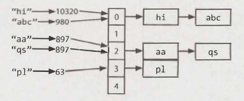

# Chapter 1 | 数组和字符串

希望本书的所有读者都熟悉数组和字符串，这样我们将不会再用这些细节来烦你。相反，我们将专注于这些数据结构的一些更常见的技术和问题。

请注意，数组问题和字符串问题通常是可以互换的。也就是说，本书使用数组陈述的一个问题可以作为字符串问题来询问，反之亦然。

### Hash Tables

Hash table是一种通过键值映射以实现高效查找的数据结构。有很多方法可以实现这一点。在这里，我们将介绍一种简单但常见的实现。

在这个简单的实现中，我们使用一个链表数组和一个 hash code 方法。要插入 key（可以是字符串，也可以是其他任何数据类型）和 value，我们需要执行以下操作：

1. 首先，计算 key 的hash code，它通常是 int 或 long 类型的。注意，两个不同的 key 可能具有相同的 hash code，因为能存在无限数量的 key，而 int 类型的个数却是有限的。
2. 然后，将 hash code 映射到数组中的一个 index。这可以通过 `hash（key） % array_length` 之类的东西来完成。当然，两个不同的 hash code 可以映射到同一个 index。
3. 在这个 index 处，有一个 key 和 value 的链表。将 key 和 value 存储在此 index 处。我们必须使用链表，是因为存在以下的冲突：我们可能遇到两个不同的 key 共用相同 hash code，或者两个不同的 hash code 映射到同一个 index。

若要按其 key 来检索对应的 value，你需要重复这个过程。计算 key 的 hash code，再根据 hash code 计算 index。然后，使用这个 key 在链表中搜索 value。

如果冲突的数量非常高，最坏的情况运行时间是 O(N)，其中 N 是 key 的数量。但是，我们通常假设一个好的实现可以将冲突保持在最小，在这种情况下查找时间为 O(1)。

<div align=center></div>
或者，我们可以使用平衡二叉搜索树来实现 hash table。这种方法的查找时间为 O(log N)。这样做的好处是可能占用更少的空间，因为我们不再分配大型数组。我们还可以按顺序遍历 key，这有时很有用。

### ArrayList & 可扩容数组

在某些语言中，数组（在本例中通常称为list）是可自动调整大小的。数组或 list 将随着添加数据项而增长。在其他语言中，如 Java，数组是固定长度的。需要创建数组时就定义其大小。

当你需要一个可以动态调整大小的数组类型数据结构时，通常可以选择 Arraylist。Arraylist 是一个根据需要调整自身大小的数组，同时仍然提供 O(1) 访问。一个典型的实现是，当数组已满时，数组的大小会加倍。每次加倍需要 O(n) 时间，但是这种情况很少发生，所以它的平摊插入时间（amortized insertion runtime）仍然是 O(1)。

```java
1 	Arraylist<String> merge(String[] words, String[] more) {
2 		Arraylist<String> sentence = new Arraylist<String>();
3 		for (String w : words) sentence.add(w);
4 		for (String w : more) sentence.add(w);
5 		return sentence;
6 	}
```

这是面试中必不可少的数据结构。确保你能够适应将要使用的任何语言中的动态调整大小的数组 / list。注意，数据结构的名称以及“调整因子（resizing factor）”（Java中为2）在不同语言中可能会有所不同。

*为什么平摊插入运行时间是 O(1)?*

假设你有一个大小为 N 的数组。我们可以倒推计算出每次扩容时需要复制的元素数量。可以看到，当我们将数组增加到 K 个元素时，该数组之前的大小就是这个数字的一半。因此，我们需要复制 K/2 个元素。

```markdown
最后一次扩容： n/2 elements to copy
前一次扩容  : n/4 elements to copy
前一次扩容  : n/8 elements to copy
前一次扩容  : n/16 elements to copy
...
第二次扩容  ： 2 elements to copy
第一次扩容  ： 1 element to copy
```

因此，插入N个元素的复制总数大致为 N/2 + N/4  + N/8  + ... + 2 + 1，刚好小于 N。

> 如果这个数列的总和对你来说不是很直观，那么想象一下：假设你要走一公里的路去商店。你步行 0.5 公里，然后 0.25 公里，然后 0.125 公里，以此类推。你永远不会超过一公里（尽管你会非常接近它）。

因此，插入N个元素总共的时间复杂度是 O(N)。这样平均每次插入是 O(1)，即便在最坏的情况下某些插入需要 O(N) 时间。

### StringBuilder

假设你正在拼接一个字符串列表，如下所示。这段代码的运行时间是多少？为简单起见，假设所有字符串都是相同的长度（即长为 x），且字符串的个数为 n。

```java
1 	String joinWords(String[] words) {
2 		String sentence = "";
3 		for (String w : words) {
4 			sentence = sentence + w;
5		}
6 		return sentence;
7 	}
```

在每次拼接时，都会创建一个新的字符串副本，并逐个字符地复制这两个字符串。第一次迭代需要复制 x 个字符。第二次迭代需要复制 2x 个字符。第三次迭代需要 3x，以此类推。因此总时间是 O(x + 2x + … + nx)。可以简化成 O(xn^2)。

> 为什么是 O(xn^2)？因为 1 + 2 + ... + n​ 等于 n(n+1)/2，或写为 O(n^2)。

StringBuilder 可以帮你避免这个问题。StringBuilder 只是创建一个包含所有字符串的可调整大小的数组，只有在必要时才将它们复制回字符串。

```java
1 	String joinWords(String[] words) {
2 		StringBuilder sentence = new StringBuilder();
3 		for (String w : words) {
4 			sentence.append(w);
5		}
6 		return sentence.toString();
7 	}
```

学习字符串、数组和通用数据结构的一个很好的练习是实现自己版本的 StringBuilder、HashTable 和 ArrayList。

**附加阅读**：Hash Table Collision Resolution (pg 636), Rabin-Karp Substring Search (pg 636).

---

### Interview Questions

---

- **1.1 是否唯一（Is Unique）**：实现一个算法来确定一个字符串中所有字符是否是唯一的。如果不能使用其他数据结构怎么办？
  
  *提示：#44, #777, #732*


- **1.2 检查全排列（Check Permutation）**：给定两个字符串，编写一个方法来确定其中一个是否是另一个的全排列。
  
  *提示：#7, #84, #722, #737*


- **1.3 URL化（URLify）**：编写一个方法，用 '%20' 替换字符串中的所有空格。你可以假设字符串在末尾有足够的空间来容纳额外的字符，并且给定了字符串的“真实”长度。（注意：如果用 Java 实现，请使用字符数组，以便可以在原来的空间（in place）执行此操作。）
  
  EXAMPLE
  
  ```
  Input: "Mr John Smith    ", 13
  Output: "Mr%20John%20Smith"
  ```

​		*提示：#53, #118*


- **1.4 回文全排列（Palindrome Permutation）**：给定一个字符串，编写一个函数来检查它是否是回文全排列。回文是指一个前后相同的单词或短语。全排列是字母的重新排列。回文不需要局限于字典中的单词。
  
  EXAMPLE
  
  ```
  Input: Tact Coa
  Output: True (permutations: "taco cat", "atco eta", etc.)
  ```
  
    *提示：#106, #121, #134, #136*


- **1.5 差一步（One Away）**：可以对字符串执行三种类型的编辑：插入字符，删除字符或替换字符。给定两个字符串，编写一个函数来检查它们是否相距一步编辑（或零步编辑）。
  
  EXAMPLE
  
  ```
  pale, ple -> true
  pales, pale -> true
  pale, bale -> true
  pale, bake -> false
  ```
  
    *提示：#23, #97, #130*


- **1.6 字符串压缩（String Compression）**：实现一种方法，使用重复字符的计数执行基本的字符串压缩。例如，字符串 `aabcccccaaa` 将变为 `a2blc5a3`。如果“压缩”后的字符串长度不会变得小于原始字符串的长度，那么你的方法应该返回原始字符串。你可以假设该字符串仅包含大写和小写字母（a ~ z）。
  
  *提示：#92, #110*


- **1.7 旋转矩阵（Rotate Matrix）**：给定一个由 `NxN` 矩阵表示的图像，其中图像中的每个像素为 4 字节，请编写一种将图像旋转 90 度的方法。你能做到吗？
  
  *提示：#51, #100*


- **1.8 零矩阵（Zero Matrix）**：编写这样一个算法，如果MxN矩阵中的元素为 0，则使其整个行和列均设置为 0。
  
  *提示：#17, #74, #702*


- **1.9 字符串旋转（String Rotation）**：假设你有一个 `isSubstring` 方法，该方法是检查一个单词是否是另一个单词的子字符串。给定两个字符串 s1 和 s2，编写代码以仅调用一次 `isSubstring` 来检查 s2 是否是 s1 的旋转（例如，“waterbottle” 是  “erbottlewat” 的旋转）。
  
  *提示：#34, #88, #704*


**附加问题**：面向对象设计(#7.12)，递归(#8.3)，排序和搜索(#10.9)，C++(#12.11 )，中等问题(#16.8, #16.17, #16.22)，困难问题(#17.4, #17.7, #17.13, #17.22, #17.26)。

提示从第 653 页开始。