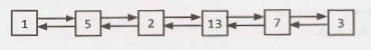

# Chapter 2 | 链表

链表是表示节点序列的数据结构。在单链表中，每个节点都指向链表中的下一个节点。双向链表为每个节点提供指向下一个节点和前一个节点的指针。

下图是一个双向链表：

<div align=center></div>

与数组不同，链表不提供对列表中特定 “index” 的固定时间访问。这意味着，如果你希望找到列表中的第 K 个元素，就需要遍历 K 个元素。

链表的好处是可以在固定的时间内从列表头添加和删除项。对于特定的应用程序，这可能很有用。  

### 创建链表

下面的代码实现了一个非常基本的单链表。

```java
1 	class Node {
2 		Node next= null;
3 		int data; 
4
5 		public Node(int d) {
6 			data= d;
7 		}
8
9 		void appendToTail(int d) {
10 			Node end= new Node(d);
11 			Node n = this;
12 			while (n.next != null) {
13 				n = n.next;
14 			}
15 			n.next = end;
16 		}
17 	}
```

在这个实现中，我们没有使用 LinkedList 数据结构。我们通过对链表头节点（head Node）的引用访问链表。以这种方式实现链表时，需要小心一点。如果多个对象需要引用链表，而链表的头节点发生了更改，该怎么办？一些对象可能仍然指向旧的头节点。

如果愿意，我们可以实现一个封装了 Node 类的 LinkedList 类。这实际上只有一个成员变量：head Node。这将在很大程度上解决前面所说的问题。

记住，当你在面试中讨论链表时，你必须清楚它是单链表还是双链表。

### 从单链表中删除节点

从链表中删除节点非常简单。给定一个节点 n，我们找到其前一节点 `prev` 并令 `prev.next = n.next`。如果实双向链表，我们还必须更新 `n.next`，令 `n.next.prev = n.prev`。 要记住的重要事项是（1）检查空指针和（2）根据需要更新头或尾指针。

此外，如果使用C、C++或其他需要开发人员进行内存管理的语言来实现此代码，则应考虑是否需要释放已删除的节点。

```java
1 	Node deleteNode(Node head, int d) {
2 		Node n = head;
3
4 		if (n.data == d) {
5 			return head.next; /* moved head */
6 		}
7
8 		while (n.next != null) {
9 			if (n.next.data == d) {
10 				n.next = n.next.next;
11 				return head; /* head didn't change */
12 			}
13 			n = n.next;
14 		}
15 		return head;
16 	}
```

### “Runner”技术

“runner”（或第二个指针）技术用于许多链表问题。runner 技术意味着你可以同时使用两个指针遍历链表，其中一个指针位于另一个指针之前。“快”节点可能领先固定的个数，或者它可能在“慢”节点遍历一个节点时跳过多个节点。

例如，假设你有一个链表 $a_1 \rightarrow a_2 \rightarrow ... \rightarrow a_n \rightarrow b_1 \rightarrow b_2 \rightarrow ... \rightarrow b_n$，并且你想把它重新排列成 $a_1 \rightarrow b_1 \rightarrow a_2 \rightarrow b_2 \rightarrow ... \rightarrow a_n \rightarrow b_n$。你不知道链表的长度（但是你知道长度是偶数）。

你可以使用一个指针 $p1$（快指针），在 $p2$ 每移动一个元素时 $p1$ 移动两个元素。当 $p1$ 到达链表的末尾时，$p2$ 将位于中点。然后，将 $p1$ 移回到链表头并开始“织入（weaving）”元素。在每次迭代中，$p2$ 选择一个元素并将其插入 $p1$ 之后。 

### 递归问题

许多链表问题依赖于递归。如果在解决链表问题时遇到困难，应该研究递归方法是否可行。这里我们不深入讨论递归，因为后面的一章将专门讨论它。

但是，你应该记住递归算法至少占用 $O(n)$ 空间，其中 n 是递归调用的深度。所有递归算法都可以替换成使用迭代实现，尽管它们可能要复杂得多。

---

### Interview Questions

------

