# Chapter 4 | 树和图

许多求职者发现树和图的问题是最棘手的。搜索一个树要比在一个线性组织的数据结构（例如数组或链表）中搜索要复杂得多。此外，最坏情况和平均情况下的时间复杂度可能会有很大差异，我们必须评估任何算法的两个方面。熟练地从头实现树或图将是必不可少的。

因为与图相比，大多数人对树更熟悉（而且它们也更简单些），所以我们将先讨论树。但这有点乱，因为树实际上就是一种图。

> 注：本章中的某些术语在不同的教科书和其他资料中可能略有不同。如果你习惯了不同的定义，那也没关系。但在面试中一定要和面试官澄清任何有歧义的地方。

### 树的类型

理解树的一种很好的方法是使用递归来解释。树是由节点（Node）组成的数据结构。

- 每棵树都有一个根节点。（实际上，这在图论中并不是绝对必要的，但通常我们在编程中使用树的方式就是这样，尤其是在编程面试中。）

- 根节点具有零个或多个子节点。

- 每个子节点都有零个或多个子节点，以此类推。  

树中不能有环。节点的顺序可能是特定的，也可能不特定，节点的值可以是任何的数据类型，并且它们可能有也可能没有返回到父节点的链接。

Node 的一个非常简单的类定义是： 

```java
1 	class Node {
2 		public String name;
3 		public Node[] children;
4 	}
```

你可能还想写一个 Tree 类来封装这个 node 。但出于面试问题的目的，我们通常不使用 Tree 类。如果你觉得这能使你的代码更简单或更好，你可以这样做，但事实上很少有这种情况。

```java
1 	class Tree {
2 		public Node root;
3 	}
```

树和图的问题经常是充满了模糊的细节和错误的假设。请务必理解下面的这些概念，并在必要时跟面试官澄清。

#### 树 vs. 二叉树
二叉树（binary tree）是指每个节点最多有两个子节点的树。并不是所有的树都是二叉树。例如，下面这个树不是二叉树。你可把它称为三元树（ternary tree）。

<div align=center>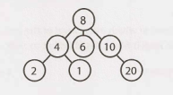</div>
有时候你可能需要一个不是二叉树的树。例如，假设你使用树来表示一串电话号码。在这种情况下，你可以使用 10 元树（10-ary tree），即每个节点最多包含10个子节点（每个节点代表一个数字）。

如果节点没有子节点，则称该节点为“叶子”节点。

#### 二叉树 vs. 二叉搜索树
二叉搜索树（binary search tree）是一种二叉树，其中每个节点都符合一个特定的排序属性：所有左子节点 <= n < 所有右子节点。对于每个节点 n 都必须如此。

> 二叉搜索树的定义在节点值相等时的处理方面可能略有不同。在某些定义下，树不能有重复的值。在其他情况下，重复的值将位于右侧，或者可以位于任意一侧。所有这些都是有效的定义，但前提是你应该和面试官说清楚。

注意，这个不等式必须对节点的所有后代都成立，而不仅仅是它的直接子节点。下图左边的树是一个二叉搜索树。右边的树不是，因为 12 在 8 的左子树里。

<div align=center>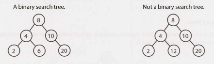</div>
当给出一个树的问题时，许多求职者下意识认为面试官说的是一个二叉搜索树。记住一定要问清楚。二叉搜索树的必要条件是，对于每个节点，其左子节点小于或等于当前节点，而当前节点小于右子节点。

#### 平衡 vs. 不平衡

虽然很多树都是平衡的，但并非所有树都平衡。让你的面试官在这里澄清一下。注意，平衡树并不意味着左右子树的大小完全相同（就像下图中的“完美二叉树”这样）。

一种理解方法是，“平衡”树实际上意味着“不是非常不平衡”。它的平衡程度足以确保 insert 和 find 的时间复杂度为 O(log n) ，但它并不一定像可能的那样平衡。

两种常见的平衡树是红黑树（pg 639）和AVL树（pg 637）。这些将在 Advanced Topics 这部分中进行更详细的讨论。

#### 完全二叉树
完全二叉树（complete binary tree）是一种除最后一层外，树的其他每一层都被完全填充的二叉树。最后一层满足从左到右填充。

<div align=center>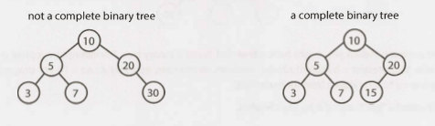</div>
#### 满二叉树
满二叉树（full binary tree）是一种二叉树，其中每个节点都有 0 个或 2 个子节点。也就是说，不存在某个节点只有一个子节点。

<div align=center>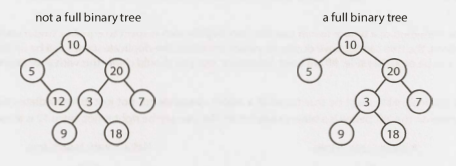</div>
#### 完美二叉树
完美二叉树（perfect binary tree）既满足完全二叉树特征，又满足满二叉树的特征。所有的叶子节点都在同一层，并且这一层拥有最大节点数。

<div align=center>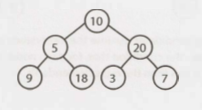</div>
注意，完美二叉树在面试和实际使用中很少见，因为完美树必须恰好有 2^k - 1 个节点（其中 k 是级树的层数）。在面试中，不要假设二叉树是完美的。

### 二叉树遍历

在面试之前，你应该能够轻松地实现中序遍历、前序遍历和后序遍历。其中最常见的是中序遍历。

#### 中序遍历
中序遍历（In-order traversal）意味着先“访问（visit）”（通常是打印）左边的分支，然后是当前节点，最后是右边的分支。

```java
1 	void inOrderTraversal(TreeNode node) {
2 		if (node != null) {
3 			inOrderTraversal(node.left);
4 			visit(node);
5 			inOrderTraversal(node.right);
6		}
7 	}
```

在二叉搜索树上执行时，它按升序访问节点（因此得名 “in-order”）。

#### 前序遍历
前序遍历（Pre-order traversal ）先访问当前节点，再访问其子节点（因此得名 “pre-order”）。

```java
1 	void preOrderTraversal(TreeNode node) {
2 		if (node != null) {
3 			visit(node);
4 			preOrderTraversal(node.left);
5 			preOrderTraversal(node.right);
6 		}
7	}
```

在前序遍历中，根节点总是被访问的第一个节点。

#### 后序遍历
后序遍历（Post-order traversal）先访问当前节点的子节点，再访问该节点(因此得名 “post-order”)。

```java
1 	void postOrderTraversal(TreeNode node) {
2 		if (node != null) {
3 			postOrderTraversal(node.left);
4 			postOrderTraversal(node.right);
5 			visit(node);
6		}
7 	}
```

在后序遍历中，根节点总是被访问的最后一个节点。

### 二叉堆（最小堆和最小堆）

我们在这里只讨论最小堆。最大堆本质上是相同的，但是元素的顺序是降序而不是升序。

最小堆是一个完整二叉树（也就是说，除了最后一层中最右边的元素之外，其他的都被填满了)，其中每个节点都比其子节点小。因此，根节点是树中的最小元素。

<div align=center>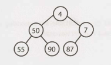</div>
在最小堆上有两个关键操作：insert 和 extract_min。

*插入（insert）*

当我们插入最小堆时，我们总是从底部插入元素开始。我们从最右边的位置插入，以便不破坏其完整二叉树的属性。

然后，我们通过将新元素与其父元素交换来“修复”树，直到找到适合该元素的位置。也就是将最小的元素向上冒泡（bubble up）。 

<div align=center>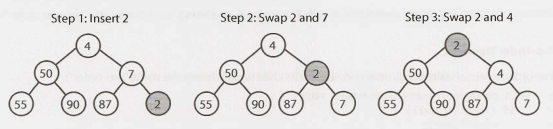</div>
这需要 O(log n) 时间，其中 n 是堆中的节点数。

*提取最小元素（Extract Minimum Element）*

找到最小堆的最小元素很容易：它始终位于顶部。而更棘手的部分是如何删除它。（事实上，这并不是那么棘手。）

首先，我们删除最小元素并将其与堆中的最后一个元素（最底部，最右侧的元素）交换。然后，我们向下冒泡（bubble down）这个元素，与它的一个子元素交换，直到最小堆属性恢复为止。

我们要和左子结点交换还是和右子结点交换？这取决于节点值的大小。在左右元素之间没有固有的顺序，但是你需要使用较小的元素来维护最小堆顺序。

<div align=center>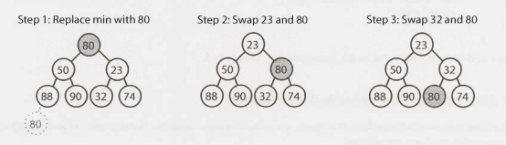</div>
这个算法也将花费 O(log n) 的时间。

### Tries（前缀树）

trie（有时称为前缀树，prefix tree）是一种有趣的数据结构。它在面试问题中经常出现，但是算法教科书并没有在这个数据结构上花费太多时间。

trie 是 n 元树的一种变体，其中字符存储在每个节点上。树下的每条路径都可以代表一个单词。

`*`节点（有时称为“空节点”）通常用于指示完整的单词。例如，MANY 下面有一个`*`节点的事实表明MANY 是一个完整的单词。MA 路径的存在表明有以 MA 开头的单词。

这些`*`节点的实际实现可能是一种特殊类型的子节点（例如 TerminingTrieNode，它继承自 TrieNode）。或者，我们可以在“父”节点内使用一个布尔标志终止。

trie 中的节点可以有 1 到 ALPHABET_SIZE + 1 个子节点（如果使用布尔标志而不是`*`节点，则可以是 0 到 ALPHABET_SIZE个 ）。

<div align=center>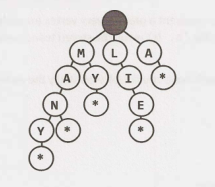</div>
通常，trie 用于存储整个（英语）语言文字以进行快速前缀查找。虽然 hash table 可以快速查阅一个字符串是否是有效单词，但它无法告诉我们一个字符串是否是任何有效单词的前缀。trie 可以很快地做到这一点。

> 有多快呢？trie 可以在 O(K) 的时间内检查一个字符串是否是有效前缀，其中 K 是字符串的长度。这实际上与 hash table 的运行时（runtime）相同。虽然我们经常将 hash table 查找的运行时称为 O(1)，但这并不完全正确。hash table 必须读取输入中的所有字符，在单词查找的情况下需要 O(K) 时间。

许多涉及有效单词列表的问题都使用 trie 作为优化。当我们在树中反复搜索相关前缀时（例如，查找M，然后 MA，然后 MAN，然后 MANY），我们可以传递对树中当前节点的引用。这将允许我们只检查 Y 是否是 MAN 的子节点，而不是每次都从根节点开始。

### 图

树实际上是一种图，但不是所有的图都是树。简而言之，树是没有环的连通图（connected graph）。

图就是通过边来互相连接的节点的集合。

- 图可以是有向的（如下图所示），也可以是无向的。有向边就像单行道，无向边就像双行道。

- 图可能由多个独立的子图组成。如果每对顶点之间都有一条路径，则称为“连通图（connected graph）”。

- 图也可以有环（或没有）。 “无环图（acyclic graph）”是没有环的图。

直观上，你可以这样画一个图: 

<div align=center>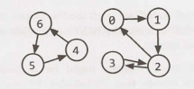</div>
在编程方面，有两种常用的方法来表示图。

#### 邻接表（Adjacency List）
这是表示图最常用的方法。每个顶点（或节点）存储一个邻接顶点表（list of adjacent vertices）。

在无向图中，像 (a, b) 这样的边会被存储两次：一次在 a 的邻接顶点中，一次在 b 的邻接顶点中。

图节点的简单类定义看起来与树节点基本相同。

```java
1 	class Graph {
2 		public Node[] nodes;
3 	}
4
5 	class Node {
6 		public String name;
7 		public Node[] children;
8 	}
```

之所以使用 Graph 类，是因为与树不同，你不一定能从一个节点到达所有节点。

你不需要任何额外的类来表示图。由列表（数组、arraylist、链表等）组成的数组（或 hash table）可以存储邻接表。上图可以表示为：

> 0: 1
> 1: 2
> 2: 0, 3
> 3: 2
> 4: 6
> 5: 4
> 6: 5

这个更紧凑一些，但看起来没有那么清晰。除非有令人信服的理由，否则我们还是倾向于使用节点类。

#### 邻接矩阵（Adjacency Matrices）
邻接矩阵是一个 NxN 布尔矩阵（其中N是节点的数量），其中当`matrix[i][j]`处的值为`true`时，表示从节点 i 到节点 j 存在一条边（也可以使用一个成分为 0 和 1 的整数矩阵来表示）。

在无向图中，邻接矩阵是对称的。而在有向图中，这不一定。

<div align=center>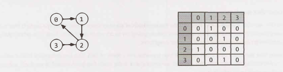</div>
邻接表中使用的图算法（广度优先搜索等）也可以使用邻接矩阵执行，但是它们的效率可能会有所降低。在使用邻接表来表示时，你可以轻松地遍历节点的邻居。在使用邻接矩阵来表示时，需要遍历所有节点来标识节点的邻接点。

### 图搜索

搜索图的两种最常用方法是深度优先搜索（depth-first search）和广度优先搜索（breadth-first search）。

在深度优先搜索（DFS）中，我们从根节点（或另一个任意选择的节点）开始，并在移动到下一个分支之前，先完全探索每个分支。即，先深度后广度（因此得名深度优先搜索）。

在广度优先搜索（BFS）中，我们从根节点（或另一个任意选择的节点）开始，并在对它的任何一个子节点的分支进行继续探索之前，先保证探索完它的每个邻接点。即，先广度后深度（因此得名广度优先搜索）。

请参阅下面对一个图及其深度优先和广度优先搜索的描述（假设邻接点按数字顺序迭代）。

<div align=center>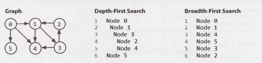</div>
广度优先搜索和深度优先搜索往往用于不同的场景。如果我们想访问图中的每个节点，通常首选 DFS。两者都可以很好地完成，但深度优先搜索的实现要更简单一些。

但是，如果我们想要找到两个节点之间的最短路径（或任何路径），BFS 通常会更好。

考虑将整个世界上所有的人际关系用一个图来表示，并尝试在 Ash 和 Vanessa 之间找到一条关系路径。

在深度优先搜索中，我们可能会经历这样一条路径，比如 Ash -> Brian -> Carleton -> Davis -> Eric -> Farah -> Gayle -> Harry -> Isabella -> John -> Kari ...，然后发现自己离得很远。这样我们可能绕了大半个世界，而无法意识到，事实上 Vanessa 直接就是 Ash 的朋友。我们最终还是会找到他们之间的关系路径，但可能需要很长时间。而且这往往也不是最短的路径。

在广度优先搜索中，我们将尽可能久地在靠近 Ash 的位置查找。我们可能会遍历 Ash 的许多朋友，但除非绝对必要，否则我们不会去搜索他那些相对更疏远的人脉关系。如果 Vanessa 是 Ash 的朋友，或者是他朋友的朋友，我们能够在相对较短的时间内地找到这条路径。

#### 深度优先搜索 (DFS)
在 DFS 中，我们访问一个节点 a，然后遍历 a 的每个邻接点。当访问 a 的邻接点 b 时，我们先访问 b 的所有邻接点，然后再访问 a 的其他邻接点。也就是说，a 比它的任何邻接点都先彻底地搜索 b 的分支。

注意，前序遍历和其他形式的树遍历是 DFS 的一种形式。关键的区别在于，在为图实现这种算法时，我们必须检查节点是否已被访问。如果我们不这样做，我们就有陷入无限循环的风险。

下面的伪代码实现了DFS。  

```java
1 	void search(Node root) {
2 		if (root == null) return;
3 		visit(root);
4 		root.visited = true;
5 		for each (Node n in root.adjacent) {
6 			if (n.visited == false) {
7				search(n);
8			}
9		}
10 	}
```

#### 广度优先搜索 (BFS)

BFS 没有那么直观，许多求职者在实现 BFS 时都会感觉到很纠结，除非他们对此已经足够熟悉。主要的障碍是（错误地）假设 BFS 是递归的。实际并不是，相反，它使用队列。

在 BFS 中，节点 a 在访问在访问完自己的所有邻接点之后，才会去访问其邻接点的邻接点。你可以将此视为从 a 开始逐级搜索。使用队列的迭代解决方案通常是效果最好的。

```java
1 	void search(Node root) {
2 		Queue queue = new Queue();
3 		root.marked = true;
4 		queue.enqueue(root); // Add to the end of queue
5
6 		while (!queue.isEmpty()) {
7 			Node r = queue.dequeue(); // Remove from the front of the queue
8 			visit(r);
9 			foreach (Node n in r.adjacent) {
10 				if (n.marked == false) {
11 					n. marked = true;
12 					queue.enqueue(n);
13				}
14			}
15 		}
16 	}
```

如果你被要求去实现 BFS，最关键是要记住使用队列。算法的其余部分都基于此。

#### 双向搜索（Bidirectional Search）

双向搜索用于寻找源节点和目标节点之间的最短路径。它通过同时运行两个广度优先搜索来进行，每个节点执行一个。当他们的搜索发生碰撞时，我们就找到了一条路径。

<div align=center>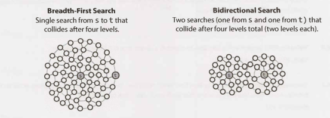</div>
为了了解为什么这更快，考虑一个图，其中每个节点最多具有 k 个相邻节点，并且从节点 s 到节点 t 的最短路径长度为 d。

- 在传统的广度优先搜索中，我们将在搜索的第一个“层级”中搜索最多 k 个节点。 在第二层中，我们将为那些前 k 个节点中的每一个搜索最多 k 个节点，因此总共 k^2 个节点（到目前为止）。我们这样做 d 次，这样就是 O(k^d) 个节点。

- 在双向搜索中，我们的两个搜索在大约在执行到 d/2 层（路径的中点）之后发生碰撞。从节点 s 开始的搜索大约访问 k^(d/2) 个节点，从节点 t 开始的搜索也是如此。 这总共给大概是 2*k^(d/2) 或 O(k^(d/2)) 个节点。  

这似乎是一个微小的差异，但事实并非如此，差距是很大的。回忆一下 (k^(d/2)) * (k^(d/2)) = k^d。双向搜索实际上要快 k^(d/2) 倍。

换句话说：如果我们的系统只能支持在广度优先搜索中搜索 “friend of friend” 路径，那么它现在可能会支持 “friend of friend of friend of friend” 路径。即我们可以支持原先两倍长的路径。

**附加阅读**：Topological Sort (pg 632), Dijkstra's Algorithm (pg 633), AVL Trees (pg 637), Red-BlackTrees (pg 639).

------

### Interview Questions

------

- **4.1 节点间路线（Route Between Nodes）**：给定一个有向图，设计一个算法来判断两个节点之间是否有存在一条路线。

  *提示：#127*

  

- **4.2 最小树（Minimal Tree）**：给定一个具有唯一整数元素的排序（递增顺序）数组，编写算法创建一个高度最小的二叉搜索树。

  *提示：#79, #73, #776*

  

- **4.3 深度列表（List of Depths）**：给定一个二叉树，设计一个算法，在每个深度创建一个该处所有节点的链表（例如，如果你有一个深度为 D 的树，你就会有 D 个链表）。

  *提示：#107, #123, #135*

  

- **4.4 检查平衡（Check Balanced）**：实现一个函数来检查二叉树是否平衡。出于此问题的目的，将平衡树定义为这样一种树：树中任意一个节点的两个子树的高度相差不会超过 1。

  *提示：#27, #33, #49, #705, #724*

  

- **4.5 验证BST （Validate BST）**：实现一个函数来检查二叉树是否是二叉搜索树。

  *提示：#35, #57, #86, #113, #128*

  

- **4.6 后继（Successor）**：编写一种算法，以在二进制搜索树中找到给定节点的“下一个”节点（即有序后继）。你可以假定每个节点都有一个指向其父节点的链接。

  *提示：#79, #91*

  

- **4.7 构建顺序（Build Order）**：给你一个项目列表和一个依赖项列表（这是一对项目的列表，其中第二个项目依赖于第一个项目）。所有依赖项必须在项目开始之前构建。找到一个允许构建项目的构建顺序。如果没有有效的构建顺序，则返回错误。

  **4.7构建顺序**:给你一个项目列表和一个依赖项列表（这是一对项目的列表，其中第二个项目依赖于第一个项目）。所有依赖项必须在项目开始之前构建。找到一个允许构建项目的构建顺序。如果没有有效的构建顺序，则返回错误。

  EXAMPLE

  ```
  Input:
  	projects: a, b, c, d, e, f
  	dependencies: (a, d), (f, b), (b, d), (f, a), (d, c)
  Output: f, e, a, b, d, c
  ```

  *提示：#26, #47, #60, #85, #725, #133*

  

- **4.8 第一个共同祖先（First Common Ancestor）**：设计一个算法，编写代码实现查找二叉树中两个节点的第一个共同祖先。避免在数据结构中存储额外的节点。注意：这不一定是二叉搜索树。

  *提示：#70, #76, #28, #36, #46, #70, #80, #96*

  

- **4.9 BST序列（BST Sequences）**：通过从左到右遍历一个数组并插入每个元素，创建二叉搜索树。给定一个具有不同元素的二叉搜索树，打印所有可能生成该树的数组。

  **4.9 BST序列**:通过从左到右遍历一个数组并插入每个元素，创建二叉搜索树。给定一个具有不同元素的二叉搜索树，打印所有可能生成该树的数组。

  EXAMPLE

  ```
  Input:
  ```

  <div align=center>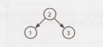</div>
  

  ```
  Output: {2, 1, 3}, {2, 3, 1}
  ```

  *提示：#39, #48, #66, #82*

  

- **4.10 检查子树（Check Subtree）**：T1 和 T2 是两个非常大的二叉树，T1 比 T2 大得多。创建算法以确定 T2 是否为 T1 的子树。如果在 T1 中存在节点 n，且该节点 n 的子树与 T2 相同，则 T2 是 T1 的一个子树。也就是说，如果你在节点 n 处砍下这个树，那么这两个树将是相同的。

  *提示：#4, #11, #18, #31, #37*

  

- **4.11 随机节点（Random Node）**：你将从头实现一个二叉树类，这个类除了插入、查找和删除外，还有一个方法 getRandomNode()，它从树中返回一个随机节点。所有节点被选择的概率应该是相等的。为 getRandomNode 设计和实现一个算法，并解释如何实现其余的方法。

  *提示：#42, #54, #62, #75, #89, #99, #112, #119*

  

- **4.12 带求和的路径（Paths with Sum）**：给定一个二叉树，其中每个节点包含一个整数值（可能是正的，也可能是负的）。设计一个算法来计算一个总和为给定值的路径总数。该路径不需要在根节点或叶节点处开始或结束，但必须向下（即只从父节点移动到子节点）。

  *提示：#6, #14, #52, #68, #77, #87, #94, #103, #108, #115*


**附加问题**：递归(#8.10)，系统设计和可扩展性(#9.2,#9.3)，排序和搜索(#10.10)，困难问题(#17.7,#17.12,#17.13,#17.14,#17.17,#17.20,#17.22,#17.25)。

提示从第 653 页开始。