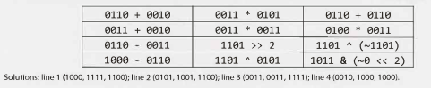
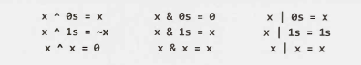
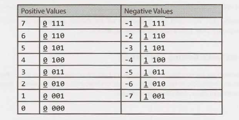
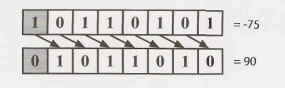
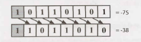

# Chapter 5 | 位操作

位操作用于处理各种各样的问题。有时候，会有问题明确说明需要通过位操作处理。但也有时候，位操纵只是被当做一种优化代码的技术来使用。你应该熟悉位操作，无论是手动计算还是使用代码实现。请小心，在进行位操作时很容易犯小错误。

### 手动位操作

如果你对位操作有些生疏，可以试试下面的手动计算练习。其中第三列中的项目可以完全靠手动解决，也可以使用一些“技巧”（如下所述）。为了简单起见，假设使用的都是四位的数字。

如果你搞混了，就将它们作为基数 10 （译者注，即十进制）进行处理。然后可以对二进制数应用相同的处理过程。记住 ^ 表示一个 XOR（异或），而 ~ 是一个 NOT（否定）。

<div align=center></div>
第三栏使用的技巧分别如下：

1. 0110 + 0110 等于0110 * 2，相当于将 0110 左移 1 位。

2. 0100 等于 4，乘以 4 就是左移 2 位。将 0011 左移 2 位，得到 1100。

3. 考虑将计算过程分解成一位一位地进行。如果将某位与它自己的否定值进行异或（XOR），则始终会得到 1。因此，a^(~a) 的解将是一个全部由 1 组成的序列。

4. ~0 会得到一个全部由 1 组成的序列，所以 ~0 << 2 结果是 1 的序列后面加两个 0。与另一个值按位与（AND）的话，将使该值的最后两位清零。

如果你没有立即想到这些技巧的话，请从逻辑上来考虑解决。

### 位操作的真相和技巧

下列表达式在位操作中很有用。不过，不要只是记住它们，仔细想想为什么这些都是正确的。我们使用 “1s” 和 “0s” 分别表示 1 或 0 的序列。

<div align=center></div>
要理解这些表达式，请回想一下这些操作是逐位发生的，其中一个位上发生的操作不会影响其他位。这意味着如果上述一个语句对于单个位为真，那么对于一个位序列也是正确的。

### 二进制补码和负数

计算机通常以二进制补码的形势存储整数。正数表示为自身，而负数表示为其绝对值的二进制补码（其符号位为 1 表示负值）。N 位数的二进制补码（其中 N 是用于该数字的位数，不包括符号位）是该数字关于 2^N 的补码。

让我们以 4 位整数 -3 为例。如果是一个 4 位的数字，我们有一位用于符号，三位用于该值。我们可以求关于 2^3 的补码，也就是 8。3（-3 的绝对值）关于 8 的补码（The complement of 3 with respect to 8，译者注，即 8 - 3）是 5。二进制中的 5 是 101。因此，二进制中 4 位数字的 -3 是1101，第一位是符号位。

换句话说，作为 N 位数字 -K（负K）的二进制表示是  `concat(1, (2^N-1) - K) `。

另一种理解方法是我们把正数表示中的各位取反，然后加1。3 在二进制中是 011。将各位取反得到 100，加 1 得到 101，然后将符号位 (1) 前置得到 1101。

在四位整数中，这将如下所示。

<div align=center></div>
观察到左边和右边的整数的绝对值之和总是为 2^3，并且左边和右边的二进制值是相同的，除了符号位。这是为什么呢？

### 算术右移 vs. 逻辑右移

右移操作符有两种类型。算术右移本质上就是除以 2。逻辑上的右移就是我们在视觉上看到的位的移动。这在负数上最能够体现。

在逻辑右移中，我们将位向右移位，并将0置于最高位。它由 `>>>` 运算符表示。对于8位整数（符号位是最高位）上，这将如下图所示。符号位用灰色背景表示。

<div align=center></div>
在算术右移中，我们将值向右移动，但用符号位的值填充空出的新位。

这（大致）具有除以 2 的效果。它由 `>>` 运算符表示。

<div align=center></div>
参数为 x=-93242 和 count=40 时，你觉得这些函数的运行结果会是什么？

```java
1 	int repeatedArithmeticShift(int x, int count) {
2 		for (int i = 0; i < count; i++) {
3 			x >>= 1; // Ar ith met ic shift by 1
4		}
5 		return x;
6	}
7
8 	int repeatedLogicalShift( int x, int count) {
9 		for (int i = 0; i < count; i++) {
10 			x >>>= 1; // Logical shift by 1
11		}
12 		return x;
13	}
```

逻辑移位操作下，我们最终会得到 0，因为我们不断地把 0 移到最高位上。

算术移位操作下，我们会得到 -1，因为我们不断地把 1 移到最高位上。一个全部由 1 组成的序列若指的是（带符号）整数，则其表示 -1。

### 常见的位操作方法：Getting 和 Setting

以下操作非常重要，但不要只是简单地记住它们。死记硬背只会导致你犯无法弥补的错误。相反，要理解如何实现这些方法，以便你可以解决这些以及其他的位操作问题。

#### Get Bit
此方法将 1 向左移位 i 位，创建一个类似于 00010000 的值。通过将前面得到的结果与 num 执行按位与（AND）操作，我们清除了 num 中除了第 i 位之外的所有位。最后，我们将其与 0 进行比较。如果结果不为零，则第 i 位必须为 1。不然则为0。

```java
1 	boolean getBit(int num, int i) {
2 		return ((num & (1 << i)) != 0);
3 	}
```

#### Set Bit
setBit 方法将 1 向左移位 i 位，创建一个类似于 00010000 的值。通过将前面得到的结果与 num 执行按位或（OR）操作，只有第 i 位的值才会改变。掩码（mask）的其他所有位都是零，因此按位或操作时不会影响 num 上其他各位的值。

```java
1 	int setBit(int num, int i) {
2 		return num | ( 1 << i);
3 	}
```

#### Clear Bit
该方法几乎与 setBit 相反。首先，我们创建一个像 11101111 这样的数字，具体操作是通过创建它的倒数（00010000）并对其进行取反运算。然后，我们将其与 num 执行按位与（AND）。这将清除第 i 位，其余部分保持不变。

```java
1 	int clearBit(int num, int i) {
2 		int mask = ~(1 << i);
3 		return num & mask;
4 	}
```

为了从最高有效位（most significant bit）到第 i 位（包括 i）清除所有位，我们在第 i 位创建一个1的掩码（1 << i）。然后，我们将其减去 1，得到一个由 0 组成的序列，并且后面跟着 i 个 1。然后我们用这个掩码和 num 执行按位与（AND），最终只留下最后的 i 位。

```java
1 	int clearBitsMSBthroughI(int num, int i) {
2 		int mask = (1 << i) - 1;
3 		return num & mask;
4 	}
```

要清除从第 i 位到第 0 位（包括0）的所有位，我们采用全部由 1 组成的序列（即-1），并将其向左移位 i + 1 位。我们得到一个由 1 组成的序列（在最高有效位上都是 1），并且后面跟着 i 个 0。

```java
1 	int clearBitsithrough0(int num, int i) {
2 		int mask = (-1 << (i + 1));
3 		return num & mask;
4 	}
```

#### Update Bit
要将第 i 位设置为值 v，我们首先使用看起来像 11101111 的掩码清除第 i 位的值。然后，我们将预期值 v，左移 i 位。这将创建一个第 i 位等于 v，其他位所有为0的数字。最后，我们对这两个数字进行按位或（OR）运算，如果 v为 1 则更新第 i 位，否则保持它为0。

```java
1 	int updateBit(int num, int i, boolean bitIs1) {
2 		int value = bitIs1 ? 1 : 0;
3 		int mask = ~(1 << i);
4 		return (num & mask) | (value << i);
5 	}
```

------

### Interview Questions

------


