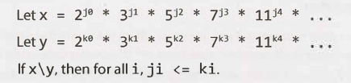
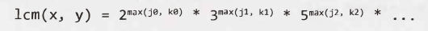
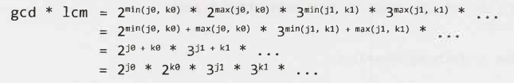
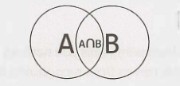

# Chapter 6 | 数学和逻辑难题

所谓的“智力题”（或脑筋急转弯）是最受争议的问题，许多公司都有禁止使用它们的政策。不幸的是，即使禁止了这些问题，你仍然可能会被问到其中之一。为什么？ 因为没有人可以就脑筋急转弯的定义达成共识。

好消息是，如果你被问到一个智力题或脑筋急转弯，它可能是一个相当公平的问题。它可能不会依赖于措辞技巧，而且几乎总是可以从逻辑上推导出来。许多人拥有数学或计算机科学的基础，而且几乎所有人的解决方案都可以从逻辑上推导出来。

我们将通过一些常见的方法以及一些基本的知识，来解决这些问题。

### 质数

你可能知道，每个正整数都可以分解成质数的乘积。例如：

<div align=center></div>

注意，许多质数的指数都是 0。

#### 可除性

上面提到的质数定律意味着，为了使数字 x 能整除数字 y（写成 x\y，或mod(y, x) = 0），x 的质因数分解中的所有质数都必须在 y 的质因数分解中。或者，更具体地说：

<div align=center></div>

实际上，x 和 y 的最大公约数是：

<div align=center></div>

x 和 y 的最小公倍数为：

<div align=center></div>

作为一个有趣的练习，停下来想一下如果使 gcd * lcm，会发生什么：

<div align=center></div>

<div align=center></div>

#### 检查质数

这个问题很常见，我们觉得有必要专门讨论一下。简单的方法是从 2 到 n-1 进行迭代，在每次迭代中检查可除性。

```java
1 	boolean primeNaive(int n) {
2 		if (n < 2) {
3 			return false;
4 		}
5 		for (int i = 2; i < n; i++) {
6 			if (n % i == 0) {
7 				return false;
8 			}
9 		}
10 		return true;
11 	}
```

一个小但重要的改进是只迭代到根号 n。

```java
1 	boolean primeSlightlyBetter(int n) {
2 		if (n < 2) {
3 			return false;
4 		}
5 		int sqrt = (int) Math.sqrt(n);
6 		for (int i = 2; i<= sqrt; i++) {
7 			if (n % i == 0) return false; 
8 		}
9 		return true;
10 	}
```

用根号 n 就足够了，因为对于每一个能整除 n 的数 a，都有一个补数 b，其中 a * b = n。如果 a > 根号 n ，那么 b < 根号 n  （因为 (根号 n )^2 = n ）。因此我们不需要 a 来检验 n 的质数，因为我们已经用 b 检验过了。

当然，实际上，我们真正需要做的就是检查 n 是否可以被质数整除。这就是埃拉托色尼筛（the Sieve of Eratosthenes）的作用。

#### 生成质数列表：埃拉托色尼筛（The Sieve of Eratosthenes）

Eratosthenes 筛法是生成质数列表的一种高效方法。它的原理是认识到所有非质数都能被一个质数整除。

我们首先列出所有数字，直到某个最大值为止。首先，我们划掉所有能被 2 整除的数。然后，我们寻找下一个质数（下一个未划去的数），并划去所有能被它整除的数。通过划去所有能被 2、3、5、7、11 等整除的数，我们得到了一个从 2 到最大值的质数列表。

下面的代码实现了 Eratosthenes 筛。

```java
1 	boolean[] sieveOfEratosthenes(int max) {
2 		boolean[] flags = new boolean[max + 1];
3 		int count = 0;
4
5 		init(flags); // Set all flags to true other than 0 and 1
6 		int prime = 2;
7 
8 		while (prime <= Math.sqrt(max)) {
9 			/* Cross off remaining multiples of prime */
10 			crossOff(flags, prime);
11
12 			/* Find next value which is true */
13 			prime = getNextPrime(flags, prime);
14 		}
15 
16 		return flags;
17 	}
18
19 	void crossOff(boolean[] flags, int prime) {
20 		/* Cross off remaining multiples of prime. We can start with (prime*prime),
21 		 * because if we have a k * prime, where k < prime, this value would have
22 		 * already been crossed off in a prior iteration. */
23 		for (int i = prime * prime; i < flags.length; i += prime) {
24 			flags[i] = false;
25 		}
26 	}
27
28 	int getNextPrime(boolean[] flags, int prime) { 
29 		int next = prime + 1;
30 		while (next < flags.length && !flags[next]) { 
31 			next++;
32 		}
33 		return next;
34 	}
```

当然，可以对此进行许多优化。一种简单的方法是仅在数组中使用奇数，这将使我们可以将空间使用量减少一半。

### 概率

概率可能是一个复杂的话题，但是它基于一些可以从逻辑上推导的基本定律。

让我们看一个维恩图来形象化两个事件 A 和 B。两个圆的面积表示它们的相对概率，重叠的区域是事件{A and B}。

<div align=center></div>

#### A and B 的概率

想象一下，你正对着这个维恩图掷飞镖。落在 A 和 B 重叠区域处的概率是多少？如果你知道落在 A 点的概率，并且你也知道 A 在 B 上的百分率（也就是说，在你落在A点的情况下，同时落在B点的概率），那么可以将概率表示为：

```
P(A and B) = P(B given A) P(A)
```

例如，假设我们正在选择一个介于 1 到 10（包括 10）之间的数字。选择的数字既是偶数又是一个介于 1 和 5 之间的数字的概率是多少？选择一个介于 1 和 5 之间的数字的概率是 50％，而 1 和 5 之间的数字是偶数的概率是 40%。因此，两者都是的概率是：

```
P(x is even and x <= 5)
	= P(x is even given x <= 5) P(x <= 5) 
	= (2/5) * (1/2)
	= 1/5
```

请注意，由于 `P(A and B) = P(B given A) P(A) = P(A given B) P(B)`，因此可以用相反的形式表示 `A given B` 的概率：

```
P(A given B) = P(B given A) P(A) / P(B) 
```

上面的方程叫做贝叶斯定理。

#### A or B 的概率

现在，假设你想要知道落在 `A or B` 上的概率是多少。如果你知道单独落在 A、B 每个上面的概率，你也知道落在覆盖区域概率，那么可以将概率表示为：

```
P(A or B) = P(A) + P(B) - P(A and B)
```

从逻辑上讲，这是有道理的。如果我们简单地把它们的大小相加，我们就会重复计算它们的交集。因此我们需要减去这个重复相加的部分。可以再次通过维恩图来形象化：

<div align=center></div>

例如，假设我们正在选择一个介于 1 到 10（包括 10）之间的数字。选择的数字是偶数，或者是一个介于 1 和 5 之间的数字的概率是多少？我们选择一个偶数的概率为50％，选择一个介于 1 和 5 之间的数字的概率是 50％。两者都做的概率是20％。因此，概率是：

```
P(x is even or x <=5)
	= P(x is even)+ P(x <= 5) - P(x is even and x <= 5)
	= 1/2 + 1/2 - 1/5
	= 4/5
```

从这里，获取独立事件和互斥事件的特殊情况规则很容易。

#### 独立

如果 A 和 B 是独立的（也就是说，一个事件发生不能代表另一事件的发生），则 `P(A and B) = P(A) P(B)`。这个规则简单地来自于认识到 `P(B given A) = P(B)`，因为 A 并不代表 B。

#### 互斥

如果 A 和 B 是互斥的（也就是说，如果一个发生，那么另一个就不会发生），则 `P(A or B) = P(A) + P(B)`。这是因为 `P(A and B) = 0`，所以这一项从先前的`P(A or B)` 方程中去掉了。

奇怪的是，许多人混淆了独立和互斥的概念。他们是完全不同的。实际上，两个事件不能既独立又互斥（假设两个概率都大于0）。为什么？因为互斥性意味着如果一个发生，那么另一个就不会发生。然而，独立性表示一个事件的发生完全与另一个事件无关。因此，只要两个事件的概率为非零，它们就永远不会相互排斥和独立。

如果一个事件或两个事件的概率为零（即不可能），那么这两个事件就既是独立的又是互斥的。这可以通过简单应用独立性和互斥性的定义（即公式）来证明。

### 开始交谈

遇到脑筋急转弯时不要惊慌。就像算法问题一样，面试官想知道你是如何解决问题的，他们不希望你立即知道答案。开始交谈，向面试官展示你是如何解决问题的。

### 开发规则和模式

在许多情况下，你会发现在解决问题时写下“规则”或模式是很有用的。是的，你确实应该把这些写下来——它会帮助你在解题时记住它们。让我们通过一个例子来演示这种方法。

你有两根绳子，每根都需要一个小时来燃烧。你将如何使用它们来精确地计时 15 分钟？注意，绳子的密度是不均匀的，所以绳子长度的一半不一定需要半个小时来燃烧。

> 提示：到此为止，花点时间尝试自己解决这个问题。如果绝对必须，请通读本节以获得提示——但是要慢慢读。每一段都会让你更接近答案。

从问题的陈述中，我们立即知道我们可以计时一小时。我们还可以计时两个小时，点燃一根绳子，等它烧完，然后点燃另一根。可以将其概括为一条规则。

*规则1*：给定一根绳子燃烧需要 x 分钟，另一根需要 y 分钟，我们可以计时 x+y 分钟。

我们还能用绳子做什么？我们可能会认为，在绳子的中间（或除绳子末端以外的任何地方）点燃一根绳子不会对我们有什么好处。火焰会向两个方向蔓延，我们不知道燃烧需要多长时间。

然而，我们可以在两头点燃一根绳子。两束火焰将在 30 分钟后汇合。

*规则2*：给定一根燃烧 x 分钟的绳子，我们可以计时 x/2 分钟。

现在，我们知道可以用一根绳子计时 30 分钟。这也意味着我们可以从第二根绳子上减少 30 分钟的燃烧时间，方法是从两端点燃绳 1，从一端点燃绳 2。

*规则3*：如果绳 1 燃烧需要 x 分钟，绳 2 需要 y 分钟，我们可以把绳 2 变成一根燃烧时间为 (y - x) 分钟或 (y - x/2) 分钟的绳子。

现在，让我们将所有这些拼在一起。我们可以将绳 2 变成燃烧时间为 30 分钟的绳子。如果然后在另一端点燃绳 2（请参阅规则 2），则绳 2 将在 15 分钟后燃烧完成。

从头到尾，我们的方法如下：

1. 从两端点燃绳 1，从一端点燃绳 2。
2. 当绳 1 上的两个火焰相遇时，30 分钟已经过去了。绳 2 的燃烧时间还剩 30 分钟。
3. 此时，在另一端点燃绳 2。
4. 在恰好 15 分钟后，绳 2 将全部烧完。

### 最坏情况转换

许多脑筋急转弯是使最坏情况最小化的问题（worst-case minimization problems），要么是最小化一个动作，要么是在做某件事时最多执行特定次数。一个有用的技巧是尝试“平衡”最坏的情况。也就是说，如果早期的决定导致最坏情况的发生，我们有时可以更改决策以平衡最坏情况。用一个例子来解释就最清楚不过了。

“九球”问题是一个经典的面试问题。你有九个球。八个重量相同，一个较重。你会得到一个天平，它只告诉你左边或右边哪个更重。仅秤两次，找出较重的球。

第一种方法是将球分成四个一组，第九个球放在一边。较重的球在较重的那一组中。如果它们的重量相同，那么我们就知道第九个球是较重的那个。对其余的组重复此方法将导致最坏的情况，即需要称重三次——多了一次！

在最坏的情况下，这是一种不平衡：第九个球只需要一次称重就可以发现它是否较重，而其他的球则需要称重三次。如果我们通过将更多的球放在一边来惩罚第九球，我们可以减轻其他球的负担。这是一个“平衡最坏情况（worst case balancing）”的例子。

如果我们把这些球分成三组，每组三个，我们就会知道哪组球重。我们甚至可以把它形式化为一个*规则*：给定 N 个球，其中 N 能被 3 整除，仅称一次就能使我们找到带有较重球的那 X/3 个球。

对于最后一组三个球，我们只需重复以下步骤：将一个球放到一边，然后称重两个。选择两者中较重的一个。或者，如果球的重量相同，则选择第三个。

### 算法的方法

如果你卡住了，可以考虑使用解决算法问题的其中一种方法来解决（从第 67 页开始）。脑筋急转弯通常只是去掉了技术方面的算法问题。Base Case 、Build 和 Do It Yourself (DIY) 这几部分的内容很有用。

**Additional Reading**： Useful Math (pg 629).

------

### Interview Questions

------


