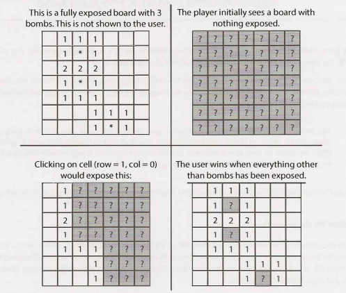

# Chapter 7 | 面向对象的设计

面向对象（Object-oriented）的设计问题要求候选人能草拟出实现技术问题或现实对象的类和方法。这些问题会让面试官对你的编码风格有一个深入的了解。

这些问题与其说是关于重复设计模式，不如说是关于说明您了解如何创建优雅的、可维护的面向对象代码。在这类问题上的糟糕表现可能会引发严重的危险信号（red flag）。

### 如何处理
无论对象是物理项还是技术任务，都可以用类似的方法处理面向对象的设计问题。下面的方法可以很好地解决许多问题。

#### 步骤1：处理歧义

面向对象设计（OOD）问题通常是有意含糊不清的，以便测试你是否会做出假设，或者是否会要求澄清问题。 毕竟，如果一个开发人员只是编写代码，而不理解她所期望创建的内容，将浪费公司的时间和金钱，并有可能会产生更严重的问题。

当被问及面向对象的设计问题时，你应该询问谁将使用它（who）以及它们将如何使用它（how）。根据实际问题，你甚至可以通过“六个W”来澄清，即：who、what、where、when、how、why。

例如，假设你被要求描述一个咖啡机的面向对象设计。这看起来很简单，对吧？ 实则并不完全是这样。

你的咖啡机可能是一台工业机器，设计用于大型餐厅，每小时为数百名顾客提供服务，并制作十种不同类型的咖啡产品。或者它可能是一台非常简单的机器，专为老年人设计用于制作简单的黑咖啡。这些用例将显著影响你的设计。

#### 步骤2：定义核心对象

既然我们已经理解了我们在设计什么，那么我们应该考虑系统中的“核心对象”是什么。例如，假设我们被要求为一家餐厅进行面向对象的设计。我们的核心对象可能是诸如 Table、Guest、Party、Order、Meal、Employee、Server 和 Host 之类的东西。

#### 步骤3：分析关系

或多或少地确定了我们的核心对象之后，我们现在要分析对象之间的关系。 哪些对象是其他对象的成员？是否有对象从其他对象继承？关系是多对多还是一对多？

例如，在餐厅（Restaurant）问题中，我们可能会提出以下设计：

- Party 上应该有很多 Guest。
- Server 和 Host 继承自 Employee。
- 每个 Table 都只有一个 Party，但是每个 Party 可以有多个 Table 。
- 该 Restaurant 只有一个 Host 。

在这里要非常小心——你可能会很容易做出错误的假设。例如，一张 Table 可能有多个 Party （在一些餐厅前卫的“公共餐桌”中很常见）。你应该跟你的面试官确认需要将设计做到何种通用程度。

#### 步骤4：探究对象的行为

此时，你应该已经有了你面向对象的设计的基本轮廓。剩下的就是考虑对象将采取的关键行为（key actions）以及它们之间是如何相互关联的。你可能会发现之前遗漏了一些对象，因此将需要更新设计。

例如，一群人（Party）走进餐厅（Restaurant），其中一位顾客（Guest）向主人（Host）要了一张桌子（Table）。主人（Host）查看预定单（Reservation），如果存在预订，则给这群人（Party）分配给一张桌子（Table）。否则，这群客人（Party）将被添加到列表的末尾。当一组客人（Party）离开时，桌子（Table）被释放并分配给列表中的新的一群人（Party） 。

### 设计模式
因为面试官想测试的是你的能力而不是你的知识，所以设计模式大多超出了面试的范围。然而，单例（Singleton）和工厂方法（Factory Method）设计模式在面试中经常会被用到，所以我们将在此简单做下介绍。

实际上设计模式的种类比本书可能会提及的要多得多。如果你想提高这方面的软件工程技能的，最好还是法是挑选一本专门针对这个领域的书。

要小心，不要陷入不断尝试为特定问题找到“正确”设计模式的陷阱。你应该创建适用于该问题的设计。在某些情况下，它可能是一个既定的设计模式，但在许多其他情况下则不是。

#### 单例类
单例模式（Singleton pattern）确保一个类只有一个实例，并确保通过应用程序访问该实例。如果你有一个只有一个实例的“全局”对象，它可能非常有用。例如，我们可以向下面这样实现 Restaurant类，使它只有一个 Restaurant 类的实例。

```java
1 	public class Restaurant {
2 		private static Restaurant _instance = null;
3 		protected Restaurant() { ... }
4 		public static Restaurant getlnstance() {
5 			if (_instance == null) {
6 				_instance = new Restaurant();
7 			}
8 			return _instance;
9 		}
10 	}
```

应该指出的是，许多人不喜欢单例设计模式，甚至称它为“反模式（anti-pattern）”。其中一个原因是它可能会干扰单元测试。

#### 工厂方法

工厂方法（Factory Method）提供了一个用于创建类实例的接口，其子类决定实例化哪个类。 你可以在 Creator 类是抽象类的情况下实现此操作，而无需为工厂方法提供实现。或者，你可以将 Creator 类作为具体类，并为工厂方法提供实现。在这种情况下，工厂方法将接受一个参数，该参数表示要实例化哪个类。

```java
1 	public class CardGame {
2 		public static CardGame createCardGame(GameType type) {
3 			if (type == GameType.Poker) {
4 				return new PokerGame();
5 			} else if (type == GameType.BlackJack) {
6 				return new BlackJackGame();
7 			}
8 			return null;
9 		}
10 	}
```

------

### Interview Questions

------

- **7.1 牌组（Deck of Cards）**：设计一个普通牌组的数据结构。解释如何使用这个数据结构来实现二十一点（blackjack）。

  *提示：#753, #275*

  

- **7.2 呼叫中心（Call Center）**：假设你有一个呼叫中心，员工分为三级：接线员，经理和主管。打进来的电话必须首先分配给有空的接线员。如果接线员不能处理呼叫，他或她必须将这个呼叫提交给经理。如果经理没有空闲或不能处理此呼叫，则应将此呼叫上升到主管那里。为这个问题设计类和数据结构。实现方法 dispatchCall()，该方法将呼叫分配给第一个可用的员工。

  *提示：#363*

  

- **7.3 点唱机（Jukebox）**：使用面向对象的原则设计一个音乐点唱机。

  *提示：#798*

  

- **7.4 停车场（Parking Lot）**：使用面向对象原则设计一个停车场。

  *提示：#258*

  

- **7.5 在线图书阅读器（Online Book Reader）**：设计在线图书阅读器系统的数据结构。

  *提示：#344*

  

- **7.6 拼图（Jigsaw）**：实现一个 NxN 拼图。设计数据结构，并说明完成拼图的算法。你可以假定你有一个 fitsWith 方法，该方法在传递两个拼图边缘时，如果两个边缘属于同一边，则返回 true。

  *提示：#192, #238, #283*

  

- **7.7 聊天服务器（Chat Server）**：说明如何设计一个聊天服务器。特别是，提供关于各种后端组件、类和方法的详细信息。最难解决的问题是什么？

  *提示：#213, #245, #271*

  

- **7.8 奥赛罗（Othello）**：奥赛罗的玩法如下：奥赛罗的每一块棋子都是一面白，另一面黑。当一个棋子的左右两边或上下两面都被对手包围时，我们就说它被抓到了，并且其颜色要被翻转。轮到你时，你必须抓到对手的至少一个棋子。当任一用户没有更多有效动作时，游戏结束。得分最高的人获胜。基于面向对象的原则设计实现奥赛罗。

  *提示：#179, #228*

  

- **7.9 环形数组（Circular Array）**：实现一个 CircularArray 类，它支持一种类似数组数据结构，以实现高效的旋转。如果可能，该类应该使用泛型类型（也称为模板），并支持以 `for (Obj o: circularArray)` 的方法实现迭代。

  *提示：#389*

  

- **7.10 扫雷（Minesweeper）**：设计并实现一个基于文本的扫雷游戏。扫雷是一个经典的单机游戏，在一个 NxN 的网格中隐藏着 B 枚地雷（或炸弹）。其余单元格要么是空白的，要么后面有数字。这些数字反映了周围八个单元中的炸弹数量。然后用户打开一个单元格。如果是炸弹，玩家就输了。如果它是一个数字，则显示该数字。如果它是一个空白单元格，那么这个单元格和所有相邻的空白单元格（直到并包括周围的数字单元格）都将显示出来。当所有非炸弹单元格都暴露出来后，玩家就获胜了。玩家还可以将某些地方标记为潜在炸弹。这不会影响游戏，除了能阻止用户不小心点击一个被认为有炸弹的单元格。（给读者的提示：如果你不熟悉此游戏，请先在线玩几轮。）

  <div align=center></div>

  *提示：#351, #361, #377, #386, #399*

  

- **7.11 文件系统（File System）**：说明用于设计内存文件系统的数据结构和算法。尽可能用一个代码示例进行说明。

  *提示：#141, #216*

  

- **7.12 哈希表（Hash Table）**：设计并实现一个哈希表，该哈希表使用链接（linked lists，链表）来处理冲突。

  *提示：#287, #307*

  

**附加问题**：线程和锁 (#16.3)

提示从第 662 页开始。