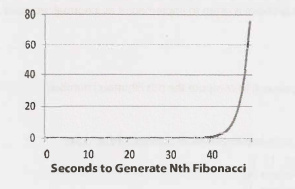
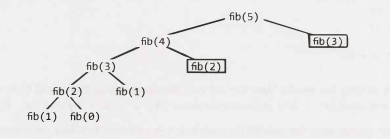
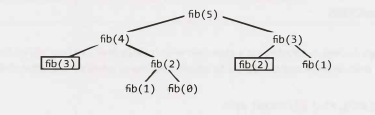

# Chapter 8 | 递归和动态规划

虽然存在大量的递归问题，但其中许多都遵循着类似的模式。判断一个问题是否是考察递归的，一个很好的暗示是这个问题可以由子问题构建而成。

当你听到以下列语句开头的问题时，它通常是（但并非总是）一个潜在的递归的问题：“设计一个算法来计算第 n 个......”，“编写代码以列出前 n 个……”， “实现一个方法来计算所有的……”，等等。

> 提示：根据我指导求职者的经验，人们在“这听起来像一个递归问题”这一直觉上通常有 50% 的准确率。利用这种直觉，因为 50% 也是很有价值的。但是不要害怕用不同的方式来看待问题，即使你最初认为它看起来是递归的。因为还有 50% 的可能性你是错的。

熟能生巧！你做的题越多，就越容易识别递归问题。

### 如何处理
根据定义，递归解决方案是基于子问题的解决方案构建的。很多时候，这意味着只需通过添加内容，删除内容或以其他方式更改f（n-1）的解来计算f（n）。在其他情况下，您可以解决数据集的前半部分，然后是后半部分的问题，然后合并这些结果。

你可以通过多种方式将问题划分为子问题。开发算法的三种最常用的方法是自下而上（bottom-up），自上而下（top-down）和一半一半（half-and-half）。

#### 自下而上的方法
自下而上的方法通常是最直观的。我们首先明确如何解决一个简单情况下的问题，比如只有一个元素的列表。然后我们弄清楚如何解决两个元素的问题，然后是三个元素，以此类推。这里的关键是考虑如何根据前一个案例（或多个以前的案例）为当前的案例构建解决方案。

#### 自上而下的方法
自上而下的方法可能更复杂，因为它不那么具体。但有时候，这是思考问题的最佳方式。

在这些问题中，我们考虑如何将案例 N 的问题划分为子问题。

小心案例之间的重叠。

#### 一半一半的方法
除了自上而下和自下而上的方法之外，将数据集分成两半通常也是有效的。

例如，二分搜索使用一种“一半一半（half-and-half）”方法。我们在有序数组中查找元素时，首先要确定数组的哪一半包含该值。然后我们在有值那一半进行递归搜索。

归并排序也是一种“一半一半（half-and-half）”的方法。我们对数组的每一半进行排序，然后将排序后的一半合并在一起。

### 递归 vs 迭代
递归算法的空间效率非常低。每次递归调用都会向堆栈添加一个新层，这意味着如果你的算法递归到 n 的深度，那么它至少会使用 O(n) 内存。

因此，迭代地实现递归算法通常更好。所有递归算法都可以迭代地实现，尽管有时候实现这样的代码要复杂得多。在深入研究递归代码之前，先问问自己迭代地实现它有多难，并与面试官讨论权衡。

### 动态规划 vs 记忆法（Memorizotion）
尽管人们对动态规划（Dynamic programming）问题的可怕程度大做文章，但实际上没有必要害怕它们。事实上，一旦你理解了，这些其实可能是非常容易的问题。

动态规划主要是采用递归算法并找到重叠的子问题（即重复调用）。然后缓存这些结果，以便将来进行递归调用。

或者，你可以研究递归调用的模式并实现迭代。你仍然要“缓存（cache）”之前的工作。

>术语说明：有些人把自上而下的动态规划称为“记忆法（memoization）”，只使用“动态规划”来指代自下而上的工作。我们在这里没有做出这样的区分。统称为动态规划。

动态规划的一个最简单的例子是计算第 n 个斐波那契数。处理这类问题的一个好方法将其作为正常的递归解决方案实现，然后添加缓存部分。

#### 斐波那契数列（Fibonacci Numbers）
让我们来看一下计算第 n 个斐波那契数的方法。

*递归*

我们将从递归实现开始。听起来很简单，对吧？

```java
1 	int fibonacci(int i) {
2 		if (i == 0) return 0;
3 		if (i == 1) return 1;
4 		return fibonacci(i - 1) + fibonacci(i - 2);
5 	}
```

这个函数的运行时间是多少？在回答之前想一下。

如果你说是 O(n) 或者 O(n^2)（很多人会这么说），请再想一想。研究代码所采用的代码路径。将代码路径画成树（即递归树）对本问题和许多递归问题都很有用。

<div align=center></div>
观察树上的叶子节点都是 fib(1) 和 fib(0)，它们表示基本案例。

树中的节点总数将表示运行时，因为每个调用在其递归调用之外只执行 O(1) 个工作。因此，调用的数量是运行时。

> 提示：对于以后的问题，请记住这一点。将递归调用绘制为树是计算递归算法运行时的一种很好的方法。

树中有多少节点？在我们开始处理基本案例（叶子）之前，可以看到除叶子外每个节点都有两个子节点。即每个节点分叉两次。

根节点有两个子节点。这些子节点中每个又分别都有两个子节点（所以“孙节点（grandchildren）”层总节点数为 4 个）。这些孙节点中每个又分别都有两个子节点，以此类推。如果我们这样做n次，我们会得到大约 O(2^n) 个节点。这样运行时大概为 O(2^n)。

>实际上，它略好于 O(2^n)。如果你看一下子树，你可能会注意到（除了叶子节点和它上面的那些节点）任何节点的右子树总是小于左子树。如果左右子树的大小相同，其运行时将为 O(2^n)。但由于左右子树的大小不同，真正的运行时间更接近于 O(1.6^n)。虽然说 O(2^n) 在技术上仍然正确，但它描述的其实是运行时的上限（参见“Big O, Big Theta,and Big Omega“，第39页）。不管怎样，我们仍然有一个指数级的运行时。

事实上，如果我们在计算机上实现这个，我们会看到秒数呈指数增长。

<div align=center></div>
我们应该寻找一种方法来优化它。

*自上而下动态规划（或记忆法）*

重新回到递归树。在哪里可以看到相同的节点?

可以发现有很多相同的节点。例如，fib(3) 出现两次，fib(2) 出现了三次。那为什么我们每次还要从头开始重新计算这些呢？

事实上，当我们调用 fib(n) 时，我们不应该做比 O(n) 更多的调用，因为只有 O(n) 个可能的值可以赋给 fib。每次计算 fib(i) 时，我们都应该缓存计算的结果并在以后直接使用这个结果。

这就是记忆法。

只需稍加修改，我们就可以将这个函数调整为在 O(n) 的时间内运行。我们只是在两次调用之间缓存fibonacci(i) 的结果。

```java
1 	int fibonacci(int n) {
2 		return fibonacci(n, new int[n + 1]);
3 	}
4
5 	int fibonacci(int i, int[] memo) {
6 		if (i == 0 || i == 1) return i;
7
8 		if (memo[i] == 0) {
9 			memo[i] = fibonacci(i - 1, memo) + fibonacci(i - 2, memo);
10 		}
11 		return memo[i];
12 	}
```

在一台典型的计算机上，第一个递归函数生成第 50 个斐波那契数可能需要超过一分钟的时间，而动态规划方法可以在几分之一毫秒内生成第 10000 个斐波那契数。(当然，使用这种精确的代码（exact code），int 值在很早就会溢出。)

现在，如果我们绘制递归树，它看起来像这样（黑框代表立即返回的缓存调用）：

<div align=center></div>
现在这棵树中有多少个节点？ 我们可能会注意到树现在直接向下延伸，深度大约为 n。这些节点中的每个节点都有一个其他的子节点，导致树中大约有 2n 个子节点。这需要 O(n) 的运行时间。

通常，将递归树描绘成如下所示是有用的：

<div align=center></div>
实际上递归不是这样发生的。但是，通过横向扩展节点而不是纵向扩展节点，你可以得到一棵在变深之前会变宽的树。（这就像是广度优先而不是深度优先。）有时这使得计算树中的节点数变得更容易。你真正要做的是更改要展开的节点和返回缓存值的节点。如果你坚持要计算动态编程问题的运行时，可以尝试这种方法。

*自下而上的动态规划*

我们也可以采用这种方法，并用自下而上的动态规划实现它。考虑做与递归记忆法相同的事情，但是要反过来。

首先，我们计算 fib(1) 和 fib(0)，这些已经从基本案例中得知。然后我们用这些来计算 fib(2)，再然后我们使用之前的答案来计算 fib(3)，然后是fib(4)，以此类推。

```java
1 	int fibonacci(int n) {
2 		if (n == 0) return 0;
3 		else if (n == 1) return 1;
4
5 		int[] memo new int[n];
6 		memo[0] = 0;
7 		memo[l] = 1;
8 		for (int i= 2; i < n; i++) {
9 			memo[i] = memo[i - 1] + memo[i - 2];
10		}
11 		return memo[n - 1] + memo[n - 2];
12 	}
```

如果你真的理解了这是如何工作的，你会发现只有在计算 memo[i+1] 和 memo[i+2] 时才需要用到 memo[i]。之后就不需要了。因此，我们可以去掉 memo 表，只存储一些变量。

```java
1 	int fibonacci(int n) {
2 		if (n == 0) return 0;
3 		int a = 0;
4 		int b = 1;
5 		for (int i = 2; i < n; i++) {
6 			int c = a + b;
7 			a = b;
8 			b = c;
9 		}
10 		return a + b;
11 	}
```

这基本上是将最后两个 Fibonacci 值的结果存储到 a 和 b 中。在每次迭代中，我们计算下一个值 (c = a + b)，然后将 (b, c = a + b) 移动到 (a, b) 中。

对于这样一个简单的问题，这种解释似乎有些过度了，但真正理解这个过程将使更困难的问题变得容易得多。阅读本章中的问题（其中许多使用动态规划）将有助于巩固你的理解。

**附加阅读**： Proof by Induction (pg 631).

---

### Interview Questions

------

