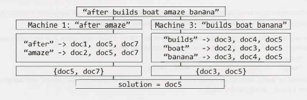

# Chapter 9 | 系统设计和可扩展性

尽管可扩展性问题看起来很吓人，但它可能是最简单的问题之一。没有“陷阱”，没有技巧，没有花哨的算法——至少通常没有。让许多人困惑的是，他们相信这些问题有某种“魔力”——一些隐藏的知识。

不是那样的。这些问题只是为了了解你在实际工作中的表现而设计。试想如果你的经理让你设计一些系统，你会怎么着手做呢？

这就是为什么你应该在面对这类问题时，要像在处理实际工作中的问题一样。多询问问题。契合你的面试官。讨论解决方案的取舍权衡。

我们将在本章中介绍一些关键概念，但要明白关键不在于记住这些概念。是，理解系统设计的一些重要组件可能很有用，但我们更多地是应该关注解决问题的流程。要记住，有好的解决方案和糟糕的解决方案。没有完美的解决方案。

### 对付这些问题

- **保持沟通**：系统设计问题的一个关键目标是评估你的沟通能力。和面试官保持互动。问他们问题。对系统问题持开放态度。

- **先注重广度**：不要直接进入算法部分，或过度专注于一部分。

- **使用白板**：使用白板可以帮助你的面试官 follow 你提出的设计方案。在一开始就使用白板来画出你的方案。

- **回应面试官的担忧**：你的面试官很可能会带着对方案的担忧来考察你。不要置之不理，要验证它们。承认面试官指出的问题，并做出相应的改变。

- **注意假设**：错误的假设可能会极大地改变问题。例如，如果你的系统为数据集生成分析/统计数据，那么这些分析是否必须完全是最新的就很重要了。

- **明确陈述你的假设**：当你做出假设时，请陈述它们。这让你的面试官在你犯错时可以帮忙纠正你，并且这也表明了你至少知道自己在做什么假设。

- **必要时估计**：在许多情况下，你可能没有所需的数据。例如，如果你正在设计一个网络爬虫，则可能需要估计存储所有 URL 所需的空间。你可以使用你知道的其他数据进行估算。

- **掌舵**：作为候选人，你应该掌控整个局面（stay in the driver's seat）。这并不意味着你不与面试官交谈；事实上你必须和面试官多沟通。但是，不要被问题影响自己的主线思路。多问问题。对权衡持开放态度。继续深入。继续改进。

这些问题主要是关于在解决过程的需要注意的，而不是针对最终的设计。

### 设计：Step-By-Step

如果你的经理要求你设计一个像 TinyURL 这样的系统，你可能不会只是说个“OK”，然后把自己锁在办公室里自己设计吧。在做之前你可能会有很多的问题要去问。这也应该是你在面试中处理设计问题的方式。

#### Step 1：审题
如果你不知道自己将要设计什么，你就不能开始设计一个系统。确定问题的范围非常重要，因为你要确保你在构建面试官想要的东西，因为这可能是面试官特别看重的。

如果你被问到诸如“设计 TinyURL ”之类的问题，你需要了解具体需要实现什么。人们能够指定自己的短 URL 吗？还是全部自动生成？你需要跟踪任何点击的统计数据吗？URL 应该永远保持活动状态，还是有超时机制？

这些是在进一步讨论之前必须回答的问题。

在这里列出主要特性或用例。例如，对 TinyURL来说，它可能是：

- 将 URL 缩短为 TinyURL。

- URL 的分析。

- 检索与 TinyURL 关联的 URL。

- 用户帐户和链接管理。

#### Step 2：做出合理的假设

可以做一些假设（必要时），但它们应该是合理的。例如，假设你的系统每天只需要处理100个用户，或假设你有无限的可用内存，这些都是不合理的。

然而，每天最多设计 100 万个新 URL 可能是合理的。做出这个假设可以帮助你计算系统可能需要存储多少数据。

有些假设可能需要一些“产品意义”（这不是一件坏事）。例如，数据最多 10 分钟就过期了，这样可以吗？这要看情况而定。如果刚刚输入的 URL 需要 10 分钟才能工作，这将是一个破坏性的问题。人们通常希望这些 URL 立即生效。但是，如果是统计数据要在 10 分钟过期，那可能没问题。和你的面试官讨论这些假设。

#### Step 3：画出主要的组件
从椅子上站起来，走到白板前，绘制一张主要组件的设计图。你可能会有类似一台前端服务器（或一组服务器）的东西，可以从后端数据存储中提取数据。可能有另一组服务器在 internet 上搜索某些数据，还有一组服务器进行流程分析。按系统可能的样子来绘制这张图。

从头到尾梳理系统的运行流程。开始时用户输入一个新的URL。然后呢？

忽略较多的可扩展性挑战，假设简单、明显的方法就可以，在系统设计时可能对你会有所帮助。你将在第4步中处理重大问题。

#### Step 4：确定关键问题
一旦你心中有了一个基本的设计，接着就该专注于关键问题了。系统中的瓶颈或主要挑战是什么？

例如，如果你正在设计 TinyURL，你可能会考虑这样一种情况：虽然某些 URL 很少被访问，但是其他 URL 可能会突然达到峰值。如果一个 URL 被发布在 Reddit 或其他流行论坛上，就可能会发生这种情况。你不一定希望经常访问数据库。

你的面试官可能会提供一些指导。如果是这样，就接受指导并加以使用。

#### Step 5：根据关键问题重新设计
一旦确定了关键问题，就可以根据需要调整设计。你可能会发现它将涉及很多的重新设计，或者只是一些小的调整（如使用缓存）。

待在白板前，随着你的设计更改及时更新你的图。

对设计中的任何边界你都要讲出来。面试官可能会注意到它们，所以你要跟面试官讲清楚你也考虑到这些边界问题，这一点很重要。

### 可扩展的算法： Step-By-Step

在某些情况下，并不要求你设计整个系统。你只是被要求设计一个单一的功能或算法，但你必须以可扩展的方式进行设计。或者，可能有一个算法部分是更广泛的设计问题的“真正”焦点。

在这些情况下，尝试以下方法。

#### Step 1 ：提问
与之前的方法一样，提问以确保你真正理解了面试官的问题。面试官可能会（有意或无意）遗漏掉一些细节。如果你不能确切地理解问题是什么，则无法解决问题。
#### Step 2：假装
假装所有数据都可以放在一台机器上，并且没有内存限制。你将如何解决这个问题？这个问题的答案将为你的解决方案提供一个大致的轮廓。

#### Step 3：回到现实
现在回到原来的问题。你可以在一台计算机上安装多少数据，以及拆分数据时会出现什么问题？ 常见问题包括弄清楚如何在逻辑上划分数据，以及一台机器如何确定在哪里查找不同的数据。

#### Step 4：解决问题
最后，考虑一下如何解决你在 Step 2 中确定的问题。请记住，每个问题的解决方案可能是实际完全移除问题，也可能只是为了缓解问题。你可以继续（带有修改地）使用 Step 1 中概述的方法，但有时你需要从根本上改变方法。

请注意，迭代方法通常很有用。也就是说，一旦你解决了 Step 3 中的问题，就可能出现新问题，你也必须处理这些问题。

你的目标不是重构一个公司花费数百万美元构建的复杂系统，而是要证明你可以分析和解决问题。深挖你自己的解决方案中是展示这一点的绝佳方式。

### 核心概念

虽然系统设计问题并不是对你所知道的内容的真正测试，但了解一些概念可以使事情变得更加容易。我们将在这里给出一个简要的概述。所有这些都是深刻而复杂的主题，因此我们鼓励你使用在线资源进行更多的研究。

#### 水平扩展 vs. 垂直扩展
一个系统可以用以下两种方法之一来扩展。

- 垂直扩展意味着增加特定节点的资源。例如，你可以向服务器添加额外的内存，以提高其处理负载更改的能力。

- 水平扩展意味着增加节点的数量。例如，你可以添加额外的服务器，从而减少任何一台服务器上的负载。

垂直缩放通常比水平缩放容易，但它是有限的。你只能添加这么多的内存或磁盘空间。

#### 负载均衡
通常，可扩展网站的一些前端部分将被抛到一个负载均衡器之后。这就允许了系统能够均匀地分配负载，因而就不会出现某个服务器会崩溃并导致整个系统宕机的情况。当然，要做到这一点，你必须构建一个由克隆服务器（cloned servers）组成的网络，这些服务器本质上具有相同的代码并访问相同的数据。

#### 数据库反模式和 NoSQL
随着系统变得越来越大，加入 SQL 等关系数据库会变得非常慢。因此，你通常会避免使用它们。

反模式是其中一种解决方案。反模式意味着向数据库中添加冗余信息以加快读取速度。例如，想象一个描述项目和任务的数据库（其中一个项目可以有多个任务）。你可能需要获取项目名称和任务信息。你可以将项目名称存储在任务表中（除了项目表之外），而不是跨这些表进行连接。

或者，你可以使用 NoSQL 数据库。NoSQL 数据库不支持连接，并且可能以不同的方式构造数据。它被设计为更好地实现扩展。

#### 数据库分区（分片，Sharding）
分片意味着将数据分割到多台机器上，同时确保你有办法确定哪台机器上有哪些数据。

一些常见的分区方法包括：

- **垂直分区**：这基本上是按功能分区。例如，如果你正在构建一个社交网络，你可能有一个分区存储用于与配置文件相关的表，另一个分区用于消息，等等。这样做的一个缺点是，如果其中一个表变得非常大，你可能需要重新分区该数据库（可能使用不同的分区方案）。

- **基于 key（或基于 hash）的分区**：使用数据的某些部分（例如 ID）对其进行分区。一个非常简单的方法是分配 N 台服务器，并将数据根据key 计算 mod(key, n) 放在相应服务器上。与此相关的一个问题是，你拥有的服务器数量实际应该是固定的。添加额外的服务器意味着重新分配所有数据——这是一项非常昂贵的任务。

- **基于目录的分区**：在此方案中，你维护一个查找表，用于查找数据所在的位置。这使得添加额外的服务器相对容易，但是它有两个主要缺点。首先，查找表可能出现单点故障。其次，经常访问这个表会影响性能。

许多架构实际上最终使用多个分区方案。

#### 缓存
内存缓存可以非常快速地返回结果。它是一个简单的 key-value 对，通常位于应用程序层和数据存储之间。

当应用程序请求一条信息时，它首先尝试缓存。如果缓存不包含这个 key，那么它将在数据存储中查找数据。（此时，数据可能存储在数据存储中，也可能不存储在数据存储中。）

缓存时，你可以直接缓存一次查询请求及其结果。或者，你也可以缓存特定对象（例如，网站某个部分的渲染版本，或者最近的博客文章列表）。

#### 异步处理 & 队列
理想情况下，应该异步完成执行速度较慢的操作。否则，用户可能会一直等待进程完成。

在某些情况下，我们可以提前做到这一点（即我们可以预处理）。例如，我们可能有一个工作队列要更新网站的某些部分。如果我们正在运行论坛，其中一个工作可能是重新渲染一个列出最热门帖子和评论数量的页面。这个列表可能会有点过时，但这也许没有关系。这比用户仅仅因为某人添加了一条新评论使得缓存的页面无效，而在网站上等待加载要好得多。

在其他情况下，我们可能会告知用户等待，并在流程完成时通知他们。你之前可能已经在网站上看过这个。或许是当你开启了网站的某个新部分，它说需要几分钟才能导入你的数据，但是一旦完成，你就会收到通知。

#### 网络指标
关于网络的一些最重要的指标包括：

- **带宽**：这是在单位时间内可以传输的最大数据量。它通常以每秒比特（或类似的方式，如每秒千兆字节）表示。

- **吞吐量**：带宽是单位时间内可以传输的最大数据，而吞吐量是实际传输的数据量。

- **延迟**：这是数据从一端到另一端所需的时间。也就是说，它是发送方发送信息（即使是非常小的数据块）到接收方接收信息之间的延迟。

想象一下，你有一条传送带可以在工厂内传送物品。延迟是物品从一边到另一边所需的时间。吞吐量是每秒从传送带上滚落的物品数量。

建造一个更宽的传送带不会改变延迟。然而，它将改变吞吐量和带宽。你可以在传送带上放更多的物品，从而在给定的时间单位内传输更多的物品。
缩短传送带会降低延迟，因为物品在运输过程中花费的时间变得更少了。它不会改变吞吐量或带宽。因为每单位时间内从带上滚落的物品的数量是相同的。

制造更快的传送带将改变这三者。物品穿越工厂所需的时间缩短了。每单位时间，也会有更多的物品从传送带上滚下来。

带宽是指在最佳条件下每单位时间可以传输的物品数。吞吐量是机器运行不顺畅时实际花费的时间。

延迟很容易被忽视，但在特定的情况下，它可能非常重要。例如，如果你正在玩某些在线游戏，延迟可能是一个非常大的问题。如果你不能很快被告知对手的动向，你怎么能玩一款典型的在线体育游戏（比如双人足球游戏）呢？此外，与吞吐量不同，吞吐量至少可以通过数据压缩来加快速度，但对于延迟，你通常无能为力。

#### MapReduce
MapReduce 通常与 Google 联系在一起，但它的用途要广泛得多。MapReduce 程序通常用于处理大量数据。

顾名思义，MapReduce 程序要求你编写 Map 步骤和 Reduce 步骤。其余的由系统处理。

- **Map** 接收一些数据并发出一个 <key, value> 对。

- **Reduce** 接受一个 key 和一组关联的 value，并以某种方式“减少（reduces）”它们，发出一个新的 key 和 value。这一结果可能会返回给 Reduce 程序以进一步减少。

MapReduce 允许我们并行地进行大量处理，这使得处理大量数据的可扩展性更高。

有关更多信息，请参见 642 页的 “MapReduce”。

### 注意事项

除了前面要学习的概念之外，在设计系统时还应该考虑以下问题。

- **故障**：系统的任何部分都可能发生故障。你需要为许多或所有这些失败做计划。

- **可用性和可靠性**：可用性是系统运行时间百分比的函数。可靠性是系统在一定单位时间内运行的概率的函数。

- **Read-heavy vs. Write-heavy**：应用程序是否会执行大量读操作或大量写操作，这将影响设计。如果写多（write-heavy），你可以考虑排队写入（但是这里要考虑潜在的失败！）。如果读多（read-heavy），你可能需要缓存。其他设计决策也可能发生变化。

- **安全**：当然，安全威胁对系统来说是毁灭性的。考虑系统可能面临的问题类型，并围绕这些问题进行设计。

这只是让你开始了解一个系统的潜在问题。记住，在面试中要开诚布公地谈论你的权衡。

### 没有“完美”的系统

对于 TinyURL 或 Google Maps 或任何其他的系统，都没有一个单一的设计能够使它们完美运行（尽管有许多系统的工作非常糟糕）。总是有权衡的。对于一个系统，两个人可以有本质上不同的设计，在不同的假设下，他们都是优秀的。

在这些问题中，你的目标是能够理解使用场景、确定问题的范围、做出合理的假设、基于这些假设创建一个可靠的设计，同时对你的设计中的弱点保持开放的态度。不要指望它是完美。

### 例题

给定一个包含数百万个文档的列表，如何找到包含单词列表的所有文档？单词可以以任何顺序出现，但必须是完整的单词。也就是说，“book” 跟 “bookkeeper” 是不匹配的。

在开始解决问题之前，我们需要明确这是一次性操作，还是可以重复调用 `findWords` 过程的操作。假设我们将为同一组文档多次调用 `findWords`，因此，我们可以接受预处理的负担。

#### Step 1
第一步是假装我们只有几十个文档。在这种情况下，我们如何实现 `findWords` ？（提示：在继续阅读之前，先停下来尝试自己解决这个问题。）

一种方法是预先处理每个文档并创建一个哈希表索引。这个哈希表将从一个单词映射到包含该单词的文档列表。

```
"books" -> {doc2, doc3, doc6, doc8}
"many" -> {doc1, doc3, doc7, doc8, doc9}
```

要搜索 “many books”，我们只需在 “books” 和“ many ”的值上做一个交集,并返回结果为 `{doc 3, doc8}`。

#### Step 2
现在回到最初的问题。数百万个文档会带来什么问题？首先，我们可能需要在多台机器上划分文档。此外，根据各种因素，例如可能的单词数量和文档中单词的重复，我们可能无法在一台机器上拼装完整的哈希表。让我们假设情况就是这样。

划分过程引入了以下主要关注点：

1. 我们如何划分哈希表？ 我们可以通过关键字对其进行划分，这样指定的机器就包含了给定单词的完整文档列表。或者，我们可以按文档划分，这样一台机器只包含一个文档子集的关键字映射。
2. 一旦我们决定如何划分数据，我们可能需要在一台机器上处理一个文档，并将结果推给其他机器。这个过程是什么样的？（注意：如果我们按文档划分哈希表，则可能不需要此步骤。）
3. 我们需要一种方法来知道哪台机器保存着一段数据。这个查找表是什么样子的？它存储在哪里？

这里只列了三个问题。可能还有很多其他的。

#### Step 3
在 Step 3 中，我们寻找这些问题的解决方案。一种解决方案是按关键字的字母顺序划分单词，这样每台机器都控制一系列单词（例如，从 “after” 到 “apple”）。

我们可以实现一个简单的算法，按字母顺序遍历关键字，在一台机器上存储尽可能多的数据。当那台机器满了，我们可以移动到下一台机器。

这种方法的优点是查找表小而简单（因为它只能指定一定范围的值），并且每台机器都可以存储查找表的副本。然而，缺点是如果添加新文档或单词，我们可能需要执行昂贵的关键字迁移。

要查找与字符串列表匹配的所有文档，我们首先对列表进行排序，然后向每台机器发送一个查询请求，以查找该机器拥有的字符串。例如，如果我们的字符串是 “after builds boat amaze banana”，则机器 1 将获得 `{"after", "amaze"}` 的查找请求。

机器 1 查找包含 “after” 和 “amaze” 的文档，并在这些文档列表上取交集。机器 3 对 `{"banana", "boat", "build"}` 执行相同的操作，并对其列表取交集。

在最后一步中，初始机器将对机器 1 和机器 3 的结果取交集。

下图说明了此过程。

<div align=center></div>
---

### Interview Questions

------

