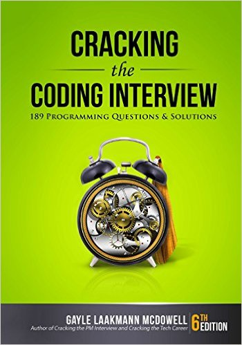

# 破解编码面试 - 中文翻译 

- 作者： [Gayle Laakmann McDowell](http://www.gayle.com/contact/)
- 原书名称：[Cracking the Coding Interview: 189 Programming Questions and Solutions](https://www.amazon.com/Cracking-Coding-Interview-6th-Edition/dp/0984782850)
- 译者：[F8F-1BearCat](https://f8f-1bearcat.github.io/about/) 

## 译者序

译者摸鱼的时候喜欢逛一亩三分地论坛，在 `终身学习>刷题` 板块里偶然发现了 CtCI 这本书。本书被誉为北美码农求职面试经典书籍，因书中包含 189 道编码题，所以也被称为 CC189，更早的版本为 CC150。

这本书介绍了 Microsoft、Google 等一线互联网公司的面试流程，讲解了该怎样准备面试、怎样回答技术问题，还单独拿出一些篇幅教你如何评估选择 Offer 以及如何跟 HR 进行 Negotiation。 当然，有关时间复杂度、空间复杂度以及具体的面试题目才是本书的重点。

本书的 189 道题目以数据机构和算法为主，其题目及答案占据了本书绝大部分的内容。此外，分别有一个章节涵盖分布式系统设计、C/C++、Java、数据库、多线程等知识性的内容，但是这些内容几乎都是浅尝辄止，旨在为读者提供一个简略却系统的知识框架，让读者可以根据自己的薄弱环节有目的的去强化训练。这 189 道题涵盖了编程面试中你可能遇到的大部分题型，题目有易有难，且所有题目都给出了比较常规的解题思路和答案，其中算法题目的实现使用了 Java 语言。当然有些解法不是最优，如果你有兴趣的话可以在此基础上自己尝试给出最优解。

就好比考 GMAT 之前要看 OG 一样，本书是针对编程面试的入门书籍。如果你工作多年，需要重新将数据结构和算法捡起来的话，本书很适合你；但如果你是打过 ACM 等算法比赛的大牛，或者从事与算法相关的工作，那这本书就可以直接跳过了。由于是面向编码面试的，本书自然不能避免其功利性，如果纯粹是想学习算法，可以去看一看 Programming Pearls 等书。本书的题目与实际面试相比还是稍简单的，如果你想进一步提升的话，建议到 Leetcode 上刷题，并自己消化总结。

顺便一提，一亩三分地论坛还经常提到另一本书：[Programming Interview Exposed](https://www.amazon.com/Programming-Interviews-Exposed-Secrets-Landing/dp/1118261364/?&_encoding=UTF8&tag=1point3acres-20&linkCode=ur2&linkId=f4a9f284abef2e91bbc0bc39a9cc3967&camp=1789&creative=9325)，这本书更基础一点，非科班零基础的小白可以尝试先从这本书入手。

最后，译者在此建议，有能力的读者最好还是去阅读本书的英文原版。

## 目录

#### [序](Foreword.md)
#### [引言](Introduction.md)
#### [I. 面试过程](I.The_Interview_Process.md)
#### [II. 幕后](II.Behind_the_Scenes.md)
#### [III. 特殊情况](III.Special_Situations.md)
#### IV. Before the Interview
#### V. Behavioral Questions
#### VI. Big O
#### VII. Technical Questions
#### VIII. The Offer and Beyond
#### IX. Interview Questions

**数据结构**

- [Chapter 1 I 数组和字符串](Chapter_1_Arrays_and_Strings.md)
- [Chapter 2 I 链表](Chapter_2_Linked_Lists.md)
- [Chapter 3 I 栈和队列](Chapter_3_Stacks_and_Queues.md)
- [Chapter 4 I 树和图](Chapter_4_Trees_and_Graphs.md)

**概念和算法**

- [Chapter 5 I 位操作](Chapter_5_Bit_Manipulation.md)
- Chapter 6 I 数学和逻辑难题
- [Chapter 7 I 面向对象的设计](Chapter_7_Object-Oriented_Design.md)
- [Chapter 8 I 递归和动态规划](Chapter_8_Recursion_and_Dynamic_Programming.md)
- [Chapter 9 I 系统设计和可扩展性](Chapter_9_System_Design_and_Scalability.md)
- [Chapter 10 I 排序与搜索](Chapter_10_Sorting_and_Searching.md)
- [Chapter 11 I 测试](Chapter_11_Testing.md)

**基础知识**

- [Chapter 12 I C 和 C++](Chapter_12_C_and_C++.md)
- [Chapter 13 I Java](Chapter_13_Java.md)
- Chapter 14 I 数据库
- [Chapter 15 I 线程和锁](Chapter_15_Threads_and_Locks.md)

**附加复习题**

- Chapter 16 I 中等
- Chapter 17 I 困难

#### [X. 答案](https://github.com/careercup/CtCI-6th-Edition)
#### XI. 进阶主题
#### [XII. 代码库](XII.Code_Library.md)
#### XIII. 提示
#### [XIV. 关于作者](XIV.About_the_Author.md)

注：本书的 `X. 答案` 部分为编码答案，本项目中不做翻译收录，需要阅读的同学可以阅读英文原版，或者 *CareerCup* 的这个项目：https://github.com/careercup/CtCI-6th-Edition 。

## 法律声明

> 《中华人民共和国著作权法》
> 第四节 权利的限制
> 第二十二条　在下列情况下使用作品，可以不经著作权人许可，不向其支付报酬，但应当指明作者姓名、作品名称，并且不得侵犯著作权人依照本法享有的其他权利：
> (六)为学校课堂教学或者科学研究，翻译或者少量复制已经发表的作品，供教学或者科研人员使用，但不得出版发行;

本项目是出于个人兴趣及学习目的而建立，仅供交流与学习研究之用，严禁公开传播发行或用于商业用途。有能力阅读英文书籍者请购买原版支持。

## LICENSE

本项目中的文档是根据 CC BY-NC-SA 4.0 许可协议授权的，该协议鼓励您共享这些文档。

详情见：[署名-非商业性使用-相同方式共享 4.0 国际  (CC BY-NC-SA 4.0)](https://creativecommons.org/licenses/by-nc-sa/4.0/deed.zh)