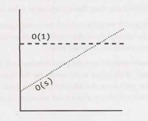
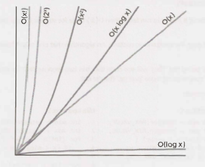
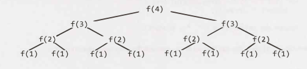
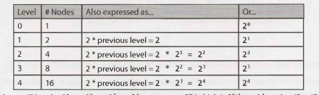

# VI. Big O

这是一个非常重要的概念，我们为此专门写了整整一章。

Big O time 是我们用来描述算法效率的语言和指标。在开发算法时，如果不能完全理解它可能会对你造成严重的伤害。你不仅可能因为没有真正理解 big O 而受到严厉地批评，而且也很难判断你的算法是变快了还是变慢了。

掌握这个概念。

### 一个类比

想象一下这样的场景：你的硬盘上有一个文件，需要把它发送给住在全国各地的朋友。你需要尽快将文件发送给你的朋友。你应该如何发送？

大多数人首先想到的是电子邮件、FTP或其他电子传输方式。这种想法是合理的，但只对了一半。

如果它是一个小文件，你当然是对的。到机场搭乘飞机，然后把它送到你的朋友那里，要花 5 到 10 个小时。

但是如果文件非常非常大呢？通过飞机运送是不是可能会更快呢？

实际上，是的。一个 1TB 的文件通过电子方式传输可能需要一天以上的时间。但如果让它通过飞机运送到全国，速度会快得多。如果你的文件很紧急（而且成本不是问题），你可能只想这么做。

如果没有航班，你不得不开车穿越整个国家呢？即使这样，对于一个非常大的文件，开车运送的速度也是较快的。

### 时间复杂度

这就是渐近运行时（asymptotic runtime）概念，或者说 big O time，的含义。我们可以将数据传输“算法”运行时描述为：

- 电子传输：O(s)，其中 s 为文件大小。这意味着传输文件的时间随文件的大小线性增加。(是的，这有点简化了，但是就当前的问题而言是可以接受的。)

- 飞机传输：O(1)，即使是考虑了文件的大小。随着文件大小的增加，将文件发送给你的朋友将不会花费更多的时间。时间是一个常数。

不管常数有多大，线性增长有多慢，线性增长总会在某个点上超过常数。

<div align=center></div>
除此之外，还有更多的运行时。最常见的有 O(log N)、O(N log N)、O(N)、O(N^2) 和 O(2^N)。但是，没有一个固定的内容为可能的运行时的列表。

你还可以在运行时中包含多个变量。例如，粉刷一个 w 米宽 h 米高的栅栏的时间可以被描述为 O(wh)。如果你需要刷 p 层油漆，那么你可以说时间是 O(whp)。

#### Big O、Big Theta 和 Big Omega

如果你从来没有在学术场合讨论过大O，你可以跳过这一小节。因为它更可能的是会让你感到困惑，而不是有所帮助。这个“供参考（FYI）”主要是为那些以前学过big O的人消除在措辞上的歧义，这样他们就不会说，“但是我以为 big O 的意思是……”

x学术上使用 big O, big Θ (theta), and big Ω (omega) 来描述运行时。

- **O (big O)**：在学术界，big O 表示时间的上限。打印数组中所有值的算法可以被描述为 O(N)，但也可以被描述为 O(N^2)、O(N^3) 或 O(2^N)（或许多其他的 big O time）。这个算法至少和这些 big O time 中任意一个一样快，因此说它们是运行时的上限。这类似于一种“小于或等于”的关系。如果 Bob 是 X 岁（我假设没有人超过130岁），那么你可以说 X <= 130。说 X <= 1,000 或 X <= 1,000,000 也将是正确的。因为在技术上，这都为真（尽管不是特别有用）。同样，打印数组中的值的简单算法的运行时是 O(N)，也可以是 O(N^3) 或任何大于 O(N) 的运行时。

- **Ω (big omega)**： 在学术界，Ω是对等的概念，但是适用于下限。打印数组中的值是Ω(N)，也可以是 Ω(log N) 和 Ω(1)。毕竟，你知道它不会比那些运行时快。

- **Θ (big theta)**： 在学术界，Θ 同时表示 O 和 Ω。也就是说，如果算法既是 O(N) 又是 Ω(N)，则算法为 Θ(N)。Θ 给出了严格限制的运行时。

在行业中（因此也是在面试中），人们似乎将 Θ 和 O 合并在一起。big O 的行业含义更接近于学术界所说的 Θ，因为将打印数组描述为 O(N^2) 被认为是不正确的。行业上只会说这是 O(N)。

在本书中，我们将以业界倾向于使用的方式使用 big O：始终尝试提供运行时最精确的描述。

#### 最佳情况，最坏情况和预期情况

实际上，我们可以用三种不同的方式描述算法的运行时。

让我们从快速排序的角度来看一下。快速排序选择一个随机元素作为“基准（pivot）”，然后交换数组中的值，以使小于基准的元素出现在大于基准的元素之前。这给出了“部分排序”，然后使用类似的过程递归地对左右两边排序。

- **最佳情况**：如果所有元素都相等，那么快速排序平均将只遍历数组一次。这是 O(N)。（这实际上在某种程度上取决于快速排序的实现。但是，有些实现将在有序数组上非常快地运行。）

- **最坏的情况**：如果我们真的很不幸，选取的基准屡次是数组中的最大元素，该怎么办？ （实际上，这很容易发生。如果选择子数组中的第一个元素为基准，并且以相反的顺序对数组进行排序，就会遇到这种情况。）在这种情况下，我们的递归不会将数组分成两半，而是在每一半上递归。它只是将子数组缩小了一个元素。这将退化为O(N^2) 运行时。

- **预期情况**：尽管如此，通常这些完美或糟糕的情况不会发生。当然，有时基准会非常低或非常高，但不会一次又一次地发生。我们可以期望运行时间为 O(N log N)。

我们很少讨论最佳情况下的时间复杂度，因为这不是一个非常有用的概念。毕竟，我们可以用任何算法，在特殊情况下的一些输入，然后在最佳情况下得到 O(1) 的时间。

对于大多数算法，最坏情况和期望情况是相同的。但是，有时它们是不同的，我们需要描述这两种运行时。

*最佳/最差/预期情况与 big O/theta/omega 之间有什么关系？*

候选人很容易混淆这些概念（可能是因为两者都有“较高”，“较低”和“完全正确”的概念），但是这些概念之间没有特定的关系。

最佳，最差和预期情况描述了特定输入或场景的 big O（或 big theta）时间。

Big O、big omega 和 big theta 描述了运行时的上限，下限和严格范围。

### 空间复杂度

时间不是算法中唯一重要的东西。我们还可能关心算法所需的内存或空间。

空间复杂度是一个与时间复杂度平行的概念。如果我们需要创建一个大小为 n 的数组，这将需要 O(n) 空间。如果我们需要一个大小为 n x n 的二维数组，则将需要 O(n^2) 空间。

递归调用中的堆栈空间也很重要。例如，这样的代码将占用 O(n) 时间和 O(n) 空间。

```java
1 	int sum(int n) { /* Ex 1. */
2 		if (n <= 0) {
3 			return 0;
4 		}
5 		return n + sum(n-1);
6 	}
```

每个调用都会向堆栈添加一层。

```
1 sum(4)
2 	-> sum(3)
3 		-> sum(2)
4 			-> sum(1)
5 				-> sum(0)
```

每个调用都被添加到调用堆栈，并占用实际内存。

但是，仅仅因为你总共有 n 次调用并不意味着它占用了 O(n) 空间。考虑下面的函数，它将 0 到 n 内相邻元素的相加：

```java
1 	int pairSumSequence(int n) {/* Ex 2.*/
2 		int sum = 0;
3 		for (int i = 0; i < n; i++) {
4 			sum += pairSum(i, i + 1);
5 		}
6 		return sum;
7 	}
8 
9 	int pairSum(int a, int b) {
10 		return a + b;
11 	}
```

对 pairSum 大约会有 O(n) 次调用。但是，这些调用不会同时存在于调用堆栈中，因此你只需要 O(1) 空间。

### 删除常量

对于特定的输入，O(N) 的代码很可能比 O(1) 的代码运行得快。Big O 只是表示增长率。

因此，我们删除了运行时中常量。一个可能曾被描述为 O(2N) 的算法事实上我们现在用 O(N) 表示。

许多人拒绝这样做。他们在看到具有两个（非嵌套）for 循环的代码时，会继续坚持认为这是 O(2N)。他们认为这样表述更加“精确”。其实不是。

考虑下面的代码：

**Min and Max 1** 

```java
1 	int min = Integer.MAX_VALUE; 
2 	int max = Integer.MIN_VALUE; 
3 	for (int x ： array) {
4 		if (x < min) min x; 
5 		if (x > max) max = x;
6 	}
```

**Min and Max 2**

```java
1 	int min = Integer.MAX_VALUE;
2 	int max = Integer.MIN_VALUE;
3 	for (int x ： array) {
4 		if (x < min) min = x;
5 	}
6 	for (int x ： array) {
7 		if (x > max) max = x;
8 	}
```

哪一个更快？第一个执行一个 for 循环，另一个执行两个 for 循环。但是，第一个方案每个 for 循环有两行代码，而不是一行。

如果你要计算指令的数量，那么你必须去到汇编层，考虑乘法比加法需要更多的指令，编译器将如何优化某些内容以及各种其他细节。

这将是极其复杂的事情，所以甚至不要走这条路。Big O 使我们能够表达运行时如何扩展。我们只需要明白，并不意味着 O(N) 总是比 O(N^2) 好。

### 删除非主导项

如何处理 O(N^2 + N) 这样的表达式？第二个 N 并不是一个常数，但它并不特别重要。

我们已经说过删掉常数。因此，O(N^2 + N^2)  就是 O(N^2)。如果我们不关心后面的 N^2 项，我们为什么要关心 N 呢？所以实际上我们没有。

你应该删除非主导项

- O(N^2 + N) 变成 O(N^2)。
- O(N + log N) 变成 O(N)。
- O(5*2^N + 1000N^100) 变成 O(2^N)。

我们可能在运行时表达式中仍保留一个和式。例如，表达式 O(B^2 + A) 不能被简化（在没有一些关于 A 和 B 的特殊说明时）。

下图描述了一些常见的 big O time 的增长率。

<div align=center></div>
可以看到，O(x^2) 比 O(x) 差得多，但远不及 O(2^x) 或 O(x!) 差。还有很多比 O(x!) 更糟糕的运行时，比如 O(x^x) 或 O(2^x * x!)。

### 多部分算法：加 vs. 乘

假设你有一个算法，它有两个步骤。什么时候将运行时相乘，什么时候将它们相加？

这是使候选人感到困惑的一个常见的原因。

**Add the Runtimes**： O(A + B)

```java
1 	for (int a ： arrA) { 
2 		print(a);
3 	}
4
5 	for (int b ： arrB) {
6 		print(b);
7 	}
```

**Multiply the Runtimes**： O(A*B) 

```java
1 	for (int a ： arrA) {
2 		for (int b ： arrB) {
3 			print(a + "," + b);
4 		}
5 	}
```

在前一个的示例中，我们先执行 A 代码块工作，然后执行 B 代码块工作。因此，总工作量为 O(A + B)。

在后一个的示例中，我们对 A 中的每个元素执行 B 代码块的操作，因此总工作量为 O(A * B)。

换一种说法：

- 如果你的算法是这样的形式：“执行这个操作，然后，当你完成了，执行那个操作”，那么你需要将运行时相加。

- 如果你的算法是这样的形式：“每次执行那个操作时，执行这个操作”，那么你需要将运行时相乘。

在面试中很容易把这个搞砸，所以要小心。

### 平摊时间（Amortized Time）

一个ArrayList，或者一个动态调整大小的数组，允许你在拥有大小灵活性的同时享受数组的好处。你不会耗尽 Arraylist 中的空间，因为它的容量会随着你插入元素而增长。

Arraylist 是用数组实现的。当数组达到容量限制时，Arraylist 类将创建一个容量加倍的新数组，并将所有元素复制到新数组。

如何描述插入的运行时间？这是一个棘手的问题。

数组可能是满的。如果数组包含 N 个元素，那么插入一个新元素将花费 O(N) 时间。你将不得不创建一个大小为 2N 的新数组，然后复制 N 个元素。因此该插入时间复杂度为 O(N)。

然而，我们也知道这并不经常发生。绝大多数的插入都在 O(1) 时间内进行。

我们需要一个兼顾两者的概念。这就是平摊时间（amortized time）的作用。我们得承认，确实，最坏的情况偶尔就会发生一次。但是一旦它发生了，它在很长一段时间内就不会再发生，所以其代价就被“平摊”了。

在这种情况下，平摊时间是多少？

插入元素时，我们将在数组大小为 2 的幂时将容量翻倍。即，在 插入 X 个元素之后，我们分别在数组大小为 1, 2, 4, 8, 16, ..., X 时，对容量进行了翻倍。每次翻倍分别需要 1, 2, 4, 8, 16, 32, 64, ..., X 次复制。

1 + 2 + 4 + 8 + 16 + ... + X 的总和是多少？如果你从左到右读这个和式，会发现它从1开始加倍，直到达到 X。如果你从右到左读，它从 X 开始，然后减半，直到 1。

那么 X + X / 2 + X / 4 + X / 8 + ... + 1 的总和是多少？ 这大约是 2X。

因此，X 次插入需要 O(2X) 的时间。每次插入的平摊时间是 O(1)。

### Log N 运行时

我们通常在运行时中看到 O(log N)。这是怎么来的？

让我们以二分查找为例。在二分查找中，我们要在一个 N 个元素的有序数组中查找元素 x。首先我们将 x 与数组的中点进行比较。如果 x == middle，则直接 return。如果 x < middle，则在数组的左侧搜索。如果 x > middle，则我们在数组的右侧搜索。

```java
search 9 within {1, 5, 8, 9, 11, 13, 15, 19, 21} 
	compare 9 to 11 -> smaller.
	search 9 within {1, 5, 8, 9, 11}
		compare 9 to 8 -> bigger
		search 9 within {9, 11}
			compare 9 to 9
			return
```

我们从一个 N 元素数组开始搜索。然后，只需一步，就剩下 N/2 个元素了。再走一步，我们就减少到 N/4 个元素。当我们找到值或只剩下一个元素时，我们就会停止。

然后，总运行时间取决于我们可以执行多少步骤（每次将 N 除以2），直到 N 变为 1。

```
N = 16
N = 8 	/* divide by 2 */ 
N = 4 	/* divide by 2 */ 
N = 2 	/* divide by 2 */ 
N = 1 	/* divide by 2 */ 
```

我们可以反过来看（从 1到 16 而不是 16 到 1）。将 1 乘以多少次 2 才能得到 N？

```
N = 1 
N = 2 	/* multiply by 2 */
N = 4 	/* multiply by 2 */
N = 8 	/* multiply by 2 */
N = 16 	/* multiply by 2 */
```

表达式 2 ^ k = N 中的 k 是多少？ 这正是 log 所表达的。

```
2^4 = 16 -> log₂16 = 4
log₂N = k -> 2^k = N
```

这是一个很好的技巧。当你看到一个问题时，如果问题空间（problem space）中的元素数量每次减半，那么运行时可能就是 O(log N)。

这也是为什么在平衡二叉搜索树中找到一个元素的时间是 O(log N) 的原因。每次比较时，我们都向左或向右移动。每边有一半的节点，所以我们每次将问题空间减半。

> log 的底是多少？问得好！简短的回答是，对于 big O 而言，这无关紧要。较长的解释可以在 630 页的 “Bases of Logs” 中找到。

### 递归运行时

这是一个棘手的问题。这段代码的运行时间是多少？

```java
1 	int f(int n) {
2 		if (n <= 1) {
3 			return 1;
4 		}
5  		return f(n - 1) + f(n - 1);
6 	}
```

很多人会因为某些原因，看到对f的两次调用，然后跳到O(N^2)这是完全错误的。

与其做假设，不如通过遍历代码来获得运行时。假设我们调用 f(4)，这个函数调用了两次 f(3)，而对 f(3) 的每次调用又都会调用 f(2)，直到 f(1) 为止。

<div align=center></div>
这个树上有多少次调用？（不要直接数！）

该树的深度（depth ）为 N。每个节点（即函数调用）有两个子节点。因此，每一层的调用次数都是上一层的两倍。每层节点数为：

<div align=center></div>
因此，将有2 ^ 0 + 2 ^ 1 + 2 ^ 2 + 2 ^ 3 + 2 ^ 4 + ... + 2 ^ N（即2 ^（N + 1）-1）个节点。（请参阅第630页上的“ 2的幂的和”。）

尝试记住这种模式。当你有一个进行多次调用的递归函数时，运行时通常（但不总是）看起来像 O(branches^depth)，其中 branch 是每个递归调用分支的次数。在这种情况下，我们得到O(2^N)。

> 你可能还记得，对于 big O 而言，log 的底数并不重要，因为不同底数的 log 仅相差一个常数。但是，这不适用于指数。指数的基数很重要。比较 2^n 和 8^n。展开 8^n，得到 (2^3)^n，等于 2^3n，等于 2^2n * 2^n。可以看到，8^n和 2^n 相差 2^2n。这不是一个常数！

该算法的空间复杂度为 O(N)。虽然树中总共有 O(2^N) 个节点，但在任何给定时间只有 O(N) 个节点存在。因此，我们只需要 O(N) 可用的内存即可。

### 示例和练习

Big O time 刚开始的确是一个困难的概念。然而，一旦你“通窍”了，它就变得相当容易。相同的模式一遍又一遍地出现，而且其他的你也可以推导出来。

我们将从简单的开始，逐步加大难度。

#### 示例 1

以下代码的运行时间是多少？

```java
1 	void foo(int[] array) {
2 		int sum = 0;
3 		int product = 1;
4 		for (int i = 0; i < array.length; i++) {
5 			sum =+ array[i);
6 		}
7 		for (int i = 0; i < array.length; i++) {
8 			product *= array[i];
9 		}
10 		System.out.println(sum + ", " + product);
11 	}
```

这将花费 O(N) 时间。我们遍历数组两次的事实并不重要。

#### 示例 2

以下代码的运行时间是多少？

```java
1 	void printPairs(int[] array) {
2 		for (int i = 0; i < array.length; i++) {
3 			for (int j = 0; j < array.length; j++) {
4 				System.out.println(array[i] + "," + array[j]);
5 			}
6 		}
7 	}
```

内部的 for 循环有 O(N) 次迭代，它被调用 N 次。因此，运行时间是 O(N^2)。

另一种方法是检查代码的“含义”。它正在打印所有的对（两个
元素序列）。有 O(N^2) 对，因此，运行时间是 O(N^2)。

#### 示例 3

这与上面的示例非常相似，但是现在内部的 for 循环从 i + 1 开始。

```java
1 	void printUnorderedPairs(int[] array) {
2 		for (int i = 0; i < array.length; i++) {
3 			for (int j = i + 1; j < array.length; j++) {
4 				System.out.println(array[i] + "," + array[j]);
5 			}
6 		}
7 	}
```

我们可以用几种方法推导出运行时间。

> 这种for循环的模式非常常见。了解运行时并深入理解它是很重要的。你不能仅仅依靠记住常见的运行时。深入理解很重要。

*计算迭代次数*

第一次通过 j 运行 N-1 步。第二次是 N-2 步。然后 N-3 步。以此类推。

因此，总步数为：

```
(N-1) + (N-2) + (N-3) + ... + 2 + 1
	= 1 + 2 + 3 + ... + N-1 
	= sum of 1 through N-1
```

1 到 N-1 的和是 N(N-1) / 2 （参见 630 页 “Sum of  Integers 1 through N”），所以运行时是 O(N^2)。

*它的含义是什么*

或者，我们可以通过思考代码的“含义”来确定运行时。它遍历 (i,  j) 中 j 大于 i 的每一对值。

总共有 N^2 对。其中约有一半是 i < j，另一半是 i > j，这段代码大概遍历了 N^2/2 对，所以它的运行时为 O(N^2)。

*观察它怎么工作*

当 N = 8 时，代码遍历以下 (i,  j) 对：

```
(0, 1) (0, 2) (0, 3) (0, 4) (0, 5) (0, 6) (0, 7)
	   (1, 2) (1, 3) (1, 4) (1, 5) (1, 6) (1, 7) 
			  (2, 3) (2, 4) (2, 5) (2, 6) (2, 7) 
					 (3, 4) (3, 5) (3, 6) (3, 7) 
							(4, 5) (4, 6) (4, 7) 
								   (5, 6) (5, 7) 
										  (6, 7)
```

这看起来像是 NxN 矩阵的一半，其大小（大约）为 N^2/2。因此，它需要 O(N^2) 的时间。

*平均工作时间*

我们知道外层循环运行 N 次。内层循环运行多少次？它随迭代而变化，但我们可以考虑平均迭代。

 `1, 2, 3, 4, 5, 6, 7, 8, 9, 10` 的平均值是多少？平均值在中间，大概是 5。(当然，我们可以给出更精确的答案，但对于 big O 而言，不需要这么做。)

那对于 `1, 2, 3, ... , N` 呢？这个序列的平均值是 N/2。

因此，由于内层循环平均执行 N/2 次工作并且运行 N 次，因此总工作量为 N^2/2，即 O(N^2)。

#### 示例 4

这与上面的类似，但是现在我们有两个不同的数组。

```java
1 	void printUnorderedPairs(int[] arrayA, int[] arrayB) {
2 		for (int i = 0; i < arrayA.length; i++) {
3 			for (int j = 0; j < arrayB.length; j++) {
4 				if (arrayA[i] < arrayB[j]) {
5 					System.out.println(arrayA[i] + "," + arrayB[j]);
6 				}
7 			}
8 		}
9 	}
```

我们可以拆开来分析。j 的 for 循环中的 if 语句是 O(1) 时间，因为它只是一个常量时间语句的序列。

我们现在有了这个：

```java
1 	void printUnorderedPairs(int[] arrayA, int[] arrayB) {
2 		for (int i= 0; i < arrayA.length; i++) {
3 			for (int j = 0; j < arrayB.length; j++) {
4 				/* O(1) work */
5 			}
6 		}
7 	}
```

对于 arrayA 的每个元素，内部的 for 循环都会进行 b 次迭代，其中 b = arrayB.length。如果 a = arrayA.length，则运行时间为 O(ab)。

如果你说 O(N^2)，那今后请你记住这个错误。它不是O(N^2)，因为有两个不同的输入。两者都重要。这是一个非常常见的错误。

#### 示例 5

那么这段奇怪的代码呢？

```java
1 	void printUnorderedPairs(int[] arrayA, int[] arrayB) {
2 		for (int i = 0; i < arrayA.length; i++) {
3 			for (int j = 0; j < arrayB.length; j++) {
4 				for (int k = 0; k < 100000; k++) {
5 					System.out.println(arrayA[i] + "," + arrayB[j]);
6 				}
7 			}
8 		}
9 	}
```

这里并没有什么实质性的改变。100,000 个单位话费的时间仍然是常数，所以运行时间还是 O(ab)。

#### 示例 6

下面的代码反转一个数组。它的运行时间是多少？

```java
1 	void reverse(int[] array) {
2 		for (int i = 0; i < array.length / 2; i++) {
3 			int other = array.length - i - 1;
4 			int temp = array[i];
5 			array[i] = array[other];
6 			array[other] = temp;
7 		}
8 	}
```

该算法运行时间为 O(N)。它仅遍历数组的一半（就迭代而言）这一事实并不会影响 big O time。

#### 示例 7

以下哪项哪一个等价于 O(N)？为什么？

- O(N + P), where P < N/2 

- O(2N)

- O(N + log N) 

- O(N + M)

让我们来看看这些。

- 如果 P < N/2，那么我们知道 N 是主导项所以我们可以去掉 O(P)。

- O(2N) 等于 O(N)，因为我们丢弃了常数。

- O(N) 主导 O(log N)，所以我们可以去掉 O(log N)。

- N 和 M 之间没有确定的关系，所以我们必须保留两个变量。

因此，除了最后一个，其余的都等价于O(N)。

#### 示例 8

假设我们有一个算法，它接收一个字符串数组，对每个字符串进行排序，然后对整个数组进行排序。运行时间是多少？

很多候选人会得出这样的结论：对每个字符串排序是 O(N log N)，并且我们必须对每个字符串进行排序，因此就是 O(N*N log N)。我们还必须对这个数组进行排序，所以这是一个额外的 O(N log N) 的工作。因此，总的运行时间是 O(N²log N + N log N)，也就是 O(N²log N)。

这是完全错误的。你发现错误了吗？

问题在于我们以两种不同的方式使用 N。在一种情况下，它是字符串的长度（哪个字符串？）。在另一种情况下，它是数组的长度。

在面试中，你可以完全不使用变量“ N”，或者仅在对 N 可以表示什么没有歧义时才使用它，以防止出现此错误。

实际上，我甚至不会在这里使用 a 和 b，或者 m 和 n。因为很容易忘记哪个是哪个，然后把它们完全搞混了。O(a^2) 运行时与 O(a*b) 运行时完全不同。

让我们定义新的术语，并使用符合逻辑的名称。

- 设 s 为最长字符串的长度。

- 设 a 为数组的长度。

现在我们可以通过以下几个部分来解决这个问题：

- 排序每个字符串为 O(s log s)。

- 我们必须对每个字符串（这里是字符串 a）执行此操作，所以是 O(a*s log s)。

- 现在我们要对所有的字符串排序。有字符串 a，所以你可能会说这要花费 O(a log a) 时间。这是大多数候选人会说的话。你还应该考虑到需要比较字符串。每个字符串比较需要 O(s) 的时间。存在 O(a log a) 个比较，因此这将花费 O(a*s log a) 的时间。

如果把这两部分相加，就得到 O(a*s(log a + log s))。

就是这个。没有办法进一步减少它。

#### 示例 9

下面的简单代码将平衡二叉搜索树中所有节点的值相加。它的运行时间是多少？

```java
1 	int sum(Node node) {
2 		if (node == null) {
3 			return 0;
4 		}
5 		return sum(node.left) + node.value + sum(node.right);
6 	}
```

仅仅因为它是一个二叉搜索树并不意味着它的运行时间里面有一个 `log`！

我们可以从两个方面来看。

*它的含义是什么*

最直接的方法是思考这段代码的含义什么。这段代码接触树中的每个节点一次，并对每个“接触”执行固定时间量的工作（不包括递归调用）。

因此，运行时就节点数而言将是线性的。如果有 N 个节点，则运行时间为 O(N)。

*递归模式*

在第 44 页，我们讨论了具有多个分支的递归函数的运行时的模式。让我们在这里尝试下这种方法。

我们说过，具有多个分支的递归函数的运行时间通常是 O(branches^depth)。每个调用有两个分支，所以我们得到 O(2^depth)。

在这一点上，许多人可能会认为，因为我们有一个指数算法，所以有些地方出了问题——我们的逻辑有缺陷，或者我们无意中创造了一个指数时间算法（呀!）

第二句话是正确的。我们确实有一个指数时间算法，但是它并不像人们想象的那样糟糕。考虑它关于哪个变量是指数的。

深度是多少？这是一棵平衡的二叉搜索树。因此，如果总共有 N 个节点，那么深度大约是 log N。

根据上面的方程，我们得到 O(2^log N)。

回顾一下 log₂ 的含义：

```
2^P = Q -> log₂Q = P
```

2^log N是多少？2 和 log 之间存在关系，因此我们可以化简一下。

令 P = 2 log N。根据 log₂ 的定义，我们可以写成 log₂P = log₂N。这意味着 P =N。

```
Let P = 2^log N
	-> log₂P = log₂N 
	-> P = N 
	-> 2^logN = N
```

因此，这段代码的运行时间是 O(N)，其中 N 是节点的数量。

#### 示例 10

以下方法来检查一个数字是否为质数，具体是通过检查小于它的数字的可除性。它只需要向上到 n 的平方根，因为如果 n 能被一个比它平方根大的数整除，那么它就能被比它小的数整除。

例如，虽然 33 可以被 11 整除（11大于33的平方根），与 11 的“对应”的因数为 3（3 * 11 = 33）。因此在使用 3 时已经将 33 排除为质数了。 

该函数的时间复杂度是多少？

```java
1 	boolean isPrime(int n) {
2 		for (int x = 2; x * x <= n; x++) {
3 			if (n % X == 0) {
4 				return false;
5 			}
6 		}
7 		return true;
8 	}
```

很多人把这个问题想错了。但如果你仔细考虑你的逻辑，这是相当容易的。

for 循环内部的工作是常数。因此，我们只需要知道在最坏的情况下 for 循环要执行多少次迭代。

for循环将在 x = 2 时开始，在 x*x = n 时结束。换句话说，当 x =√n 时（x等于n的平方根），for 循环停止。

这个 for 循环实际上是这样的：

```java
1 	boolean isPrime(int n) {
2 		for (int x = 2; x =< sqrt(n); x++) { 
3 			if (n % x == 0) {
4 				return false;
5 			}
6 		}
7 		return true;
8 	}
```

这需要 O(√n) 的时间。

#### 示例 11

下面的代码计算 n!（n的阶乘）。它的时间复杂度是多少？

```java
1 	int factorial(int n) {
2 		if (n < 0) {
3 			return -1;
4 		} else if (n == 0) { 
5 			return 1;
6 		} else {
7 			return n * factorial(n - 1);
8 		}
9 	}
```

这是一个从 n 到 n-1 到 n-2 一直到 1 的递归。这将花费 O(n) 时间。

#### 示例 12

这段代码计算字符串的所有排列。

```java
1 	void permutation(String str) {
2 		permutation(str, "");
3 	}
4 
5 	void permutation(String str, String prefix) {
6 		if (str.length() == 0) {
7 			System.out.println(prefix);
8 		} else {
9 			for (int i = 0; i < str.length(); i++) {
10 				String rem = str.substring(0, i) + str.substring(i + 1);
11 				permutation(rem, prefix + str.charAt(i));
12 			}
13 		}
14 	}
```

这是一个（非常！）棘手的问题。我们可以通过调用 permutation 方法的次数和每次调用的时间来考虑这个问题。我们的目标是尽可能缩小上限。

*permutation 方法在基本情况下被调用多少次？*

如果要生成一个排列，则需要为每个“槽（slot）”选择字符。假设字符串中有 7 个字符。在第一个槽中，我们有 7 个选择。选好字母后，下一个槽有 6 个选择。（请注意，这是前面 7 个选项中的每一个的 6 个选项。）然后，对于下一个槽，有 5 个选择，依此类推。

因此，选项的总数为 `7 * 6 * 5 * 4 * 3 * 2 * 1`，也表示为`7!`（7d 阶乘）。

这告诉我们有 `n!` 个排列。因此，在基本情况下 permutation 方法被调用了 `n!` 次（当 prefix 是全排列时）。

*permutation 方法在基本情况之前被调用多少次？*

但是，当然，我们还需要考虑第 9 行到第 12 行被命中的次数。绘制一个表示所有调用的大型调用树。有 `n!` 个叶子，如上所示。每个叶子都连接到一个长度为 n 的路径上。因此，我们知道不会超过 `n * n!` 个该树中的节点（函数调用）。

*每个函数调用需要多长时间？*

执行第 7 行需要 O(n) 时间，因为每个字符都需要打印。

由于字符串连接，第 10 行和第 11 行也将花费 O(n) 时间。注意 rem、prefix 和 str. charAt(i) 的长度之和始终为 n。

因此，调用树中的每个节点都对应 O(n) 的工作。

*总运行时间是多少？*

因为我们调用了 O(n * n!) 次（作为上限）permutation 方法，每次调用都需要 O(n)次，所以总的运行时不会超过 O(n^2 * n!)。

通过更复杂的数学，我们可以推导出一个更紧凑的运行时方程（尽管不一定是一个漂亮的封闭表达式）。几乎可以肯定，这超出了任何普通面试的范围。

#### 示例 13

下面的代码计算第 N 个斐波那契数。

```java
1 	int fib(int n) {
2 		if (n <= 0) return 0;
3 		else if (n == 1) return 1; 
4 		return fib(n - 1) + fib(n - 2);
5 	}
```

我们可以使用之前为递归调用建立的模式：O(branches^depth)。

每个调用有 2 个分支，我们深度到 N，因此运行时是 O(2^N)。

> 通过一些非常复杂的数学运算，我们实际上可以获得更紧凑的运行时。时间确实是指数的，但实际上更接近 O(1.6^N)。它不是 O(2^N) 的原因是，在调用堆栈的底部，有时只有一个调用。事实证明，许多节点都位于底部（大多数树都是这样），因此，单次调用与两次调用实际上会产生很大的差异。但是，说 O(2^N) 在面试范围内就足够了（并且，如果你阅读了有关第 39 页的 big theta 的说明，就会知道这从技术上讲也是正确的）。你可能会得到“额外的分数”，如果你能意识到它实际上会比这少。

一般来说，当你看到一个具有多个递归调用的算法时，你需要考虑指数运行时。

#### 示例 14

下面的代码打印从 0 到 n 的所有斐波那契数。它的时间复杂度是多少？

```java
1 	void allFib(int n) {
2 		for (int i = 0; i < n; i++) {
3 			System.out.println(i + "： "+ fib(i));
4 		}
5 	}
6 
7 	int fib(int n) {
8 		if (n <= 0) return 0;
9 		else if (n == 1) return 1;
10 		return fib(n - 1) + fib(n - 2);
11 	}
```

许多人会急于得出这样的结论，因为 fib(n) 需要 O(2^n) 的时间，被调用 n 次，那么它就是 O(n2^n)。

不要这么快下结论。你能找出逻辑上的错误吗？

错误是 n 是在变化的。的确，fib(n) 需要 O(2^n) 的时间，但重要的是 n 的值是多少。

相反，让我们遍历每个调用。

```
fib(1) -> 2^1 steps 
fib(2) -> 2^2 steps 
fib(3) -> 2^3 steps 
fib(4) -> 2^4 steps
...
fib(n) -> 2^n steps

```

因此，总工作量为：

```
2^1 + 2^2 + 2^3 + 2^4 + ... + 2^n
```

正如我们在第 44 页上展示的那样，这是 2^(n+1)。因此，计算前 n 个斐波那契数的运行时间（使用这个糟糕的算法）仍然是 O(2^n)。

#### 示例 15

下面的代码打印从 0 到 n 的所有斐波那契数。但是，这一次，它将先前计算出的值存储（即缓存）在整数数组中。如果已经计算过，它将仅返回缓存。它的运行时间是多少？

```java
1 	void allFib(int n) {
2 		int[] memo = new int[n + 1];
3 		for (int i = 0; i < n; i++) {
4 			System.out.println(i + "： " + fib(i, memo));
5 		}
6 	}
7 
8 	int fib(int n, int[] memo) {
9 		if (n <= 0) return 0;
10 		else if (n == 1) return 1;
11 		else if (memo[n] > 0) return memo[n];
12 
13 		memo[n]= fib(n - 1, memo) + fib(n - 2, memo);
14 		return memo[n];
15 	}
```

让我们来看看这个算法是怎么工作的。

```
fib(1) -> return 1
fib(2)
	fib(1) -> return 1 
	fib(0) -> return 0 
	store 1 at memo[2]
fib(3)
	fib(2) -> lookup memo[2] -> return 1 
	fib(1) -> return 1
	store 2 at memo[3]
fib(4)
	fib(3) -> lookup memo[3] -> return 2 
	fib(2) -> lookup memo[2] -> return 1 
	store 3 at memo[4]
fib(5)
	fib(4) -> lookup memo[4] -> return 3 
	fib(3) -> lookup memo[3] -> return 2 
	store 5 at memo[5]
...
```

在每次调用 fib(i) 时，我们都已经计算并存储了 fib(i-1) 和 fib(i-2) 的值。我们只需查找这些值，对它们求和，存储新结果，然后返回。这只需要固定的时间。

我们做了N次花费固定时间的工作，所以这是 O(N) 时间。

这种技术称为记忆法（memoization），是一种非常常见的优化指数时间递归算法的方法。

#### 示例 16

下面的函数从1到n（包括 1 和 n）打印2的幂。例如，如果 n 是4，它会输出 1、2 和 4。它的运行时间是多少？

```java
1 	int powers0f2(int n) {
2 		if (n < 1) {
3 			return 0;
4 		} else if (n == 1) {
5 			System.out.println(1);
6 			return 1;
7 		} else {
8 			int prev = powers0f2(n / 2); 
9 			int curr = prev * 2; 
10 			System.out.println(curr); 
11 			return curr;
12 		} 
13 	}
```

有几种方法可以计算此运行时间。

*它做了什么*

让我们来看看像 powers0f2(50) 这样的调用。

```java
powers0f2(50)
	-> powers0f2(25)
 		-> powers0f2(12)
			-> powers0f2(6)
				-> powers0f2(3)
					-> powersOf2(1)
						-> print & return 1 
					print & return 2
				print & return 4 
			print & return 8
		print & return 16 
	print & return 32
```

那么，运行时间就是我们将 50（或n）除以 2 直到得出基本情况(1)的次数。正如我们在第 44 页上讨论的那样，可以将 n 减半直到得到 1 的次数是 O(log n)。

*它的含义是什么*

我们也可以通过思考代码应该是做什么的，来得出运行时。它应该是为了从 1 到 n 计算 2 的幂。

对 powers0f2 的每次调用都会打印并返回一个数字（不包括递归调用中发生的情况）。因此，如果该算法在最后打印了 13 个值，那么 powers0f2 就是被调用了 13 次。

在本例中，我们被告知它打印了 1 到 n 之间的所有 2 的幂。因此，函数被调用的次数（也就是它的运行时）必须等于 1 到 n 之间的 2 的幂的个数。

在 1 和 N 之间有 log N 个 2 的幂，因此，运行时间为 O(log n)。

*增加速率*

处理运行时的最后一种方法是考虑当 n 变大时运行时如何变化。毕竟，这正是 big O time 的意义所在。

如果 N 从 P 变为 P+1，那么对 powersOfTwo 的调用数量可能根本不会改变。什么时候调用 powersOfTwo 的次数会增加？每次 n 大小加倍时，它将增加 1。

因此，每当 n 翻倍时，对 powersOfTwo 的调用次数就增加 1。因此，对powersOfTwo 的调用次数就是你从 1 开始执行翻倍直到得到 n 的所用的次数，它是方程 2x = n 中的 x。

x是什么？x 的值是 log n，这正是 x = log n 的含义。

因此，运行时为 O(log n)。

---

### Interview Questions

------


