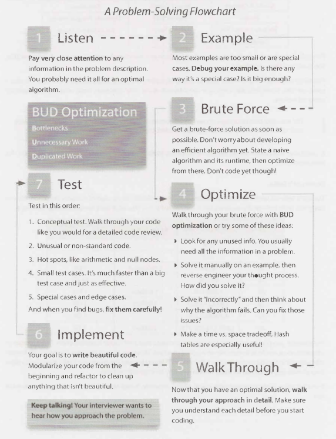
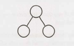
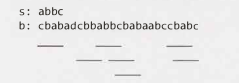

# VII. 技术问题

技术问题是许多顶级科技公司面试的基础。很多考生都被这些问题的难度吓到了，但还是有一些合理的方法来解决它们。

### 如何准备

许多候选人只是通读问题和答案。这就像试图通过阅读问题及其答案来学习微积分一样。你需要练习解决问题，单纯记住答案对你是没有多大帮助的。

对于本书中的每个问题（以及你可能遇到的任何其他问题），请执行以下操作：

1. 试着自己解决这个问题。在这本书的后面提供了一些提示，但是要逼着自己在尽可能少的帮助下给出答案。很多问题都是被设计成来刁难人的——这也没关系！当你解决一个问题时，一定要考虑空间和时间效率。
2. 把代码写在纸上。在计算机上编码提供了诸如语法高亮显示、代码补全和快速调试等功能，写在纸上的代码则不然。通过在纸上编码来习惯这种情况，适应以这样较慢的速度编写和编辑代码。
3. 在纸上测试代码。这意味着要测试一般情况、基本情况、错误情况等等。你在面试时需要这样做，因此最好事先进行练习。
4. 把你的纸面代码原样输入计算机。你可能会犯很多错误。列出所有你犯过的错误，这样你就能在面试时记住这些错误。

此外，尝试进行尽可能多的模拟采访。你和朋友可以轮流互相进行模拟面试。尽管你的朋友可能不是专家面试官，但他或她仍然可以引导你解决编码或算法问题。同时通过体验面试官的工作，你也会学到很多。

### 你需要知道什么

构和算法问题并不是针对知识点的测试。但是，他们确实也假定了一个知识基线。

#### 核心数据结构、算法和概念

大多数面试官不会问有关二叉树平衡或其他复杂算法的这类特殊算法。坦白说，由于已经离开学校几年了，他们可能也不记得这些算法。

你通常只需要知道基本的知识。以下是一些绝对必备的知识：

|       数据结构        |         算法         |          概念           |
| :-------------------: | :------------------: | :---------------------: |
|     Linked Lists      | Breadth-First Search |    Bit Manipulation     |
| Trees, Tries, &Graphs |  Depth-First Search  | Memory (Stack vs. Heap) |
|    Stacks & Queues    |    Binary Search     |        Recursion        |
|         Heaps         |      Merge Sort      |   Dynamic Programming   |
| Vectors / ArrayLists  |      Quick Sort      |   Big O Time & Space    |
|      Hash Tables      |                      |                         |

对于每个主题，确保你了解如何使用和实现它们、以及分别适用于什么情况，空间和时间复杂度分别是多少。

练习实现数据结构和算法（先在纸上，然后在计算机上）也是一个很好的训练。它将帮助你了解数据结构的内部是如何工作的，这对于许多面试是很重要的。

> 你错过了上面的那段吗？ 这一点很重要。如果你对列出的每个数据结构和算法都不是很熟悉，请从头开始练习实现它们。

特别地，哈希表是一个非常重要的主题。确保你对这种数据结构非常熟悉。

#### “2 的幂”表

下表对于许多涉及可伸缩性或任何内存限制的问题都很有用。虽然并不严格要求对这个表进行记忆，但是它很有用。你至少应该轻松的推导出来。

| 2 的幂 |    精确值（X）    |    约值    | X Byte 转 MB/GB/等等 |
| :----: | :---------------: | :--------: | :------------------: |
|   7    |        128        |            |                      |
|   8    |        256        |            |                      |
|   10   |       1024        | 1 thousand |         1KB          |
|   16   |      65,536       |            |         64KB         |
|   20   |     1,048,576     | 1 million  |         1 MB         |
|   30   |   1,073,741,824   | 1 billion  |         1 GB         |
|   32   |   4,294,967,296   |            |         4 GB         |
|   40   | 1,099,511,627,776 | 1 trillion |         1 TB         |

例如，使用这个表，你可以快速推断出将每个 32 位整数映射到布尔值的位向量（bit vector），是否可以装入典型计算机的内存中。有 2^32 个这样的整数。因为每个整数在这个位向量中取一个位，所以我们需要 2^32 位（或 2^29 个字节）来存储这个映射。这大约是半个千兆字节的内存，可以轻松地将其保存在典型计算机上的内存中。

如果你正在与一家基于 Web （web-based）的公司进行视频面试，那么面前放一张这个表格可能会很有用。

### 解决问题

下面的流程图将引导你如何逐步解决问题。在你的练习中使用它。你可以在 *CrackingTheCodinglnterview.com* 上下载这个资料以及更多内容。

<div align=center></div>
我们将详细介绍此流程图。

#### 期待什么

面试应该是很困难的。如果你没有立即得到所有或任何的答案，那也没关系！这是正常的体验，也不坏。

听取面试官的引导。面试官可能会在你解决问题的过程中扮演更积极或不那么积极的角色。面试官的参与程度取决于你的表现、问题的难度、面试官想要什么以及面试官的个性。

当你遇到问题的时候（或者当你练习的时候），请使用以下方法去解决它。

#### 1. 仔细听

你可能以前听过这个建议，但是我说的比标准的“确保你正确地听到了问题”这种建议要稍微多一点。

是的，你确实需要倾听问题并确保听对了。你确实需要对一些你不确定的地方进行提问。

但我要说的远不止这些。

仔细听问题，确保你已经在脑中记录了关于问题的所有独特信息。

例如，假设一个问题从以下几行之一开始。我们有理由认为这些信息的存在是有原因的。

- “给出两个已排序的数组，找到...”

  你可能需要知道数据是已排序。用于排序情况下的最优算法可能不同于未排序情况下的最优算法。

- “设计一个算法，以在服务器上重复运行……”

  服务器要反复运行的情况不同于一次运行的情况。也许这意味着你需要缓存数据？ 或者这表明了对初始数据集要进行合理的预计算？

如果不影响你的算法，面试官不太可能（尽管不是不可能）给你这些信息。

许多候选人会正确地听到这个问题。但是在开发算法的十分钟后，该问题的一些关键细节就被遗忘了。现在他们处于实际上无法最优地解决问题的情况。

你的第一个算法不需要使用这些信息。但是，如果你发现自己陷入了困境，或者你仍然在努力开发更优的东西，问问自己是否已经使用了问题中的所有信息。

你甚至会发现在白板上写下相关信息是很有用的。

#### 2. 举一个例子

当你听到问题时，从椅子上站起来，走到白板前，画一个例子。

画一个例子是有艺术的。你需要一个好的例子。

这里有一个非常典型的案例，候选人可能会画这样的东西作为二叉搜索树的一个例子：

<div align=center></div>
这是一个糟糕的例子，有几个原因。首先，它太小了。在这么小的示例中，你将很难找到一个模式。其次，它并不具体。一个二叉搜索树应该是有值的。不然如果这些数字告诉你如何解决这个问题，你该怎么办？第三，这实际上是一个特例。它不仅是一棵平衡的树，而且还是一棵美丽，完美的树，除了叶子以外的每个节点都有两个孩子。特殊情况可能很具有欺骗性。

相反，你应该创建这样一个示例：

- 具体。应该使用实数或字符串（如果适用于此问题）。

- 足够大。大多数例子都太小了，只有 50%。

- 不是特例。要当心。很容易在不经意间画出一个特例。如果你的示例有某种特殊情况（即使你认为这可能没什么大不了的），你应该修复它。

尽力举出最好的例子。如果后来发现你的示例不太正确，你可以并且应该修复它。

#### 3. 使用蛮力

一旦你完成了一个示例（实际上，你可以在某些问题中切换步骤 2 和步骤 3 的顺序），就可以使用蛮力破解了，并且对你的初始算法不是最优的有个心理预期。

一些候选人没有使用蛮力破解，因为他们认为蛮力破解方法是很浅显的，同时又很糟糕。但这就是问题：即使对你来说显而易见，但对所有的候选人来说未必都是显而易见的。而且，你也不希望你的面试官认为你正在努力查找这个简单的解决方案。

这个最初的解决方案很糟糕，这没有关系。解释空间和时间复杂度是多少，然后再进行改进。

尽管可能很慢，但蛮力算法还是值得讨论的。这是一个优化的起点，它可以帮助你理解问题。

#### 4. 优化

一旦你有了一个蛮力算法，你应该优化它。以下是一些行之有效的技巧：

1. 查找任何未使用的信息。你的面试官是否告诉你数组已排序？ 你如何利用这些信息？
2. 举一个新的例子。有时，仅仅看一个不同的例子就能让你的头脑清醒，或者帮助你发现问题的模式。
3. “不正确地”解决它。就像拥有低效的解决方案可以帮助你找到有效的解决方案一样，拥有不正确的解决方案也可以帮助你找到正确的解决方案。例如，如果要求你从一个集合中生成一个随机值，使所有值的概率都相等，那么错误的解决方案可能是返回一个半随机值：任何值都可以返回，但是有些值的概率比其他值大。然后，你可以考虑为什么该解决方案不是完全随机的。你可以重新平衡概率吗？
4. 权衡时间和空间。有时，存储关于该问题额外的状态数据可以帮助你优化运行时间。
5. 预计算信息。有没有一种方法可以重组数据（排序等）或预先计算一些值，从而长远来看将有助于节省时间？
6. 使用哈希表。哈希表在面试问题中被广泛使用，你应该首先考虑它。
7. 考虑一下可能的最佳运行时（第72页讨论）。

带着这些想法审视之前的蛮力算法，并寻找 BUD（第67页）。

#### 5. 审视

在你确定了一个最优算法之后，不要只专注于编码。花一点时间巩固你对算法的理解。

白板编程很慢很慢。测试和修复代码也是如此。因此，你需要确保你在一开始就尽可能接近“完美”。

审视一遍你的算法，感受一下代码的结构。知道变量是什么，什么时候改变。

> 考虑先使用伪代码怎么样？ 你可以根据需要编写伪代码。请注意所写内容。基本步骤（"(1) Search array. (2) Find biggest. (3) Insert in heap."）或简短的逻辑（"if p < q, move p. else move q"）都很有用。但是，当你的伪代码开始出现用简单的英语编写的 for 循环时，那么你实际上只是在编写草率的代码。这样的话，直接编写代码可能会更快。

如果你不能准确地理解将要编写的内容，那么你将很难编写代码。它将花费你更长的时间来完成代码，并且你更有可能犯重大错误。

#### 6. 实现

现在你已经有了一个最优的算法，你也知道你要编写什么了，那就去实现它吧。

从白板左上角开始编码（你需要空间）。避免“线蠕动（line creep）”（即每行代码都写得歪歪扭扭）。它使你的代码看起来很凌乱，在使用诸如 Python 之类的对空格敏感语言时可能会非常混乱。

请记住，你只有少量的代码来证明你是一名出色的开发人员。每件事都很重要。编写漂亮的代码。

漂亮的代码意味着：

- 模块化的代码。这显示出良好的编码风格。这也使事情变得更轻松。如果你的算法使用初始化为 `{{1, 2, 3}, {4, 5, 6}, ...}` 的矩阵，请不要浪费时间来编写这个初始化代码。只需要假设你有一个函数 `initIncrementalMatrix(int size)` 就可以了。如果需要，稍后再填写详细信息。

- 错误检查。有些面试官很在乎这个，而有些则不然。一个不错的折衷方法是添加一个 `todo`，然后大声地解释你想要测试的内容。

- 在适当的地方使用其他类/结构。如果需要用函数返回一个起点和终点的列表，则可以将其作为二维数组来执行。最好将其作为一个 StartEndPair（或可能是 Range）对象的列表来执行。你不必为类填写详细信息。只需要假装它是存在的就可以了，后面有时间再处理细节。

- 好的变量名。到处都使用单字母变量的代码很难阅读。这并不是说在适当的地方使用 i 和 j 会有什么问题（例如在遍历数组的基本 for 循环中）。但是，要注意在哪里才可以这样做。如果你编写类似 `int i = startOfChild(array)` 这样的内容，则此变量应该有一个更好的名称，例如 startChild。

  不过，长变量名也可能写起来很慢对于大多数面试官来说，在第一次使用后将其缩写是可以接受的。你可以第一次使用 startChild，然后向面试官说明，此后你将其缩写为 sc。

决定能否写出漂亮代码的具体细节，在不同的面试官和候选人之间，甚至在不同的问题上，都是不同的。专注于编写漂亮的代码，不管它对你来说意味着什么。

如果你发现一些你以后可以重构的东西，那么向你的面试官解释一下，然后决定是否值得花时间这么做。通常是值得的，但也并非总是如此。

如果你感到困惑（这很常见），请回到你的示例并再次审视一遍。

#### 7. 测试

在实际工作中，你不可能不经过测试就提交代码，你也不应该在不测试代码的情况下就向面试官“提交”代码。

但是，有一些聪明的和不那么聪明的方法来测试你的代码。

许多候选人要做的就是以他们先前的示例为例，并对照其代码进行测试。这可能会发现bug，但这需要很长时间。手工测试非常慢。如果你确实使用了一个不错的大型示例来开发算法，那么你将需要很长时间才能在代码末尾发现一个很小的差一错误（off-by-one error）。

相反，请尝试以下方法：

1. 从“概念”测试开始。概念测试意味着只阅读和分析每行代码的功能。想一想，就像你在为代码审阅者解释代码行一样。代码是否按照你认为的方式工作？
6. 看起来很奇怪的代码。仔细检查 `x = length - 2` 的那行代码。研究从 `i = 1` 开始的 for 循环。尽管你这样做无疑是有原因的，但确实是这里很容易出错。
9. 热点。你已经编写了足够多的代码，应该了解哪些地方可能导致问题。递归代码中的基本用例。整数除法。二叉树中的空节点。一个链表的迭代的开始和结束。再检查一遍。
10. 小的测试用例。这是我们第一次使用实际的、特定的测试用例来测试代码。不要使用算法部分中那个漂亮的 8 个元素的大数组。相反，要使用 3 或 4 个元素的数组。它可能会发现相同的 bug，但是这样做要快得多。
5. 特殊情况。针对空值或单个元素值、极端情况和其他特殊情况测试代码。

当你发现 bug 时（你可能会发现），当然应该修复它们。但不要只做你想到的第一个修正。相反，应该仔细分析错误发生的原因，并确保你的修复是最好的。

### 优化和解决技巧 #1：寻找 BUD

这可能是我发现的用于优化问题的最有用的方法。“BUD” 是一个愚蠢的缩写词：

- 瓶颈
- 不必要的工作
- 重复的工作

这是算法可以“浪费”时间做的三件事。你可以从这几个方面出发审视你的蛮力算法。找到其中之一后，你就可以集中精力摆脱它。

如果它仍然不是最优的，你可以在当前的最佳算法上重复这种方法。

#### 瓶颈

瓶颈是算法的一部分，它会减慢整体运行时间。有两种常见的发生方式：

- 有一次工作（one-time work）减慢了你的算法。例如，假设你有一个两步算法，首先对数组排序，然后查找具有特定属性的元素。第一步是 O(N log N)，第二步是 O(N)。也许你可以将第二步简化为 O(log N) 或 O(1)，但这有关系吗？不会太多。这当然不是优先事项，因为 O(N log N) 是瓶颈。在优化第一步之前，你的整体算法仍将是 O(N log N)。

- 你有一大块工作是重复做的，比如搜索。也许你可以把它从 O(N) 减少到 O(log N) 甚至 O(1)。这将大大加快你的整体运行时间。

优化瓶颈可以对你的整体运行时间产生很大的影响。

> 示例：给定一个由不同整数值组成的数组，计算具有差 k 的整数对的数量。例如，给定数组 {1, 7, 5, 9, 2, 12, 3}，且差 k = 2，则有具有差 2 整数对有四个：(1, 3), (3, 5), (5, 7), (7, 9)。

蛮力算法是从第一个元素开始遍历数组，然后搜索其余元素（将构成该对的另一边）。对于每一对，计算它们的差。如果差值等于 k，则增加该差的计数器。

这里的瓶颈是重复搜索这一对的“另一边”。因此，优化是最重要的。

我们怎样才能更快地找到正确的“另一边”？我们知道 (x, ？) 的另一边，它是 x + k 或者 x - k。如果我们对数组排序，可以在 O(log N) 时间内通过二分查找找到 N 个元素的另一边。

我们现在有一个两步算法，两个步骤都花费 O(N log N) 的时间。现在，排序成为了新的瓶颈。优化第二步是没有用的，因为第一步无论如何都会减慢我们的速度。

我们只需要完全摆脱第一步，然后对未排序的数组进行操作即可。如何在一个无序的数组中快速查找？用一个哈希表。

将数组中的所有内容都放入哈希表中。然后，要查找数组中是否存在 x + k 或 x-k，只需在哈希表中查找它即可。我们可以在 O(N) 时间内完成此操作。

#### 不必要的工作

> 示例：打印方程 a^3 + b^3 = c^3 + d^3 的所有正整数解，其中 a、b、c 和 d 是 1 到 1000 之间的整数。

一个蛮力解决方案就是有四个嵌套的 for 循环。就像是：

```
1 	n = 1000
2 	for a from 1 to n
3 		for b from 1 to n
4 			for c from 1 to n
5 				for d from 1 to n
6 					if a^3 + b^3 == c^3 + d^3 
7 						print a, b, c, d
```

该算法会遍历 a、b、c 和d 的所有可能值，并检查该组合是否正确。

没必要继续检查其他可能的 d 值。因为只有一个可以工作。找到正确的那个答案后，我们至少应该执行 break。

```
1 	n = 1000
2 	for a from 1 to n
3 		for b from 1 to n
4 			for c from 1 to n
5 				for d from 1 to n
6 					if a^3 + b^3 == c^3 + d^3
7 						print a, b, c, d
8 						break // break out of d's loop
```

这对运行时来说并不是一个意义的修改，我们的算法仍然是 O(N^4)，但是这仍然是一个很好的快速修复方法。

还有其他不必要的东西吗？有的。如果每个 (a, b, c) 只有一个有效的 d 值，那么我们就可以对其进行计算。这只是简单的数学运算：d = <sup>3</sup>√(a^3 + b^3 - C^3)。

```
1 	n = 1000
2 		for a from 1 to n
3 			for b from 1 to n
4 				for c from 1 to n
5 					d = pow(a^3 + b^3 - c^3, 1/3) // Will round to int
6 					if a^3 + b^3 == c^3 + d^3 // Validate that the value works
7 						print a, b, c, d
```

第 6 行的 if 语句很重要。第 5 行总是会找到 d 的值，但是我们需要检查它是否是正确的整数值。

这将使我们的运行时间从 O(N^4) 减少到 O(N^3)。

#### 重复的工作

使用与上面相同的问题和蛮力算法，让我们这次查找重复的工作。

该算法通过遍历所有 (a, b) 对，然后搜索所有 (c, d) 对来以查找与该 (a, b) 对是否匹配。

为什么我们要为每一对 (a, b) 计算所有 (c, d) 对？我们应该只创建一次 (c, d) 对的列表。然后，当我们有一个 (a, b) 对时，在 (c, d) 列表中查找匹配项。我们可以通过将每个 (c, d) 对插入到哈希表中来快速定位匹配项，哈希表将从总和映射到该对（或者更确切地说，映射到具有该总和的对列表）。

```
1 	n = 1000
2 	for c from 1 to n
3 		for d from 1 to n
4 			result = c^3 + d^3
5 			append (c, d) to list at value map[result]
6 	for a from 1 to n
7 		for b from 1 to n
8 			result = a^3 + b^3
9 			list= map.get(result) 
10 			for each pair in list
11 				print a, b, pair
```

实际上，一旦我们有了所有 (c, d) 对的映射，我们就可以直接使用它。我们不需要生成 (a, b) 对。每个 (a, b) 都已经在 map 上了。

```
1 	n = 1000
2 	for c from 1 to n
3 		for d from 1 to n
4 			result = c^3 + d^3
5 			append (c, d) to list at value map[result]
6 
7 	for each result, list in map 
8 		for each pair1 in list
9 			for each pair2 in list
10 				print pair1, pair2
```

这将使我们的运行时间达到 O(N^2)。

### 优化和解决技巧 #2：DIY (Do It Yourself)

当你第一次听说如何在有序数组中查找元素（在学习二分查找之前），你可能不会立即想到，“啊哈!
我们将把目标元素与中点进行比较，然后在适当的那一半上进行递归。”

然而，你可以给一个没有计算机科学知识的人一堆按字母顺序排列的学生论文，他们很可能会执行类似二进制搜索的方法来查找学生论文。他们可能会说，“天哪，Peter Smith？他会在最底层的某个地方。”他们会在中间（大约）随机选择一篇论文，把名字和 “Peter Smith” 相比较，然后在剩下的论文上继续这个过程。虽然他们不懂二分查找，但他们凭直觉同样“搞得定（get it）”。

我们的大脑就像这样有趣。如果在其中加上“设计算法”这句话，人们常常会感到没有头绪。但是给人们一个实际的例子——无论是关于数据的（例如，数组），还是关于现实生活中存在的（例如，一堆论文）——他们的直觉会给他们一个非常好的算法。

我见过无数次这样的候选人。他们在使用计算机算法是进度非常慢，但是当被要求手动解决相同的问题时，他们立即可以很快地完成工作。（从某种意义上说，这并不奇怪。对计算机来说很慢的东西，用手通常也很慢，为什么还要花费额外的精力呢？）

因此，当你遇到问题时，请尝试通过一个真实的例子来直观地解决它。通常，更大的例子会更容易。

> 示例：给定一个较小的字符串 s 和一个较大的字符串 b，设计一种算法来找出较短字符串在较长字符串内的所有排列。打印每个排列的位置。

考虑一下如何解决这个问题，注意排列是字符串的重新排列，因此 s 中的字符可以按 b 中的任何顺序出现，但是它们必须是连续的（不能被其他字符分开）。

如果你和大多数候选人一样，你可能会想到：生成 s 的所有排列，然后在 b 中查找每个排列。因为有 `S!` 个排列，所以这将花费 O(S!* B) 时间，其中 S 是 s 的长度，B 是 b 的长度。

这是可行的，但它是一个非常慢的算法。它实际上比指数算法更糟糕。如果 s 有 14 个字符，则会有超过 870 亿个排列。再加一个字符到 s 中，排列的数量又会增加到之前的15倍。哎哟！

采用另一种方法，你可以相当轻松地开发出不错的算法。给自己一个大例子，比如这个：

```
s: abbc
b: cbabadcbbabbcbabaabccbabc
```

b 中 s 的排列在哪里？不要考虑你通过什么方式来找，只需找到它们。甚至一个 12 岁的孩子都能做到！

（不，真的，去找到它们。我会等你！）

我在每个排列下面都画了下划线。

<div></div>

你找到这些了吗？ 怎么找的？

很少有人——甚至是那些较早提出 O(S! * B) 算法的人——实际上都会生成 `abbc` 的所有排列，以在 b 中定位这些排列。几乎每个人都采用以下两种（非常相似的）方法之一：

3. 遍历b，观察4个字符的滑动窗口（因为s的长度为4），检查每个窗口是否是 s 的排列。
4. 遍历b。每次在看到 s 中的一个字符时，检查后面四个（s的长度）字符是否是 s 的排列。

根据“这是否是一个排列”部分具体实现的不同，你可能会得到 O(B * S)、O(B * S log S) 或O(B * S^2) 的运行时。这些都不是最优的算法（有一个 O(B) 的算法），但它比我们之前的算法要好得多。

当你解决问题的时候，试试这个方法。使用一个不错的、大的、直观的例子——手动地，也就是针对特定的例子来解决它。然后，再认真思考你是如何解决的。逆向工程你自己的方法。

要特别注意你直觉上或自动做出的任何“优化”。例如，当你处理这个问题时，你可能跳过了包含 “d” 的滑动窗口，因为 “d” 不在 `abbc` 中。这是你的大脑做出的优化，你至少应该在你的算法中意识到这一点。

### 优化和解决技巧 #3：简化和推广

通过简化和推广，我们实现了一个多步骤的方法。首先，我们简化或调整一些约束，例如数据类型。然后，我们解决这个新的简化版本的问题。最后，一旦我们有了一个简化问题的算法，我们就试着将其改编为适用于更复杂情况的版本。

> 示例：可以通过从一本杂志上剪下几个单词组成一个新句子的方式拼凑出一封勒索信。你如何确定是否可以从给定的杂志（字符串）中拼成一封勒索信（表示为字符串）？

为了简化问题，我们可以对其进行修改，改成我们可以从杂志上剪下字符，而不一定必须是完整的单词。

我们可以通过简单地创建一个数组并计算字符数来解决简化的勒索信问题。数组中的每一位对应一个字符。首先，我们数一数勒索信中每个字符出现的次数，然后我们遍历杂志，查看是否拥有所有这些字符。

当我们推广这个算法时，我们做的事情非常相似。这一次，我们不是创建一个字符计数的数组，而是创建一个哈希表，从一个单词映射到其频率。

### 优化和解决技巧 #4：基本用例和构建

使用基本案例和构建，我们首先针对基本用例例（例如，n = 1）解决问题，然后尝试从那里构建。当我们遇到更复杂/有趣的情况（通常为 n = 3 或 n = 4）时，我们尝试使用先前的解决方案来构建。

> 示例：设计一种算法来打印字符串的所有排列。为简单起见，假设所有字符都是唯一的。

考虑一个测试字符串 `abcdefg`。

```
Case "a" --> {"a"}
Case "ab" --> {"ab", "ba"} 
Case "abc" --> ?
```

这是第一个“有趣”的案例。如果我们有 P ("ab") 的答案，我们如何生成 P ("abc")？额，新加的字母是 c，所以我们可以在所有可能的位置插入 c。那就是：

```
P("abc") = insert "c" into all locations of all strings in P("ab")
P("abc") = insert "c" into all locations of all strings in {"ab","ba"}
P("abc") = merge({"cab", "acb", "abc"}, {"cba", "bca", bac"})
P("abc") = {"cab", "acb", "abc", "cba", "bca", bac"}
```

现在我们了解了这个模式，可以开发一个通用的递归算法。我们要生成字符串 S1 ... Sn 的所有排列，可以先“切掉”最后一个字符，并生成S1 ... Sn-1的所有排列。一旦我们有了 S1 ... Sn-1 的所有排列的列表，便可以遍历该列表。对于其中的每个字符串，我们将 Sn 插入到字符串的每个位置。

基本案例和构建算法通常会变成自然的递归算法。

### 优化和解决技巧 #5：数据结构头脑风暴

这种方法当然是笨拙的，但通常是有效的。我们可以简单地遍历数据结构列表并尝试应用每个结构。这种方法是有用的，因为一旦我们想到使用树，解决问题就变得很简单了。

> 示例：数字随机生成，并存储到一个（扩展的）数组中。你将如何跟踪中位数？

我们的数据结构头脑风暴可能是这样的：

- 链表？可能不会。链表在访问和排序数字方面做得不是很好。

- 数组？可能，但你已经有一个数组了。你能以某种方式保持元素有序吗？这成本可能是很高的。我们先不谈这个，如果需要的话再谈。

- 二叉树？这是可能的，因为二叉树在排序方面做得相当好。事实上，如果二叉搜索树是完全平衡的，那么顶部可能是中位数。但是要注意，如果元素个数是偶数，中位数实际上是中间两个元素的平均值。中间的两个元素不能同时在顶部。这可能是一个可行的算法，但让我们先记下来。

- 堆？ 堆真的很擅长基本排序并跟踪最大和最小。这实际上很有趣——如果你有两个堆，则可以跟踪元素的较大一半和较小一半。较大的一半保留在最小堆中，以便较大的一半中的最小元素位于根。较小的一半保留在最大堆中，使得较小的一半的最大元素位于根。现在，有了这些数据结构，在根处就有了潜在的中位数元素。如果堆的大小不再相同，你可以通过从一个堆中取出一个元素并将其推到另一个堆中来快速“重新平衡”堆。

请注意，你做的问题越多，对要应用哪种数据结构的直觉就越发达。你还会培养出一种更敏锐的直觉，知道哪一种方法最有用。

### 最佳可能的运行时 (BCR，Best Conceivable Runtime)

考虑最佳可行的运行时可以为某些问题提供有用的提示。

最好的运行时，从字面上来说，就是你能想到的解决问题的最好的运行时。你可以很容易地证明你没有办法击败BCR。

例如，假设你想要计算两个数组（长度为 A 和 B）共有的元素数量。你马上就知道你不能在比 O(A + B) 更好的时间内完成，因为你必须“触摸”每个数组中的每个元素。O(A + B) 就是 BCR。

或者，假设你想打印一个数组中的所有值对。你知道你不能在比 O(N^2) 更好的时间内完成，因为有 N^2 对要打印。

不过要小心！假设你的面试官要求你在一个数组中找出所有总和为 k 的对（假设所有的元素都不同）。一些尚未完全掌握 BCR 概念的候选人会说 BCR 为 O(N^2)，因为你必须查看 N^2 对。

那是不对的。仅仅因为你希望所有对都具有特定的总和，并不意味着你必须查看所有对。事实上，你没有。

> 最佳可能的运行时（Best Conceivable Runtime）和最佳情况运行时（Best Case Runtime）之间有什么关系？ 没有任何联系！ 最佳可能运行时是针对一个问题的，很大程度上取决于输入和输出。它与特定算法没有直接的联系。实际上，如果你通过考虑思考你的算法做了什么，来计算最佳可能的运行时，你可能做错了什么。最佳情况运行时是针对特定算法的（并且通常是一个无用的值）。

请注意，最佳可能的运行时不一定是可实现的，它只是说你不能比它做得更好。

#### 一个如何使用BCR的例子

问题：给定两个已排序的数组，找出它们共有的元素个数。数组的长度相同，每个数组中所有的元素都不同。

让我们从一个很好的例子开始。我们将在共同的元素下划线。

A: 13 27 <u>_35 40_</u> 49 <u>_55_</u> 59 
B: 17 <u>_35_</u> 39 <u>_40 55_</u> 58 60

这个问题的一个蛮力算法是从 A 中的每个元素开始，在 B 中搜索它。这需要 O(N^2) 的时间，因为对于 A 的 N 个元素中每个来说，我们都需要在 B 中进行 O(N) 的搜索。

BCR 是 O(N)，因为我们知道每个元素至少要查看一次，并且总共有 2N 个元素。（如果我们跳过一个元素，那么该元素的值可能会改变结果。例如，如果我们从未查看过 B 中的最后一个值，那么最后的 60 也可以是 59。）

让我们考虑一下我们现在的位置。我们有一个 O(N^2) 算法，我们想要做得更好——可能地，但不一定，我们希望能和 O(N) 一样快。

```
Brute Force:       O(N^2) 
Optimal Algorithm: ? 
BCR:               O(N)
```

 O(N^2) 和 O(N) 之间是什么？很多东西。实际上是无限的东西。理论上我们可以得到一个 O(N log(log(log(log(N)))) 的算法。然而，无论是在采访中还是在现实生活中，这个运行时都不会经常出现。

> 在面试时请记住这一点，因为这会让很多人感到困惑。是的，运行时通常是O(log N)、O(N)、O(N log N)、O(N^2) 或 O(2^N)。但是，你不应仅仅纯粹通过淘汰的办法就假定某样东西有一个特定的运行时间。事实上，当你对运行时感到困惑时，你就需要猜测一下——这些时候你很可能会得到一个不太明显和不太常见的运行时。可能运行时间是 O(N^2 K)，其中 N 是数组的大小，K 是对的数量。推导出来，不要猜测。

最有可能的是，我们正朝着 O(N) 算法或 O(N log N) 算法的方向前进。这告诉了我们什么？

如果我们把当前算法的运行时间想象成 O(N x N)，那么得到 O(N) 或 O(N x log N) 可能意味着将方程中的第二个O(N) 减少到 O(1) 或 O(log N)。

> 这是 BCR 发挥作用的一种方式。我们可以使用运行时来获得需要减少的内容的“提示”。

第二个 O(N) 来自搜索。数组已排序。我们能在比O（N）更快时间下地搜索一个排序数组吗？

为什么不，我们能。我们可以使用二分查找在 O(log N) 时间内找到排序数组中的一个元素。

我们现在有一个改进的算法：O(N log N)

```
Brute Force:        O(N^2) 
Improved Algorithm: O(N log N) 
Optimal Algorithm:  ?
BCR:                O(N)
```

我们能做得更好吗？做得更好意味着将 O(log N) 减少到 O(1)。

一般来说，我们不能在比 O(log N) 更快的时间内搜索一个数组——甚至是一个排序的数组。但是，这不是一般情况。我们会一遍又一遍地进行搜索。

BCR 告诉我们，我们永远不会有比 O(N) 更快的算法。因此，我们在 O(N) 时间内做的任何工作都是“免费的（freebie）”——它不会影响我们的运行时。

重新阅读第 64 页的优化技巧列表。有什么可以帮助我们的吗？

其中一个建议是预先计算或进行前期工作。我们在 O(N) 时间里做的任何前期工作都是免费的。它不会影响我们的运行时间。

> 这是 BCR 可以发挥作用的另一个地方。任何小于或等于 BCR 的工作都是“免费的（free）”，因为它不会影响你的运行时。你可能想要最终消除它，但这并不是当前的首要任务。

我们的重点仍然是将搜索从 O(log N) 减少到 O(1)。任何小于 O(N) 的预计算都是“免费的”。

在这种情况下，我们可以把 B 中的所有内容都放到哈希表中。这将花费 O(N) 时间。然后，我们只需遍历 A 并查找哈希表中的每个元素。这个查找（或搜索）是 O(1) 的，所以我们的运行时是 O(N)。

假设我们的面试官问了一个让我们畏缩的问题：我们能做得更好吗？

不，不是在运行时方面。我们已经实现了尽可能快的运行时间，因此我们无法进一步优化 big O time。但是我们可以优化空间复杂度。

事实上，即使没有面试官的提示，我们也应该对我们的算法有一个问号。如果数据没有排序，我们将获得完全相同的运行时。那么为什么面试官会给我们排序的数组呢？这并非闻所未闻，但这有点奇怪。

让我们回到我们的例子。

A: 13 27 <u>_35 40_</u> 49 <u>_55_</u> 59 
B: 17 <u>_35_</u> 39 <u>_40 55_</u> 58 60

我们现在正在寻找一种算法，可以：

- 在 O(1) 空间中操作（可能）。我们已经有了一个具有最佳运行时的 O(N) 空间算法。如果我们想使用更少的额外空间，则可能意味着没有额外的空间。因此，我们需要删除哈希表。

- 在 O(N) 时间内操作（可能）。我们可能想要至少匹配当前最佳的运行时，我们知道我们无法超越它。

- 使用数组已排序的事实。

我们最好的不用额外空间的算法是二分查找。我们来优化一下。我们可以试着审视一下该算法。

```
1. Do a binary search in B for A[0] = 13. Not found.
2. Do a binary search in B for A[1] = 27. Not found.
3. Do a binary search in B for A[2] = 35. Found at B[1].
4. Do a binary search in B for A[3] = 40. Found at B[5].
5. Do a binary search in B for A[4] = 49. Not found.
6. ...
```

考虑一下 BUD。瓶颈在于搜索。是否有不必要或重复的内容？

执行`A[3] = 40` 时不必搜索整个 B。我们知道我们刚刚在 B[1] 发现 35，所以 40 肯定不会在 35 之前。

每个二分查找应该从最后一个停止的地方开始。

事实上，我们现在根本不需要做二分查找。我们可以做一个线性搜索。只要 B 中的线性搜索是在最后一个结束的地方继续，我们就知道我们将在线性时间内进行操作。

```
1. Do a linear search in B for A[0] = 13. Start at B[0] = 17. Stop at B[0] = 17. Not found.
2. Do a linear search in B for A[1] = 27. Start at B[0] = 17. Stop at B[1] = 35. Not found.
3. Do a linear search in B for A[2] = 35. Start at B[1] = 35. Stop at B[1] = 35. Found.
4. Do a linear search in B for A[3] = 40. Start at B[2] = 39. Stop at B[3] = 40. Found.
5. Do a linear search in B for A[4] = 49. Start at B[3] = 40. Stop at B[4] = 55. Found.
6. ...
```

这个算法非常类似于合并两个排序的数组。它在 O(N) 时间和 O(1) 空间中运行。

我们现在已经到达了 BCR，并且空间很小。我们知道我们不能做得更好。

> 这是我们使用 BCR 的另一种方式。如果你已经到达 BCR 并且只有 O(1) 的额外空间，则说明你无法再优化 big O time 或空间了。

最好想象的运行时不是一个“真正的”算法概念，因为你在算法教科书中找不到它。但是我个人发现，当我自己解决问题以及指导人们解决问题时，它非常有用。

如果你很难理解它，确保你首先理解 big O time（第38页）。你需要掌握它。一旦你掌握了，计算出一个问题的 BCR 只需要几秒钟。

### 处理错误答案

最普遍也是最危险的谣言之一是，候选人需要正确回答每一个问题。这不完全是对的。

第一，对面试问题的回答不应该被视为“正确的”或“不正确的”。当我评估一个人在面试中的表现时，我从来不会想，“他们有多少问题是正确的？”它不是一个二元的评判。而是更关注他们的最终解决方案有多理想，得出该解决方案他们花了多长时间，他们需要多少帮助，以及他们代码的整洁程度。这里有一系列的评判因素。

第二，你的表现是通过与其他候选人的比较来评估的。例如，如果你在 15 分钟内给出了一个问题的最优解，而另一个人在 5 分钟内解决了一个简单得多的问题，那么这个人的表现是否比你更好？也许是，也许不是。如果你被问到非常简单的问题，那么可能会期望你很快地得到最优解。但是，如果问题很难解决，则允许你的回答里出现一些错误。

第三，许多（可能是大多数的）问题都太难了，以至于即使是一个很强的候选人也无法立即得出最优算法。我倾向于提出这样的问题，它们通常需要很强的候选人花 20 到 30 分钟来解决。

我在 Google 在评估成千上万的招聘信息（hiring packets）时，只见过一位候选人的面试是“完美无缺（flawless）”的。其他所有人，包括数百名获得 offer 的人，都犯过错误。

### 以前听过问题

如果你以前听到过这个问题，请向面试官承认。面试官问你这些问题是为了评估你解决问题的能力。如果你已经知道了这个问题，那么你就没有给他们评价你的机会。

另外，如果你不告诉面试官你知道这个问题，面试官可能会觉得你很不诚实。（反过来说，如果你真的透露了这一点，你会得到很高的诚实分。）

### 面试的“完美”语言

在许多顶级公司，面试官对语言并不挑剔。他们更感兴趣的是你如何解决问题，而不是你是否知道一门特定的语言。

不过，也有其他一些公司对语言会更加关注，并且有兴趣了解你使用某种特定语言编写代码的能力。

如果可以选择一种语言，那么你应该选择最适合自己的语言。

也就是说，如果你掌握几种不错的语言，则应牢记以下几点：

#### 流行

这不是必需的，但对你的面试官来说，了解你所使用的语言是最理想的情况。因此，更广为人知的语言会更好。

#### 语言可读性

即使你的面试官不懂你的编程语言，他们也应该能够基本理解。一些语言与其他语言很相似，因此理所当然地它们比其他不具此特征的语言更具可读性。

例如，Java 很容易让人理解，即使他们没有使用过它。因为大多数人都使用过类似 Java 的语法，比如 C 和 C++。

但是，诸如 Scala 或 Objective C 之类的语言具有完全不同的语法。

#### 潜在问题

某些语言只会使你面临潜在的问题。例如，使用 C++ 意味着，除了代码中可能存在的所有常见 bug 之外，还可能存在内存管理和指针问题。

#### 冗长性

有些语言比其他语言更冗长。例如，与 Python 相比，Java 是一种相当冗长的语言。只需比较以下代码段。

Python:

```python
1 	dict {"left": 1, "right": 2, "top": 3, "bottom": 4};
```

Java:

```java
1 	HashMap<String, Integer> dict = new HashMap<String, Integer>().
2 	dict.put("left", 1);
3 	dict.put("right", 2);
4 	diet.put("top", 3);
5 	dict.put("bottom", 4);
```

但是，可以通过缩写代码来减少 Java 的一些冗长性。我可以想象一个候选人在白板上写这样的东西：

```Java
1 	HM<S, I> dict = new HM<S, I>().
2 	dict.put("left", 1);
3 	... "right", 2
4 	... "top", 3
5 	... "bottom", 4
```

候选人可能需要解释这些缩写，但大多数面试官一般都不会介意。

#### 易用性

在某些语言中，某些操作比其他语言更容易。例如，在 Python 中，你可以轻松地从一个函数返回多个值。而在  Java 中，相同的操作将需要一个新类。这对于某些问题可能很方便。

但是，与上述类似，可以通过简化代码或假定你实际上没有的方法来缓解这种情况。例如，如果一种语言提供了转置矩阵的函数，而另一种语言没有，这并不一定会使第一种语言能更好地编码（针对需要这种功能的问题）。你可以假设其他语言也有类似的方法。

### 好的代码是什么样的

你现在可能已经知道，老板希望看到你编写出“良好、干净”的代码。但是，这到底意味着什么，在面试中又该如何体现出来呢？

一般来说，好的代码具有以下特性：

- **正确**：代码应该在所有预期的和意外的输入上正确运行。

- **高效**：代码在时间和空间上都应尽可能高效地运行。这种“效率”包括渐近（big O）效率和实际的、现实生活中的效率。也就是说，当你计算 big O time 时，一个常数因子可能会被去掉，但是在现实生活中，它可能非常重要。

- **简单**：如果你有能力在 10 行而不是 100 行中完成功能，那你就应该这样做。开发人员应该尽可能快地编写代码。

- **可读**：另一个开发人员应该能够阅读你的代码，并了解其功能以及如何执行。可读代码不只是在必要的地方带有注释，更重要的是它以易于理解的方式实现了功能。这意味着你执行大量复杂的位移位（bit shifting）的高级代码不一定是好的代码。

- **可维护**：代码应在产品的生命周期内合理地适应更改，并且应易于其他开发人员以及最初的开发人员进行维护。

兼顾这些方面需要一种平衡的艺术。例如，通常建议牺牲一定程度的效率来提高代码的可维护性，反之亦然。

在面试编写代码时，你应该考虑这些因素。代码的以下方面以更具体的方式演示了前面的列表。

#### 大量使用数据结构

假设你被要求写一个函数来使两个简单的数学表达式相加，它们的形式为 `Ax^a + Bx^b + ... `（其中系数和指数可以是任何正或负实数）。也就是说，表达式是一组项的序列，其中每个项只是一个常数乘以一个指数。面试官还补充说，她不需要你进行字符串解析，所以你可以使用任何想要的数据结构来保存表达式。

你可以通过多种不同的方法来实现它。

*糟糕的实现*

一个糟糕的实现是将表达式存储为一个 double 数组，其中第 k 个元素对应于表达式中 x^k 项的系数。这种结构是有问题的，因为它不能支持带有负或非整数指数的表达式。它还将需要一个包含 1000 个元素的数组来存储表达式 x^1000。

```java
1 	int[] sum(double[] expr1, double[] expr2) {
2 		...
3 	}
```

*不那么糟糕的实现*

一个稍微不那么糟糕的实现是将表达式存储为两个数组（系数和指数，coefficients and exponents）的集合。在这种方法下，表达式的项以任意顺序存储，但“匹配”的表达式的第 i 项表示为 ` coefficients[i] * X^ exponents[i]`。

在该实现方式下，如果系数 [p] = k，指数 [p] = m，则第 p 项就是 kx ^ m。尽管它没有与早期解决方案相同的局限性，但仍然非常混乱。仅仅因为一个表达式，你就必须追踪两个数组。且如果数组的长度不同，表达式可能会有“未定义”的值。而且返回表达式很麻烦，因为你需要返回两个数组。

```java
1 	??? sum(double[] coeffs1, double[] expon1, double[] coeffs2, double[] expon2) {
2 		...
3 	}
```

*良好的实现*

此问题一个良好的实现是为表达式设计自己的数据结构。

```java
1 	class ExprTerm {
2 		double coefficient;
3 		double exponent;
4 	}
5
6 	ExprTerm[] sum(ExprTerm[] expr1, ExprTerm[] expr2) { 
7 		...
8 	}
```

有些人可能（或者曾经）认为这是“过度优化”。也许是这样，也许不是。无论你是否认为这是过度优化，上面的代码都表明你考虑了如何设计代码，而不是以最快的方式将一些东西拼凑在一起。

#### 适当的代码重用

假设你被要求编写一个函数来检查二进制数（作为字符串传递）的值是否等于一个字符串的十六进制表示形式。

此问题的一个优雅实现利用了代码重用。

```java
1 	boolean compareBinToHex(String binary, String hex) {
2 		int n1 = convertFromBase(binary, 2);
3 		int n2 = convertFromBase(hex, 16);
4 		if (n1 < 0 || n2 < 0) { 
5 			return false;
6 		}
7 		return n1 == n2;
8 	}
9
10 	int convertFromBase(String number, int base) {
11 		if (base < 2 || (base > 10 && base != 16)) return -1; 
12 		int value = 0;
13 		for (int i = number.length() - 1; i >= 0; i--) {
14 			int digit = digitToValue(number.charAt(i));
15 			if (digit < 0 || digit >= base) { 
16 				return -1;
17 			}
18 			int exp = number.length() - 1 - i;
19 			value += digit * Math.pow(base, exp);
20 		}
21 		return value;
22 	}
23
24 	int digitToValue(char c) { ... }
```

我们本可以实现单独的代码来转换二进制数和十六进制码，但这只会使我们的代码更难于编写和维护。相反，我们通过编写一个 convertFromBase 方法和一个 digitToValue 方法实现了代码重用。

#### 模块化

编写模块化代码意味着将独立的代码块分离到它们自己的方法中。这这有助于使代码更具可维护性、可读性和可测试性。

假设你正在编写代码以交换整数数组中的最小和最大的元素。你可以使用以下面这种方法来实现所有功能：

```java
1 	void swapMinMax(int[] array) {
2 		int max index = 0;
3 		for (int i = 1; i < array.length; i++) { 
4 			if (array[i] > array[maxindex]) {
5 				minindex = i;
6 			}
7 		}
8 
9 		int minindex = 0;
10 		for (int i = 1; i < array.length; i++) { 
11 			if (array[i] < array[minindex]) {
12 				maxindex= i;
13 			}
14 		}
15 
16 		int temp = array[minindex];
17 		array[minindex] array[maxindex];
18 		array[maxindex] = temp;
19 }
```

或者，你可以以一种更模块化的方式实现，将相对独立的代码块分离到它们自己的方法中。

```java
1 	void swapMinMaxBetter(int[] array) {
2 		int minindex = getMinindex(array);
3 		int maxindex = getMaxindex(array);
4 		swap(array, minindex, maxindex);
5 	}
6
7 	int getMinindex(int[] array) { ... }
8 	int getMaxindex(int[] array) { ... }
9 	void swap(int[] array, int m, int n) { ... }
```

虽然非模块化代码并不是特别糟糕，但是模块化代码的优点在于它很容易测试，因为每个组件都可以单独验证。随着代码变得越来越复杂，以模块化的方式编写代码变得越来越重要。这将使其更容易阅读和维护。你的面试官希望看到你在面试中展示这些技能。

#### 灵活和健壮

仅仅因为你的面试官只是要求你编写代码，来检查正常的井字棋盘（tic-tac-toe board）中是否有赢家，并不意味着你必须假定它是 3x3 的棋盘。为什么不以一种更通用的方式来编写代码来实现 NxN 的棋盘呢？

编写灵活的通用代码也意味着使用变量而不是写死（hard-coded）的值，或者使用模板/泛型来解决问题。如果我们可以编写代码来解决更通用的问题，我们就应该这样做。

当然，这是有限制的。如果对于一般情况而言解决方案要复杂得多，并且在目前看来似乎不必要，那么最好只实现简单的、预期的情况。

#### 错误检查

一个谨慎的程序员的标志是她不会对输入做任何假设。相反，她通过 ASSERT 语句或 if 语句验证输入是否正确。

例如，回想一下前面的代码，它将一个数字从其基数 i（例如，基数 2 或基数 16）表示形式转换为一个整数。

```java
1 	int convertToBase(String number, int base) {
2 		if (base < 2 || (base > 10 && base != 16)) return -1; 
3 		int value = 0;
4 		for (int i = number.length() - 1; i >= 0; i--) {
5 			int digit = digitToValue(number.charAt(i));
6 			if (digit < 0 || digit >= base) { 
7 				return -1;
8 			}
9 			int exp = number.length() - 1 - i;
10 			value =+ digit * Math.pow(base, exp);
11 		}
12 		return value;
13 	}
```

在第 2 行中，我们检查基数是否有效（我们假设大于 10 的基数，除 16 之外，没有字符串形式的标准表示形式）。在第 6 行中，我们执行另一个错误检查：确保每个数字都在允许的范围内。

此类检查在生产代码中至关重要，因此在面试代码中也是如此。

当然，编写这些错误检查可能很乏味，并且会在面试中浪费宝贵的时间。重要的是要指出你要写这些检查。如果错误检查不仅仅是一个快速的 If 语句，那么最好在错误检查的地方留出一些空间，并向面试官表明，当你完成其余代码时，你将补充这些错误检查。

### 不要放弃!

我知道面试问题可能会让人不知所措，但这也是面试官测试的一部分。面对挑战你是迎头而上，还是会因恐惧而退缩？ 重要的是，你要积极主动地直面棘手的问题。毕竟，请记住面试应该是很艰难的。当你遇到一个非常棘手的问题时，你不应该感到惊讶。

表现出对解决棘手问题的兴奋，会让你获得额外的“加分”。

